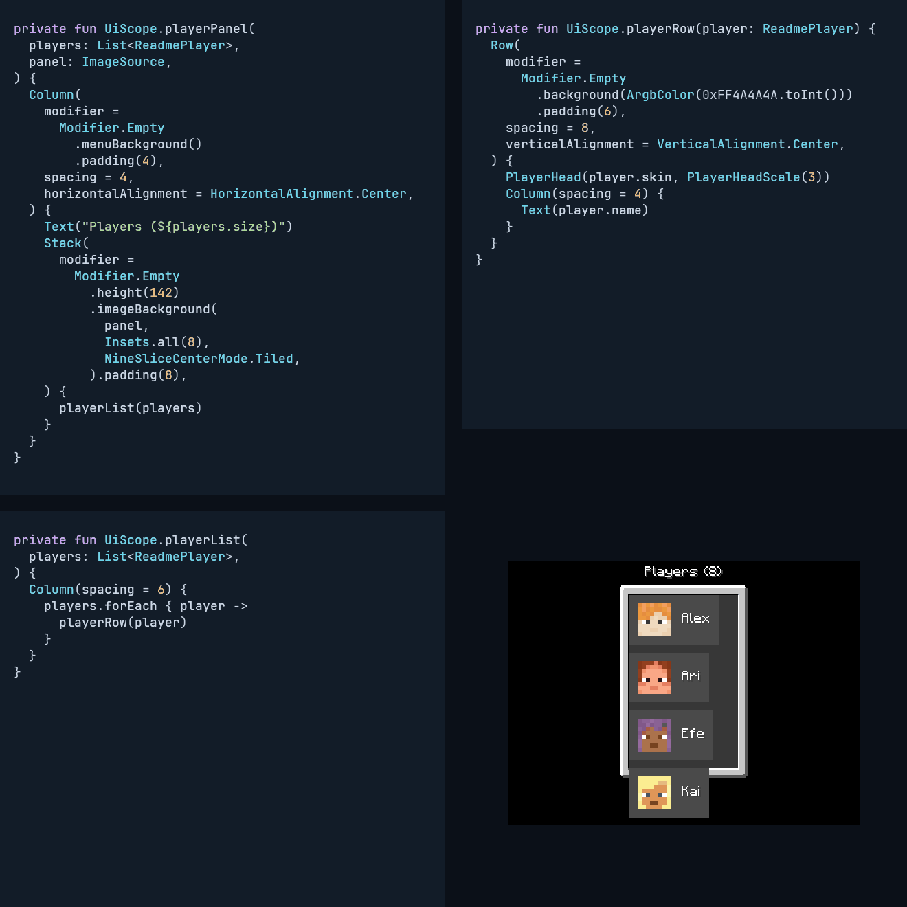

<div align="center">
  
  <h1>Strata</h1>
</div>

Declarative Minecraft UI with reusable components, caller-owned state, and headless rendering.

This page documents the development sources; for an installed version, use the documentation at its matching [release tag](https://github.com/sya-ri/strata/releases).

<!-- strata-readme-demo:start -->
[](docs/readme-demo/README.md)

[Example](integration/docs/src/readmeExamples/kotlin/dev/s7a/strata/integration/docs/example/ScrollPlayersExample.kt) · [Still frames](docs/readme-demo/README.md)
<!-- strata-readme-demo:end -->

Minecraft screens often mix layout, input, state, resources, and version-specific calls in one class.
Strata separates those responsibilities so an interface can be composed, reused, and tested through a common API.

## What you can build

- Keep one interface as a screen or HUD, switch its presentation, and control game input through its session.
- Arrange interfaces with rows, columns, wrapping groups, grids, and overlays.
- Compose controls, text editors, scrolling views, images, and Minecraft resource-backed content.
- Add sizing, backgrounds, pointer and keyboard actions, focus, and layout parent data through modifiers.
- Reuse application components or implement custom primitives through the public Element and Node SPI.
- Render portable drawing and semantics in JVM tests, with separate loaded-client verification for native behavior.

The [component overview](docs/reference/components.md) shows the available components with images and compiled examples.
[Complete screens](docs/examples/screens.md) demonstrate how they fit together.
Try the [interactive web demos](https://gh.s7a.dev/strata/demos/) for a counter, progress controls, and a keyed list running in your browser.

<!-- strata-component-showcase:start -->
<!-- Generated file. Do not edit. -->

## A screen built from components

A confirmation screen combines text, buttons, and layout components into a reusable UI definition.


[Compare components and browse their examples](docs/reference/components.md).
<!-- strata-component-showcase:end -->

## Installation

<!-- strata-installation:start -->
Application UI source needs only `strata-api` on its compile classpath.
Install exactly one version-matched runtime as a separate client Fabric Mod together with Fabric Language Kotlin; do not bundle multiple versioned Strata runtimes.

```kotlin
dependencies {
    compileOnly("dev.s7a.strata:strata-api:0.2.0")
    modRuntimeOnly("dev.s7a.strata:strata-runtime-minecraft-fabric-<minecraft-version>:0.2.0")
    modRuntimeOnly("net.fabricmc:fabric-language-kotlin:<compatible-version>")
}
```

The version-matched runtimes are also available from [Modrinth](https://modrinth.com/mod/strata-ui).
Declare it as a required dependency in the consuming Mod so `UiDefinition.open()` always has a presenter in production:

```json
{
  "depends": {
    "strata": ">=0.2.0"
  }
}
```
<!-- strata-installation:end -->

The [compatibility reference](docs/reference/compatibility.md) lists supported targets, artifact names, and Java requirements.

## Open a screen

Create a new `UiDefinition` for each opening and call `open()` on the installed runtime's owner thread.
Compose actions with modifiers, as in this API-only example:

<a id="api-only-open-example"></a>

<!-- strata-api-open-example:start -->
```kotlin
import dev.s7a.strata.component.Button
import dev.s7a.strata.component.Column
import dev.s7a.strata.component.Text
import dev.s7a.strata.layout.HorizontalAlignment
import dev.s7a.strata.modifier.Modifier
import dev.s7a.strata.modifier.menuBackground
import dev.s7a.strata.modifier.onActivate
import dev.s7a.strata.modifier.padding
import dev.s7a.strata.modifier.size
import dev.s7a.strata.ui.UiDefinition

/**
 * Opens a confirmation screen on the installed runtime's owner thread.
 */
internal fun openConfirmationScreen(onConfirm: () -> Unit) {
    UiDefinition("Confirm action") {
        Column(
            modifier =
                Modifier.Empty
                    .size(320, 180)
                    .menuBackground()
                    .padding(12),
            spacing = 8,
            horizontalAlignment = HorizontalAlignment.Center,
        ) {
            Text("Continue with this action?")
            Button(
                "Yes",
                modifier = Modifier.Empty.onActivate { onConfirm() },
            )
        }
    }.open()
}
```
<!-- strata-api-open-example:end -->

[Screens and state](docs/guides/screens-and-state.md) explains definition ownership, state, input, and resource use.

## Build a web screen from source

The experimental browser runtime renders supported Strata components into native browser DOM.
See the [web build guide](docs/development/build.md#initial-web-documents) for the shared example, supported features, and build instructions.

## Choose modules

| Module | Use |
| --- | --- |
| `api` | Compile application UI and custom components. |
| `runtime/core` | Integrate the shared retained engine through its runtime contracts. |
| `runtime/remote` | Encode, negotiate, and synchronize server-owned declarations and typed client events. |
| `paper-api` | Compile Paper and Folia plugins against public opening methods and lifecycle events. |
| `velocity-api` | Compile Velocity plugins against public asynchronous methods and lifecycle events. |
| `runtime/paper` | Open server-owned screens and HUDs through an installed Paper or Folia plugin. |
| `runtime/velocity` | Own DSL screens on a Velocity proxy and coordinate backend connection lifetimes. |
| `runtime/headless` | Render portable output and inspect UI behavior without launching Minecraft. |
| `runtime/web` | Build initial HTML and mount supported components into native browser DOM. |
| `runtime/minecraft` | Host profile-backed components and resources in a common runtime. |
| `runtime/minecraft-fonts-lwjgl` | Supply a CPU backend for offline resource-font rendering. |
| `runtime/minecraft-fabric-<version>` | Run the interface as a client Fabric screen on one matching game version. |

Versioned Fabric Mods package their common runtime libraries.
Integration modules contain verification and examples and are not published.
See [architecture](docs/development/architecture.md) for dependency boundaries.

The [Paper and Folia](docs/guides/paper.md) and [Velocity](docs/guides/velocity.md) guides cover server-owned screens, HUDs, and their client requirements.

## Changelog

See the [changelog](CHANGELOG.md) for release summaries, detailed changes, and upgrade notes.

## Documentation

Start with the [documentation index](docs/README.md), then use [layout](docs/guides/layout.md), [modifiers](docs/guides/modifiers.md), and [text and editing](docs/guides/text.md) to build an interface.
The [Dokka API reference](https://gh.s7a.dev/strata/) contains signatures and KDoc; the [Element SPI](docs/reference/element-spi.md) explains custom primitives.
[Contributing](CONTRIBUTING.md) covers development.

The public [Strata skill](skills/strata/SKILL.md) provides checked authoring guidance for AI tools.
Preview it with `gh skill preview sya-ri/strata skills/strata` or install it with `npx skills add sya-ri/strata --skill strata`.

Strata is pronounced “STRAY-tuh” (`/ˈstreɪtə/`), the plural of *stratum*, meaning a layer.
It is available under the [MIT License](LICENSE).
