<!-- Generated file. Do not edit. -->

# Minecraft component showcase

Each component image is the complete frame of the dedicated minimal `ScreenDefinition` shown in its compiled example, containing the featured primitive and only the parent layout needed to demonstrate its responsibility.
One loaded Minecraft 26.2 Fabric GameTest renders that definition independently through the Fabric adapter and headless runtime, requires exact ARGB equality, and publishes the entire resulting frame without cropping a larger showcase screen.
Separate native full-screen parity scenes for `ConfirmScreen`, `DirectJoinServerScreen`, `ContainerScreen`, Social Interactions, and `ObjectSelectionList`, plus complete test Mod screens, remain acceptance evidence for real assets, fonts, textures, placement, and draw order.
The menu and generic-container images are active background modifiers on layout components rather than logical component entries.

[Open the machine-readable parity receipt](components/minecraft-26.2-parity.properties)


## Overview source

```kotlin
import dev.s7a.strata.component.Button
import dev.s7a.strata.component.Column
import dev.s7a.strata.component.Row
import dev.s7a.strata.component.Stack
import dev.s7a.strata.component.Text
import dev.s7a.strata.layout.Alignment
import dev.s7a.strata.layout.HorizontalAlignment
import dev.s7a.strata.modifier.Modifier
import dev.s7a.strata.modifier.menuBackground
import dev.s7a.strata.modifier.onPress
import dev.s7a.strata.modifier.size
import dev.s7a.strata.screen.ScreenDefinition

/**
 * Builds the deterministic Minecraft ConfirmScreen content used by the Fabric and headless parity paths.
 *
 * @return one-shot screen definition reproducing the native title, message, and button-row geometry.
 */
internal fun createConfirmScreenDefinition(): ScreenDefinition =
    ScreenDefinition("Strata parity") {
        Stack(
            modifier = Modifier.Empty.size(320, 180).menuBackground(),
            contentAlignment = Alignment.Center,
        ) {
            Column(
                spacing = 24,
                horizontalAlignment = HorizontalAlignment.Center,
            ) {
                Column(
                    spacing = 8,
                    horizontalAlignment = HorizontalAlignment.Center,
                ) {
                    Text("Confirm action")
                    Text("Continue with this action?")
                }
                Row(spacing = 4) {
                    Button(
                        "Yes",
                        modifier = Modifier.Empty.onPress {},
                    )
                    Button(
                        "No",
                        modifier = Modifier.Empty.onPress {},
                    )
                }
            }
        }
    }
```

<details><summary>Overview component tree</summary>

The tree shows Minecraft components in logical draw order; platform-neutral layout scaffolding remains visible in the compiled source.

```text
`- Stack [Size(width=320, height=180)]
  `- Column [Spacing(value=24)]
    |- Column [Spacing(value=8)]
    | |- Text
    | `- Text
    `- Row [Spacing(value=4)]
      |- Button
      `- Button
```

</details>

## Components

- [Row](#row)
- [Column](#column)
- [Stack](#stack)
- [Grid](#grid)
- [Spacer](#spacer)
- [Text](#text)
- [TextField](#text-field)
- [Button](#button)
- [Checkbox](#checkbox)
- [CycleButton](#cycle-button)
- [Slider](#slider)
- [Tab](#tab)
- [ScrollArea](#scroll-area)
- [Scrollbar](#scrollbar)
- [VirtualList](#virtual-list)
- [SelectionList](#selection-list)
- [Image](#image)
- [Slot](#slot)
- [PlayerHead](#player-head)
- [LoadingIndicator](#loading-indicator)
- [ProgressBar](#progress-bar)

<a id="row"></a>

## Row

Row places an ordered sibling sequence on one horizontal main axis, with typed arrangement, spacing, default vertical alignment, and direct-child overrides.

This 136 by 64 image is the complete frame of the compiled dedicated `ScreenDefinition`, after exact Fabric/headless ARGB comparison recorded in [the verification receipt](components/minecraft-26.2-parity.properties); it is not cropped from a larger screen.

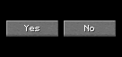

### Compiled example

```kotlin
import dev.s7a.strata.component.Button
import dev.s7a.strata.component.Row
import dev.s7a.strata.layout.Arrangement
import dev.s7a.strata.layout.VerticalAlignment
import dev.s7a.strata.modifier.Modifier
import dev.s7a.strata.modifier.background
import dev.s7a.strata.modifier.size
import dev.s7a.strata.render.ArgbColor
import dev.s7a.strata.screen.ScreenDefinition

/**
 * Builds a self-contained Row showcase whose complete frame demonstrates horizontal placement.
 *
 * @return one-shot definition containing two Minecraft-profile buttons centered by the Row itself.
 */
internal fun createRowShowcaseScreenDefinition(): ScreenDefinition =
    ScreenDefinition("Row showcase") {
        Row(
            modifier =
                Modifier.Empty
                    .size(136, 64)
                    .background(ArgbColor(0xFF000000.toInt())),
            spacing = 4,
            horizontalArrangement = Arrangement.Center,
            verticalAlignment = VerticalAlignment.Center,
        ) {
            Button("Yes", width = 60)
            Button("No", width = 60)
        }
    }
```

### Modifiers

Sizing, padding, paint, semantics, focus, and input modifiers apply to the Row itself; `spacing` and `horizontalArrangement` express structure, while `RowScope.weight` and `RowScope.align` affect only direct children.

### Parent scope

`Row` evaluates a callback-lifetime `RowScope`, emits children in declaration order, and exposes only vertical alignment and weight parent data to its direct children.

<details><summary>Component tree</summary>

The tree mirrors the complete dedicated definition, including the featured component, its minimum parent layout, and the children used to demonstrate its responsibility.

```text
`- Row [Size(width=136, height=64), Background(color=0xFF000000), Spacing(value=4), Arrangement(value=Center), RowDefaultAlignment(alignment=Center)]
  |- Button [Size(width=60, height=20)]
  `- Button [Size(width=60, height=20)]
```

</details>

<a id="column"></a>

## Column

Column places an ordered sibling sequence on one vertical main axis, with typed arrangement, spacing, default horizontal alignment, and direct-child overrides.

This 120 by 64 image is the complete frame of the compiled dedicated `ScreenDefinition`, after exact Fabric/headless ARGB comparison recorded in [the verification receipt](components/minecraft-26.2-parity.properties); it is not cropped from a larger screen.


### Compiled example

```kotlin
import dev.s7a.strata.component.Button
import dev.s7a.strata.component.Column
import dev.s7a.strata.layout.Arrangement
import dev.s7a.strata.layout.HorizontalAlignment
import dev.s7a.strata.modifier.Modifier
import dev.s7a.strata.modifier.background
import dev.s7a.strata.modifier.size
import dev.s7a.strata.render.ArgbColor
import dev.s7a.strata.screen.ScreenDefinition

/**
 * Builds a self-contained Column showcase whose complete frame demonstrates vertical placement.
 *
 * @return one-shot definition containing two Minecraft-profile buttons centered by the Column itself.
 */
internal fun createColumnShowcaseScreenDefinition(): ScreenDefinition =
    ScreenDefinition("Column showcase") {
        Column(
            modifier =
                Modifier.Empty
                    .size(120, 64)
                    .background(ArgbColor(0xFF000000.toInt())),
            spacing = 4,
            verticalArrangement = Arrangement.Center,
            horizontalAlignment = HorizontalAlignment.Center,
        ) {
            Button("First", width = 96)
            Button("Second", width = 96)
        }
    }
```

### Modifiers

Sizing, padding, paint, semantics, focus, and input modifiers apply to the Column itself; `spacing` and `verticalArrangement` express structure, while `ColumnScope.weight` and `ColumnScope.align` affect only direct children.

### Parent scope

`Column` evaluates a callback-lifetime `ColumnScope`, emits children in declaration order, and exposes only horizontal alignment and weight parent data to its direct children.

<details><summary>Component tree</summary>

The tree mirrors the complete dedicated definition, including the featured component, its minimum parent layout, and the children used to demonstrate its responsibility.

```text
`- Column [Size(width=120, height=64), Background(color=0xFF000000), Spacing(value=4), Arrangement(value=Center), ColumnDefaultAlignment(alignment=Center)]
  |- Button [Size(width=96, height=20)]
  `- Button [Size(width=96, height=20)]
```

</details>

<a id="stack"></a>

## Stack

Stack is the explicit overlay primitive: children share one content rectangle, receive two-axis alignment, and paint in declaration order. It is not a generic div-like container.

This 64 by 64 image is the complete frame of the compiled dedicated `ScreenDefinition`, after exact Fabric/headless ARGB comparison recorded in [the verification receipt](components/minecraft-26.2-parity.properties); it is not cropped from a larger screen.

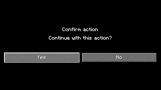

### Compiled example

```kotlin
import dev.s7a.strata.component.Button
import dev.s7a.strata.component.Spacer
import dev.s7a.strata.component.Stack
import dev.s7a.strata.layout.Alignment
import dev.s7a.strata.modifier.Modifier
import dev.s7a.strata.modifier.background
import dev.s7a.strata.modifier.size
import dev.s7a.strata.render.ArgbColor
import dev.s7a.strata.screen.ScreenDefinition

/**
 * Builds a self-contained Stack showcase with a status badge painted over a Minecraft-profile button.
 *
 * @return one-shot definition demonstrating declaration-order painting from the button to the foreground badge.
 */
internal fun createStackShowcaseScreenDefinition(): ScreenDefinition =
    ScreenDefinition("Stack showcase") {
        Stack(
            modifier =
                Modifier.Empty
                    .size(64, 64)
                    .background(ArgbColor(0xFF000000.toInt())),
            contentAlignment = Alignment.Center,
        ) {
            Button("Open", width = 56)
            Spacer(
                modifier =
                    Modifier.Empty
                        .size(10, 10)
                        .background(ArgbColor(0xFFE53935.toInt()))
                        .align(Alignment.CenterEnd),
            )
        }
    }
```

### Modifiers

Use Stack only when children intentionally overlap. Ordinary sizing and background modifiers belong on the Stack; `StackScope.align` positions an individual overlay child without coordinate padding.

### Parent scope

`Stack` evaluates a callback-lifetime `StackScope`; it measures and paints overlapping direct children in declaration order and exposes two-axis alignment parent data.

<details><summary>Component tree</summary>

The tree mirrors the complete dedicated definition, including the featured component, its minimum parent layout, and the children used to demonstrate its responsibility.

```text
`- Stack [Size(width=64, height=64), Background(color=0xFF000000), StackContentAlignment(alignment=Center)]
  |- Button [Size(width=56, height=20)]
  `- Spacer [Size(width=10, height=10), Background(color=0xFFE53935), StackAlign(alignment=CenterEnd)]
```

</details>

<a id="grid"></a>

## Grid

Grid assigns children row-major to a fixed column count, measures each column and row from its largest member, and supports an incomplete final row without placeholders.

This 64 by 64 image is the complete frame of the compiled dedicated `ScreenDefinition`, after exact Fabric/headless ARGB comparison recorded in [the verification receipt](components/minecraft-26.2-parity.properties); it is not cropped from a larger screen.

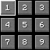

### Compiled example

```kotlin
import dev.s7a.strata.component.Button
import dev.s7a.strata.component.Grid
import dev.s7a.strata.modifier.Modifier
import dev.s7a.strata.modifier.background
import dev.s7a.strata.modifier.size
import dev.s7a.strata.render.ArgbColor
import dev.s7a.strata.screen.ScreenDefinition

/**
 * Builds a self-contained Grid showcase with a complete three-by-three set of Minecraft-profile buttons.
 *
 * @return one-shot definition whose 64 by 64 root is also the complete captured frame.
 */
internal fun createGridShowcaseScreenDefinition(): ScreenDefinition =
    ScreenDefinition("Grid showcase") {
        Grid(
            columns = 3,
            modifier =
                Modifier.Empty
                    .size(64, 64)
                    .background(ArgbColor(0xFF000000.toInt())),
            horizontalSpacing = 2,
            verticalSpacing = 2,
        ) {
            repeat(9) { index ->
                Button((index + 1).toString(), width = 20)
            }
        }
    }
```

### Modifiers

Sizing, padding, and paint modifiers apply to the Grid. Fixed columns, independent horizontal and vertical spacing, and `GridScope.align` replace repeated Row declarations and per-cell coordinate padding.

### Parent scope

`Grid` evaluates a callback-lifetime `GridScope`; it assigns direct children row-major and exposes two-axis alignment only inside each measured cell.

<details><summary>Component tree</summary>

The tree mirrors the complete dedicated definition, including the featured component, its minimum parent layout, and the children used to demonstrate its responsibility.

```text
`- Grid [Size(width=64, height=64), Background(color=0xFF000000), GridColumns(value=3), GridSpacing(horizontal=2, vertical=2)]
  |- Button [Size(width=20, height=20)]
  |- Button [Size(width=20, height=20)]
  |- Button [Size(width=20, height=20)]
  |- Button [Size(width=20, height=20)]
  |- Button [Size(width=20, height=20)]
  |- Button [Size(width=20, height=20)]
  |- Button [Size(width=20, height=20)]
  |- Button [Size(width=20, height=20)]
  `- Button [Size(width=20, height=20)]
```

</details>

<a id="spacer"></a>

## Spacer

Spacer is an empty measurable primitive for genuine visual separators, connectors, and weighted empty regions; it carries no screen-specific meaning.

This 160 by 64 image is the complete frame of the compiled dedicated `ScreenDefinition`, after exact Fabric/headless ARGB comparison recorded in [the verification receipt](components/minecraft-26.2-parity.properties); it is not cropped from a larger screen.

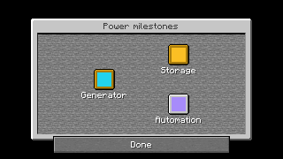

### Compiled example

```kotlin
import dev.s7a.strata.component.Button
import dev.s7a.strata.component.Row
import dev.s7a.strata.component.Spacer
import dev.s7a.strata.layout.Arrangement
import dev.s7a.strata.layout.VerticalAlignment
import dev.s7a.strata.modifier.Modifier
import dev.s7a.strata.modifier.background
import dev.s7a.strata.modifier.size
import dev.s7a.strata.render.ArgbColor
import dev.s7a.strata.screen.ScreenDefinition

/**
 * Builds a self-contained Spacer showcase that reserves visible space between two siblings.
 *
 * @return one-shot definition in which the Spacer, rather than parent spacing or child padding, owns the 16-pixel gap.
 */
internal fun createSpacerShowcaseScreenDefinition(): ScreenDefinition =
    ScreenDefinition("Spacer showcase") {
        Row(
            modifier =
                Modifier.Empty
                    .size(160, 64)
                    .background(ArgbColor(0xFF000000.toInt())),
            horizontalArrangement = Arrangement.Center,
            verticalAlignment = VerticalAlignment.Center,
        ) {
            Button("Left", width = 60)
            Spacer(modifier = Modifier.Empty.size(16, 20))
            Button("Right", width = 60)
        }
    }
```

### Modifiers

Sizing, weight, and paint modifiers give Spacer a deliberate empty footprint, such as a separator or progress connector; ordinary parent spacing and alignment should remain layout arguments rather than placeholder children.

### Parent scope

`Spacer` has no content scope or children. Its size and modifier chain alone define its retained layout and paint behavior.

<details><summary>Component tree</summary>

The tree mirrors the complete dedicated definition, including the featured component, its minimum parent layout, and the children used to demonstrate its responsibility.

```text
`- Row [Size(width=160, height=64), Background(color=0xFF000000), Arrangement(value=Center), RowDefaultAlignment(alignment=Center)]
  |- Button [Size(width=60, height=20)]
  |- Spacer [Size(width=16, height=20)]
  `- Button [Size(width=60, height=20)]
```

</details>

<a id="text"></a>

## Text

Text renders a printable-ASCII literal with the extracted Minecraft glyph advances, shadow layer, foreground layer, and native baseline.

This 120 by 64 image is the complete frame of the compiled dedicated `ScreenDefinition`, after exact Fabric/headless ARGB comparison recorded in [the verification receipt](components/minecraft-26.2-parity.properties); it is not cropped from a larger screen.

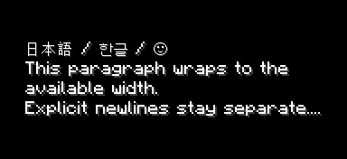

### Compiled example

```kotlin
import dev.s7a.strata.component.Stack
import dev.s7a.strata.component.Text
import dev.s7a.strata.layout.Alignment
import dev.s7a.strata.modifier.Modifier
import dev.s7a.strata.modifier.background
import dev.s7a.strata.modifier.size
import dev.s7a.strata.render.ArgbColor
import dev.s7a.strata.screen.ScreenDefinition

/**
 * Builds a self-contained literal Text showcase.
 *
 * @return one-shot definition whose complete frame centers one Minecraft-profile text component.
 */
internal fun createTextShowcaseScreenDefinition(): ScreenDefinition =
    ScreenDefinition("Text showcase") {
        Stack(
            modifier =
                Modifier.Empty
                    .size(120, 64)
                    .background(ArgbColor(0xFF000000.toInt())),
            contentAlignment = Alignment.Center,
        ) {
            Text("Hello, Strata!")
        }
    }
```

### Modifiers

Ordinary sizing, padding, placement, and paint modifiers compose around `Text`; text content remains a typed component argument.

### Parent scope

`Text` is a top-level extension on the active `UiScope`. The screen runtime installs its selected Minecraft profile only for the definition callback, and the component has no content callback or parent-data API.

<details><summary>Component tree</summary>

The tree mirrors the complete dedicated definition, including the featured component, its minimum parent layout, and the children used to demonstrate its responsibility.

```text
`- Stack [Size(width=120, height=64), Background(color=0xFF000000), StackContentAlignment(alignment=Center)]
  `- Text
```

</details>

<a id="text-field"></a>

## TextField

TextField reproduces the 200 by 20 Minecraft EditBox sprites, text origin, glyph colors, owner-thread value state, focus, and bounded editing behavior.

This 216 by 64 image is the complete frame of the compiled dedicated `ScreenDefinition`, after exact Fabric/headless ARGB comparison recorded in [the verification receipt](components/minecraft-26.2-parity.properties); it is not cropped from a larger screen.

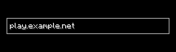

### Compiled example

```kotlin
import dev.s7a.strata.component.Stack
import dev.s7a.strata.component.TextField
import dev.s7a.strata.component.TextFieldState
import dev.s7a.strata.layout.Alignment
import dev.s7a.strata.modifier.Modifier
import dev.s7a.strata.modifier.background
import dev.s7a.strata.modifier.size
import dev.s7a.strata.render.ArgbColor
import dev.s7a.strata.screen.ScreenDefinition

/**
 * Builds a self-contained TextField showcase from one caller-selected initial value.
 *
 * @param initialValue printable ASCII value copied into owner-thread field state before the definition is retained.
 * @return one-shot definition containing the complete Minecraft-profile text-field frame.
 * @throws IllegalArgumentException when [initialValue] is unsupported or exceeds the showcase limit.
 */
internal fun createTextFieldShowcaseScreenDefinition(
    initialValue: String = "play.example.net",
): ScreenDefinition {
    val state = TextFieldState(initialValue, maxLength = 128)
    return ScreenDefinition("TextField showcase") {
        Stack(
            modifier =
                Modifier.Empty
                    .size(216, 64)
                    .background(ArgbColor(0xFF000000.toInt())),
            contentAlignment = Alignment.Center,
        ) {
            TextField(state)
        }
    }
}
```

### Modifiers

Pointer, keyboard, committed-character, preedit, and focus modifiers run as active retained behavior around `TextField`; a consuming focused modifier overrides built-in editing.

### Parent scope

`TextField` is a member extension on the active `UiScope`. The implicit runtime context supplies assets, while caller-owned `TextFieldState` owns the editable value.

<details><summary>Component tree</summary>

The tree mirrors the complete dedicated definition, including the featured component, its minimum parent layout, and the children used to demonstrate its responsibility.

```text
`- Stack [Size(width=216, height=64), Background(color=0xFF000000), StackContentAlignment(alignment=Center)]
  `- TextField [Size(width=200, height=20)]
```

</details>

<a id="button"></a>

## Button

Button renders verified fixed-height Minecraft sprite and label states, including the native 150- and 200-pixel widths, while reusable input actions live in modifiers.

This 166 by 64 image is the complete frame of the compiled dedicated `ScreenDefinition`, after exact Fabric/headless ARGB comparison recorded in [the verification receipt](components/minecraft-26.2-parity.properties); it is not cropped from a larger screen.


### Compiled example

```kotlin
import dev.s7a.strata.component.Button
import dev.s7a.strata.component.Stack
import dev.s7a.strata.layout.Alignment
import dev.s7a.strata.modifier.Modifier
import dev.s7a.strata.modifier.background
import dev.s7a.strata.modifier.onHover
import dev.s7a.strata.modifier.onPress
import dev.s7a.strata.modifier.size
import dev.s7a.strata.render.ArgbColor
import dev.s7a.strata.screen.ScreenDefinition

/**
 * Builds a self-contained Button showcase with ordinary pointer actions attached through its modifier.
 *
 * @return one-shot definition containing the complete normal Button frame and no surrounding application screen.
 */
internal fun createButtonShowcaseScreenDefinition(): ScreenDefinition =
    ScreenDefinition("Button showcase") {
        Stack(
            modifier =
                Modifier.Empty
                    .size(166, 64)
                    .background(ArgbColor(0xFF000000.toInt())),
            contentAlignment = Alignment.Center,
        ) {
            Button(
                "Continue",
                modifier =
                    Modifier.Empty
                        .onPress {}
                        .onHover {},
            )
        }
    }
```

### Modifiers

Pointer behavior is active modifier behavior. `onPointerEvent`, `onPress`, `onRelease`, `onMove`, `onDrag`, `onScroll`, and `onHover` can be composed without adding component-specific callback parameters.

### Parent scope

`Button` is a top-level extension on the active `UiScope`. The screen runtime installs its selected Minecraft profile only for the definition callback, and pointer event modifiers remain valid only through their retained modifier-node lifetime.

<details><summary>Component tree</summary>

The tree mirrors the complete dedicated definition, including the featured component, its minimum parent layout, and the children used to demonstrate its responsibility.

```text
`- Stack [Size(width=166, height=64), Background(color=0xFF000000), StackContentAlignment(alignment=Center)]
  `- Button [Size(width=150, height=20)]
```

</details>

<a id="checkbox"></a>

## Checkbox

Checkbox reproduces the verified 20-pixel Minecraft checkbox surface, label spacing, focused input, checked semantics, and caller-owned boolean state.

This 166 by 36 image is the complete frame of the compiled dedicated `ScreenDefinition`, after exact Fabric/headless ARGB comparison recorded in [the verification receipt](components/minecraft-26.2-parity.properties); it is not cropped from a larger screen.


### Compiled example

```kotlin
import dev.s7a.strata.component.Checkbox
import dev.s7a.strata.component.CheckboxState
import dev.s7a.strata.component.Stack
import dev.s7a.strata.layout.Alignment
import dev.s7a.strata.modifier.Modifier
import dev.s7a.strata.modifier.background
import dev.s7a.strata.modifier.size
import dev.s7a.strata.render.ArgbColor
import dev.s7a.strata.screen.ScreenDefinition

/** Builds the complete minimal Checkbox showcase frame. */
internal fun createCheckboxShowcaseScreenDefinition(): ScreenDefinition {
    val state = CheckboxState(initialChecked = true)
    return ScreenDefinition("Checkbox showcase") {
        Stack(
            modifier = Modifier.Empty.size(166, 36).background(ArgbColor(0xFF000000.toInt())),
            contentAlignment = Alignment.Center,
        ) {
            Checkbox("Allow invites", state)
        }
    }
}
```

### Modifiers

Sizing and placement modifiers compose around `Checkbox`; caller-owned state and typed checked-change actions keep the reusable boolean control independent of a settings domain.

### Parent scope

`Checkbox` is a leaf extension on the active `UiScope`; `CheckboxState` is caller-owned, owner-thread confined, and may be shared with application state adapters.

<details><summary>Component tree</summary>

The tree mirrors the complete dedicated definition, including the featured component, its minimum parent layout, and the children used to demonstrate its responsibility.

```text
`- Stack [Size(width=166, height=36), Background(color=0xFF000000), StackContentAlignment(alignment=Center)]
  `- Checkbox [Size(width=150, height=20)]
```

</details>

<a id="cycle-button"></a>

## CycleButton

CycleButton reuses the verified button surface for a finite generic option sequence with forward, backward, wheel, and keyboard navigation.

This 166 by 36 image is the complete frame of the compiled dedicated `ScreenDefinition`, after exact Fabric/headless ARGB comparison recorded in [the verification receipt](components/minecraft-26.2-parity.properties); it is not cropped from a larger screen.

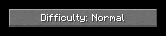

### Compiled example

```kotlin
import dev.s7a.strata.component.CycleButton
import dev.s7a.strata.component.CycleButtonState
import dev.s7a.strata.component.Stack
import dev.s7a.strata.layout.Alignment
import dev.s7a.strata.modifier.Modifier
import dev.s7a.strata.modifier.background
import dev.s7a.strata.modifier.size
import dev.s7a.strata.render.ArgbColor
import dev.s7a.strata.screen.ScreenDefinition

/** Difficulty options rendered by the typed CycleButton showcase. */
private enum class Difficulty(
    val label: String,
) {
    Peaceful("Peaceful"),
    Easy("Easy"),
    Normal("Normal"),
    Hard("Hard"),
}

/** Builds the complete minimal CycleButton showcase frame. */
internal fun createCycleButtonShowcaseScreenDefinition(): ScreenDefinition {
    val state = CycleButtonState(Difficulty.Normal) { value -> "Difficulty: ${value.label}" }
    return ScreenDefinition("CycleButton showcase") {
        Stack(
            modifier = Modifier.Empty.size(166, 36).background(ArgbColor(0xFF000000.toInt())),
            contentAlignment = Alignment.Center,
        ) {
            CycleButton(state = state)
        }
    }
}
```

### Modifiers

Sizing and placement modifiers compose around `CycleButton`; its immutable option set and typed change action remain generic rather than encoding one game's option model.

### Parent scope

`CycleButton` is a leaf extension on the active `UiScope`; it snapshots labels for the validated finite option set and retains no child scope.

<details><summary>Component tree</summary>

The tree mirrors the complete dedicated definition, including the featured component, its minimum parent layout, and the children used to demonstrate its responsibility.

```text
`- Stack [Size(width=166, height=36), Background(color=0xFF000000), StackContentAlignment(alignment=Center)]
  `- CycleButton [Size(width=150, height=20)]
```

</details>

<a id="slider"></a>

## Slider

Slider reproduces Minecraft's profile-backed track and handle while normalizing finite numeric ranges and optional discrete steps in caller-owned state.

This 166 by 36 image is the complete frame of the compiled dedicated `ScreenDefinition`, after exact Fabric/headless ARGB comparison recorded in [the verification receipt](components/minecraft-26.2-parity.properties); it is not cropped from a larger screen.

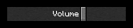

### Compiled example

```kotlin
import dev.s7a.strata.component.Slider
import dev.s7a.strata.component.SliderState
import dev.s7a.strata.component.Stack
import dev.s7a.strata.layout.Alignment
import dev.s7a.strata.modifier.Modifier
import dev.s7a.strata.modifier.background
import dev.s7a.strata.modifier.size
import dev.s7a.strata.render.ArgbColor
import dev.s7a.strata.screen.ScreenDefinition

/** Builds the complete minimal Slider showcase frame. */
internal fun createSliderShowcaseScreenDefinition(): ScreenDefinition {
    val state = SliderState(initialValue = 0.65)
    return ScreenDefinition("Slider showcase") {
        Stack(
            modifier = Modifier.Empty.size(166, 36).background(ArgbColor(0xFF000000.toInt())),
            contentAlignment = Alignment.Center,
        ) {
            Slider("Volume", state)
        }
    }
}
```

### Modifiers

Sizing and placement modifiers compose around `Slider`; caller-owned range state and typed value-change actions remain reusable across volume, brightness, machine power, and other numeric domains.

### Parent scope

`Slider` is a leaf extension on the active `UiScope`; `SliderState` owns normalization and quantization while the active profile owns rendering.

<details><summary>Component tree</summary>

The tree mirrors the complete dedicated definition, including the featured component, its minimum parent layout, and the children used to demonstrate its responsibility.

```text
`- Stack [Size(width=166, height=36), Background(color=0xFF000000), StackContentAlignment(alignment=Center)]
  `- Slider [Size(width=150, height=20)]
```

</details>

<a id="tab"></a>

## Tab

Tab combines the verified button surface with external selection semantics and a reusable underline or caller-defined selected indicator, without encoding a particular screen's tab model.

This 160 by 64 image is the complete frame of the compiled dedicated `ScreenDefinition`, after exact Fabric/headless ARGB comparison recorded in [the verification receipt](components/minecraft-26.2-parity.properties); it is not cropped from a larger screen.


### Compiled example

```kotlin
import dev.s7a.strata.component.Row
import dev.s7a.strata.component.Tab
import dev.s7a.strata.component.TabSelectionIndicator
import dev.s7a.strata.layout.Arrangement
import dev.s7a.strata.layout.VerticalAlignment
import dev.s7a.strata.modifier.Modifier
import dev.s7a.strata.modifier.background
import dev.s7a.strata.modifier.onPress
import dev.s7a.strata.modifier.size
import dev.s7a.strata.render.ArgbColor
import dev.s7a.strata.screen.ScreenDefinition

/**
 * Builds a self-contained Tab showcase with selected and unselected states side by side.
 *
 * @return one-shot definition whose selected All tab displays the standard underline indicator.
 */
internal fun createTabShowcaseScreenDefinition(): ScreenDefinition =
    ScreenDefinition("Tab showcase") {
        Row(
            modifier =
                Modifier.Empty
                    .size(160, 64)
                    .background(ArgbColor(0xFF000000.toInt())),
            spacing = 1,
            horizontalArrangement = Arrangement.Center,
            verticalAlignment = VerticalAlignment.Center,
        ) {
            Tab(
                "All",
                selected = true,
                width = 73,
                indicator = TabSelectionIndicator.Underline,
                modifier = Modifier.Empty.onPress {},
            )
            Tab(
                "Hidden",
                selected = false,
                width = 73,
                modifier = Modifier.Empty.onPress {},
            )
        }
    }
```

### Modifiers

Selection is caller-owned data, while `Underline` or `Custom` controls its reusable selected-state presentation. All pointer actions remain ordinary event modifiers, exactly as for Button and other interactive components.

### Parent scope

`Tab` is a top-level extension on the active `UiScope`. A custom selected indicator emits exactly one nested root; the selected value and event actions remain application-owned.

<details><summary>Component tree</summary>

The tree mirrors the complete dedicated definition, including the featured component, its minimum parent layout, and the children used to demonstrate its responsibility.

```text
`- Row [Size(width=160, height=64), Background(color=0xFF000000), Spacing(value=1), Arrangement(value=Center), RowDefaultAlignment(alignment=Center)]
  |- Tab [Size(width=73, height=20)]
  `- Tab [Size(width=73, height=20)]
```

</details>

<a id="scroll-area"></a>

## ScrollArea

ScrollArea reproduces the verified Minecraft menu-list background, clipping, separators, and wheel behavior without owning or positioning a scrollbar.

This 120 by 48 image is the complete frame of the compiled dedicated `ScreenDefinition`, after exact Fabric/headless ARGB comparison recorded in [the verification receipt](components/minecraft-26.2-parity.properties); it is not cropped from a larger screen.

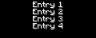

### Compiled example

```kotlin
import dev.s7a.strata.component.Column
import dev.s7a.strata.component.ScrollArea
import dev.s7a.strata.component.ScrollState
import dev.s7a.strata.component.Text
import dev.s7a.strata.layout.HorizontalAlignment
import dev.s7a.strata.modifier.Modifier
import dev.s7a.strata.modifier.background
import dev.s7a.strata.modifier.size
import dev.s7a.strata.render.ArgbColor
import dev.s7a.strata.screen.ScreenDefinition

/** Builds a ScrollArea showcase without a scrollbar. */
internal fun createScrollAreaShowcaseScreenDefinition(): ScreenDefinition {
    val state = ScrollState()
    return ScreenDefinition("ScrollArea showcase") {
        ScrollArea(
            state = state,
            modifier = Modifier.Empty.size(120, 48).background(ArgbColor(0xFF000000.toInt())),
        ) {
            Column(modifier = Modifier.Empty.size(120, 72), horizontalAlignment = HorizontalAlignment.Center) {
                repeat(4) { index -> Text("Entry ${index + 1}") }
            }
        }
    }
}
```

### Modifiers

Ordinary sizing and placement modifiers define only the clipped viewport. The shared `ScrollState` links optional external controls without forcing a scrollbar into the component tree.

### Parent scope

`ScrollArea` evaluates a callback-lifetime `UiScope` that emits exactly one content root; the caller owns the linked state and may omit a scrollbar.

<details><summary>Component tree</summary>

The tree mirrors the complete dedicated definition, including the featured component, its minimum parent layout, and the children used to demonstrate its responsibility.

```text
`- ScrollArea [Size(width=120, height=48), Background(color=0xFF000000), ScrollRate(value=9)]
  `- Column [Size(width=120, height=72), ColumnDefaultAlignment(alignment=Center)]
    |- Text
    |- Text
    |- Text
    `- Text
```

</details>

<a id="scrollbar"></a>

## Scrollbar

Scrollbar reproduces the verified tiled track and proportional thumb while remaining an independently placed observer of shared scroll metrics.

This 94 by 48 image is the complete frame of the compiled dedicated `ScreenDefinition`, after exact Fabric/headless ARGB comparison recorded in [the verification receipt](components/minecraft-26.2-parity.properties); it is not cropped from a larger screen.

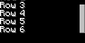

### Compiled example

```kotlin
import dev.s7a.strata.component.Column
import dev.s7a.strata.component.Row
import dev.s7a.strata.component.ScrollArea
import dev.s7a.strata.component.ScrollState
import dev.s7a.strata.component.Scrollbar
import dev.s7a.strata.component.Text
import dev.s7a.strata.modifier.Modifier
import dev.s7a.strata.modifier.background
import dev.s7a.strata.modifier.size
import dev.s7a.strata.render.ArgbColor
import dev.s7a.strata.screen.ScreenDefinition

/** Builds a Scrollbar with the smallest linked viewport needed to establish its metrics. */
internal fun createScrollbarShowcaseScreenDefinition(): ScreenDefinition {
    val state = ScrollState(initialOffset = 18.0)
    return ScreenDefinition("Scrollbar showcase") {
        Row(
            spacing = 8,
            modifier = Modifier.Empty.size(94, 48).background(ArgbColor(0xFF000000.toInt())),
        ) {
            ScrollArea(state = state, modifier = Modifier.Empty.size(80, 48)) {
                Column(modifier = Modifier.Empty.size(80, 96)) {
                    repeat(6) { index -> Text("Row ${index + 1}") }
                }
            }
            Scrollbar(state = state, modifier = Modifier.Empty.size(6, 48))
        }
    }
}
```

### Modifiers

Sizing and parent placement modifiers position `Scrollbar` independently from its viewport; sharing `ScrollState` is the only link required.

### Parent scope

`Scrollbar` is an independent leaf in any surrounding layout. It observes caller-owned `ScrollState` and releases that observation when its retained node is disposed.

<details><summary>Component tree</summary>

The tree mirrors the complete dedicated definition, including the featured component, its minimum parent layout, and the children used to demonstrate its responsibility.

```text
`- Row [Size(width=94, height=48), Background(color=0xFF000000), Spacing(value=8)]
  |- ScrollArea [Size(width=80, height=48), ScrollRate(value=9)]
  | `- Column [Size(width=80, height=96)]
  |   |- Text
  |   |- Text
  |   |- Text
  |   |- Text
  |   |- Text
  |   `- Text
  `- Scrollbar [Size(width=6, height=48)]
```

</details>

<a id="virtual-list"></a>

## VirtualList

VirtualList retains only visible fixed-height rows plus bounded overscan, supports prepended and appended loading, and can jump by index or stable key.

This 120 by 48 image is the complete frame of the compiled dedicated `ScreenDefinition`, after exact Fabric/headless ARGB comparison recorded in [the verification receipt](components/minecraft-26.2-parity.properties); it is not cropped from a larger screen.

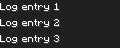

### Compiled example

```kotlin
import dev.s7a.strata.component.Stack
import dev.s7a.strata.component.Text
import dev.s7a.strata.component.VirtualList
import dev.s7a.strata.component.VirtualListState
import dev.s7a.strata.geometry.IntSize
import dev.s7a.strata.layout.Alignment
import dev.s7a.strata.modifier.Modifier
import dev.s7a.strata.modifier.background
import dev.s7a.strata.modifier.size
import dev.s7a.strata.render.ArgbColor
import dev.s7a.strata.screen.ScreenDefinition

/** Builds a finite VirtualList while materializing only visible rows. */
internal fun createVirtualListShowcaseScreenDefinition(): ScreenDefinition {
    val items = (1..100).map { index -> "Log entry $index" }
    val state = VirtualListState<String>()
    return ScreenDefinition("VirtualList showcase") {
        VirtualList(items, { item -> item }, state, IntSize(120, 48), rowHeight = 16) { item ->
            Stack(
                modifier = Modifier.Empty.size(120, 16).background(ArgbColor(0xFF202020.toInt())),
                contentAlignment = Alignment.CenterStart,
            ) {
                Text(item)
            }
        }
    }
}
```

### Modifiers

Sizing is expressed by `viewportSize`; modifier actions receive leading and trailing load requests while caller-owned state supports index, key, and boundary navigation.

### Parent scope

`VirtualList` evaluates row callbacks only for visible rows plus bounded overscan; stable keys preserve retained identity while the caller owns source and navigation state.

<details><summary>Component tree</summary>

The tree mirrors the complete dedicated definition, including the featured component, its minimum parent layout, and the children used to demonstrate its responsibility.

```text
`- VirtualList [Size(width=120, height=48)]
```

</details>

<a id="selection-list"></a>

## SelectionList

SelectionList adds generic caller-owned selection and typed selection-change actions to VirtualList without encoding Social, inventory, advancement, or Mod-specific rows.

This 120 by 48 image is the complete frame of the compiled dedicated `ScreenDefinition`, after exact Fabric/headless ARGB comparison recorded in [the verification receipt](components/minecraft-26.2-parity.properties); it is not cropped from a larger screen.

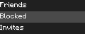

### Compiled example

```kotlin
import dev.s7a.strata.component.SelectionList
import dev.s7a.strata.component.SelectionListState
import dev.s7a.strata.component.Stack
import dev.s7a.strata.component.Text
import dev.s7a.strata.geometry.IntSize
import dev.s7a.strata.layout.Alignment
import dev.s7a.strata.modifier.Modifier
import dev.s7a.strata.modifier.background
import dev.s7a.strata.modifier.size
import dev.s7a.strata.render.ArgbColor
import dev.s7a.strata.screen.ScreenDefinition

/** Builds a selected-row SelectionList showcase. */
internal fun createSelectionListShowcaseScreenDefinition(): ScreenDefinition {
    val items = listOf("Friends", "Blocked", "Invites", "Recent")
    val state = SelectionListState(initialSelection = "Blocked")
    return ScreenDefinition("SelectionList showcase") {
        SelectionList(items, { item -> item }, state, IntSize(120, 48), rowHeight = 16) { item ->
            val color = if (state.selectedKey == item) ArgbColor(0xFF4A4A4A.toInt()) else ArgbColor(0xFF202020.toInt())
            Stack(
                modifier = Modifier.Empty.size(120, 16).background(color),
                contentAlignment = Alignment.CenterStart,
            ) {
                Text(item)
            }
        }
    }
}
```

### Modifiers

Viewport behavior composes with typed selection actions and caller-owned selection state; row visuals remain application composition rather than a screen-specific built-in.

### Parent scope

`SelectionList` wraps visible virtual rows with generic selection semantics and press handling while leaving each row's single content root to the caller.

<details><summary>Component tree</summary>

The tree mirrors the complete dedicated definition, including the featured component, its minimum parent layout, and the children used to demonstrate its responsibility.

```text
`- SelectionList [Size(width=120, height=48)]
```

</details>

<a id="image"></a>

## Image

Image maps one immutable resource-pack image to an exact logical size with deterministic nearest sampling; it is reusable for icons, portraits, diagrams, and Mod-owned panels.

This 64 by 64 image is the complete frame of the compiled dedicated `ScreenDefinition`, after exact Fabric/headless ARGB comparison recorded in [the verification receipt](components/minecraft-26.2-parity.properties); it is not cropped from a larger screen.

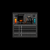

### Compiled example

```kotlin
import dev.s7a.strata.component.Image
import dev.s7a.strata.component.ImageSource
import dev.s7a.strata.component.Stack
import dev.s7a.strata.geometry.IntSize
import dev.s7a.strata.layout.Alignment
import dev.s7a.strata.modifier.Modifier
import dev.s7a.strata.modifier.background
import dev.s7a.strata.modifier.size
import dev.s7a.strata.render.ArgbColor
import dev.s7a.strata.screen.ScreenDefinition

/**
 * Builds a self-contained Image showcase from caller-provided deterministic pixels or an active resource.
 *
 * @param source immutable pixel snapshot or resource-pack identifier rendered by the Image component itself.
 * @return one-shot definition containing the complete 32 by 32 nearest-sampled image inside a minimal canvas.
 */
internal fun createImageShowcaseScreenDefinition(source: ImageSource): ScreenDefinition =
    ScreenDefinition("Image showcase") {
        Stack(
            modifier =
                Modifier.Empty
                    .size(64, 64)
                    .background(ArgbColor(0xFF000000.toInt())),
            contentAlignment = Alignment.Center,
        ) {
            Image(source, size = IntSize(32, 32))
        }
    }
```

### Modifiers

Sizing and placement modifiers compose around `Image`; `imageBackground` paints the same immutable resource behind any layout component with typed stretch or tile mapping.

### Parent scope

`Image` is a top-level extension on the active `UiScope`. It retains detached pixels rather than a Minecraft resource object, so the Fabric loader may resolve a resource-pack replacement before the description is built.

<details><summary>Component tree</summary>

The tree mirrors the complete dedicated definition, including the featured component, its minimum parent layout, and the children used to demonstrate its responsibility.

```text
`- Stack [Size(width=64, height=64), Background(color=0xFF000000), StackContentAlignment(alignment=Center)]
  `- Image [Size(width=32, height=32)]
```

</details>

<a id="slot"></a>

## Slot

Slot reproduces the native 18 by 18 hit region and 24 by 24 back-item-front highlight order; its binding overload polls real ItemStack state and delegates interaction through Minecraft's active container menu.

This 64 by 64 image is the complete frame of the compiled dedicated `ScreenDefinition`, after exact Fabric/headless ARGB comparison recorded in [the verification receipt](components/minecraft-26.2-parity.properties); it is not cropped from a larger screen.

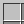

### Compiled example

```kotlin
import dev.s7a.strata.component.Slot
import dev.s7a.strata.component.Stack
import dev.s7a.strata.layout.Alignment
import dev.s7a.strata.modifier.Modifier
import dev.s7a.strata.modifier.background
import dev.s7a.strata.modifier.size
import dev.s7a.strata.render.ArgbColor
import dev.s7a.strata.screen.ScreenDefinition

/**
 * Builds a deterministic unbound Slot showcase without depending on a player or container menu.
 *
 * The capture pointer targets the centered Slot so its profile highlight layers make the otherwise-empty hit region visible.
 *
 * @return one-shot definition containing one empty, highlightable Slot centered in the complete frame.
 */
internal fun createSlotShowcaseScreenDefinition(): ScreenDefinition =
    ScreenDefinition("Slot showcase") {
        Stack(
            modifier =
                Modifier.Empty
                    .size(64, 64)
                    .background(ArgbColor(0xFF000000.toInt())),
            contentAlignment = Alignment.Center,
        ) {
            Slot()
        }
    }
```

### Modifiers

Sizing is native-fixed at 18 by 18. `Slots.playerInventory(index)` binds player storage, `Slots.container(index)` addresses logical storage exposed by chests, ender chests, furnaces, and custom server menus, and `Slots.activeMenu(index)` remains the raw-menu escape hatch; the optional-content overload remains portable for custom item visuals.

### Parent scope

`Slot` is a member extension on the active `UiScope`. Its optional callback emits at most one 16 by 16 content root, while its bound overload obtains the version platform implicitly and retains no public Minecraft type.

<details><summary>Component tree</summary>

The tree mirrors the complete dedicated definition, including the featured component, its minimum parent layout, and the children used to demonstrate its responsibility.

```text
`- Stack [Size(width=64, height=64), Background(color=0xFF000000), StackContentAlignment(alignment=Center)]
  `- Slot [SlotHighlightable(value=true), Size(width=18, height=18)]
```

</details>

<a id="player-head"></a>

## PlayerHead

PlayerHead reproduces Minecraft 26.2 face-then-hat rendering from a 64 by 64 skin; its default 24 by 24 extent matches Social Interactions while remaining reusable in lists, profiles, scoreboards, and Mod screens.

This 64 by 64 image is the complete frame of the compiled dedicated `ScreenDefinition`, after exact Fabric/headless ARGB comparison recorded in [the verification receipt](components/minecraft-26.2-parity.properties); it is not cropped from a larger screen.

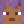

### Compiled example

```kotlin
import dev.s7a.strata.component.PlayerHead
import dev.s7a.strata.component.PlayerSkinSource
import dev.s7a.strata.component.Stack
import dev.s7a.strata.layout.Alignment
import dev.s7a.strata.modifier.Modifier
import dev.s7a.strata.modifier.background
import dev.s7a.strata.modifier.size
import dev.s7a.strata.render.ArgbColor
import dev.s7a.strata.screen.ScreenDefinition

/**
 * Builds a self-contained PlayerHead showcase from a caller-selected skin source.
 *
 * @param skin player identity lookup or immutable 64 by 64 skin source rendered by PlayerHead itself.
 * @return one-shot definition containing the complete 24 by 24 face and hat layers inside a minimal canvas.
 */
internal fun createPlayerHeadShowcaseScreenDefinition(
    skin: PlayerSkinSource,
): ScreenDefinition =
    ScreenDefinition("Player head") {
        Stack(
            modifier = Modifier.Empty.size(64, 64).background(ArgbColor(0xFF000000.toInt())),
            contentAlignment = Alignment.Center,
        ) {
            PlayerHead(source = skin)
        }
    }
```

### Modifiers

Sizing and placement modifiers compose around `PlayerHead`; its immutable skin argument stays separate from Social, player-list, scoreboard, profile, and Mod-specific row state.

### Parent scope

`PlayerHead` is a top-level extension on the active `UiScope`. `Pixels` retains a detached immutable skin, while `CurrentPlayer`, `Name`, and `Uuid` remain structural asynchronous lookups deferred to node attachment; the retained node owns and releases that lookup lifetime.

<details><summary>Component tree</summary>

The tree mirrors the complete dedicated definition, including the featured component, its minimum parent layout, and the children used to demonstrate its responsibility.

```text
`- Stack [Size(width=64, height=64), Background(color=0xFF000000), StackContentAlignment(alignment=Center)]
  `- PlayerHead [Size(width=24, height=24)]
```

</details>

<a id="loading-indicator"></a>

## LoadingIndicator

LoadingIndicator reproduces the Minecraft 26.2 friends-loading sprite as three vertical 5 by 2 cells with the native six-tick frame duration; older runtimes use the same pack-overridable path before their compatibility fallback.

This 32 by 24 image is the complete frame of the compiled dedicated `ScreenDefinition`, after exact Fabric/headless ARGB comparison recorded in [the verification receipt](components/minecraft-26.2-parity.properties); it is not cropped from a larger screen.

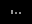

### Compiled example

```kotlin
import dev.s7a.strata.component.LoadingIndicator
import dev.s7a.strata.component.Stack
import dev.s7a.strata.layout.Alignment
import dev.s7a.strata.modifier.Modifier
import dev.s7a.strata.modifier.background
import dev.s7a.strata.modifier.size
import dev.s7a.strata.render.ArgbColor
import dev.s7a.strata.screen.ScreenDefinition

/**
 * Builds the complete minimal LoadingIndicator showcase frame.
 */
internal fun createLoadingIndicatorShowcaseScreenDefinition(): ScreenDefinition =
    ScreenDefinition("Loading indicator") {
        Stack(
            modifier = Modifier.Empty.size(32, 24).background(ArgbColor(0xFF000000.toInt())),
            contentAlignment = Alignment.Center,
        ) {
            LoadingIndicator()
        }
    }
```

### Modifiers

Sizing and placement modifiers compose around `LoadingIndicator`; explicit host frame time advances its discrete profile animation without application-owned timer state.

### Parent scope

`LoadingIndicator` is a top-level extension on the active `UiScope`. The Fabric host supplies one timestamp per native render pass and the retained node invalidates only when its discrete animation cell changes.

<details><summary>Component tree</summary>

The tree mirrors the complete dedicated definition, including the featured component, its minimum parent layout, and the children used to demonstrate its responsibility.

```text
`- Stack [Size(width=32, height=24), Background(color=0xFF000000), StackContentAlignment(alignment=Center)]
  `- LoadingIndicator [Size(width=10, height=4)]
```

</details>

<a id="progress-bar"></a>

## ProgressBar

ProgressBar uses the reusable bundle progress border, partial fill, and completed fill with their native two-pixel nine-slice borders and exposes read-only progress semantics.

This 116 by 28 image is the complete frame of the compiled dedicated `ScreenDefinition`, after exact Fabric/headless ARGB comparison recorded in [the verification receipt](components/minecraft-26.2-parity.properties); it is not cropped from a larger screen.

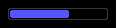

### Compiled example

```kotlin
import dev.s7a.strata.component.ProgressBar
import dev.s7a.strata.component.Stack
import dev.s7a.strata.layout.Alignment
import dev.s7a.strata.modifier.Modifier
import dev.s7a.strata.modifier.background
import dev.s7a.strata.modifier.size
import dev.s7a.strata.render.ArgbColor
import dev.s7a.strata.screen.ScreenDefinition

/**
 * Builds the complete minimal ProgressBar showcase frame.
 */
internal fun createProgressBarShowcaseScreenDefinition(): ScreenDefinition =
    ScreenDefinition("Progress bar") {
        Stack(
            modifier = Modifier.Empty.size(116, 28).background(ArgbColor(0xFF000000.toInt())),
            contentAlignment = Alignment.Center,
        ) {
            ProgressBar(progress = 0.62)
        }
    }
```

### Modifiers

Sizing and placement modifiers compose around `ProgressBar`; its normalized value is immutable component data while the active profile supplies resource-pack-aware fill, completed-fill, and border sprites.

### Parent scope

`ProgressBar` is a top-level extension on the active `UiScope`. The implicit profile resolves the active resource pack before retaining immutable sprite pixels.

<details><summary>Component tree</summary>

The tree mirrors the complete dedicated definition, including the featured component, its minimum parent layout, and the children used to demonstrate its responsibility.

```text
`- Stack [Size(width=116, height=28), Background(color=0xFF000000), StackContentAlignment(alignment=Center)]
  `- ProgressBar [Size(width=100, height=12)]
```

</details>

## Complete screens

These screens exercise the primitives in real vanilla-shaped and Mod-shaped use cases.
Purpose-specific compositions stay in the compiled examples instead of becoming standard components; reusable capabilities remain available as general layout, image, text, input, slot-binding, and player-rendering primitives.

- [Social Interactions](#screen-social)
- [Synchronized inventory](#screen-inventory)
- [Industrial controller](#screen-industrial)
- [Power milestones](#screen-progress)

<a id="screen-social"></a>

## Social Interactions

A Social Interactions reconstruction composes `Text`, `TextField`, `ScrollArea`, `Scrollbar`, `PlayerHead`, and ordinary layout primitives without introducing a purpose-specific SocialEntry component.

A loaded Fabric GameTest requires exact ARGB equality between the native Minecraft screen, the Strata Fabric screen, and the headless frame before this image is accepted.

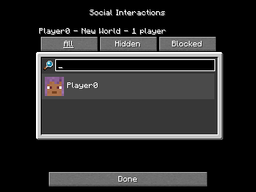

### Compiled screen

```kotlin
import dev.s7a.strata.component.Button
import dev.s7a.strata.component.Column
import dev.s7a.strata.component.Image
import dev.s7a.strata.component.ImageSource
import dev.s7a.strata.component.NineSliceCenterMode
import dev.s7a.strata.component.PlayerHead
import dev.s7a.strata.component.PlayerSkinSource
import dev.s7a.strata.component.Row
import dev.s7a.strata.component.Stack
import dev.s7a.strata.component.Tab
import dev.s7a.strata.component.Text
import dev.s7a.strata.component.TextField
import dev.s7a.strata.component.TextFieldState
import dev.s7a.strata.component.TextStyle
import dev.s7a.strata.geometry.Insets
import dev.s7a.strata.geometry.IntSize
import dev.s7a.strata.layout.Alignment
import dev.s7a.strata.layout.Arrangement
import dev.s7a.strata.layout.HorizontalAlignment
import dev.s7a.strata.layout.VerticalAlignment
import dev.s7a.strata.modifier.Modifier
import dev.s7a.strata.modifier.background
import dev.s7a.strata.modifier.imageBackground
import dev.s7a.strata.modifier.initialFocus
import dev.s7a.strata.modifier.menuBackground
import dev.s7a.strata.modifier.onPress
import dev.s7a.strata.modifier.padding
import dev.s7a.strata.modifier.size
import dev.s7a.strata.render.ArgbColor
import dev.s7a.strata.resource.ResourceId
import dev.s7a.strata.screen.ScreenDefinition

/**
 * Builds the deterministic one-player Minecraft Social Interactions screen from general-purpose primitives.
 *
 * Social-entry composition remains application code: the public runtime supplies PlayerHead, text, actions, images, fields, layout, and active backgrounds without exposing a purpose-specific SocialEntry component.
 *
 * @param panel active-resource `social_interactions/background` source.
 * @param searchIcon active-resource `icon/search` source.
 * @param playerSkin selected player lookup or detached skin source.
 * @param playerName active local player name shown by the native screen.
 * @return one-shot screen definition reproducing the native screen geometry and draw order.
 */
internal fun createSocialScreenDefinition(
    panel: ImageSource = socialPanel,
    searchIcon: ImageSource = socialSearchIcon,
    playerSkin: PlayerSkinSource = PlayerSkinSource.Name("Player0"),
    playerName: String = "Player0",
): ScreenDefinition {
    val search = TextFieldState("", maxLength = 16)
    return ScreenDefinition("Social Interactions") {
        Stack(
            modifier =
                Modifier.Empty
                    .size(320, 240)
                    .background(ArgbColor(0xFF000000.toInt()))
                    .menuBackground(),
        ) {
            Stack(
                modifier = Modifier.Empty.size(320, 176),
                contentAlignment = Alignment.BottomCenter,
            ) {
                Stack(
                    modifier =
                        Modifier.Empty
                            .padding(left = 4)
                            .size(236, 112)
                            .imageBackground(
                                panel,
                                Insets.all(8),
                                NineSliceCenterMode.Tiled,
                            ),
                ) {}
            }
            Column(
                modifier = Modifier.Empty.size(222, 234).align(Alignment.TopCenter),
                verticalArrangement = Arrangement.SpaceBetween,
            ) {
                Column(modifier = Modifier.Empty.padding(top = 12)) {
                    Column(
                        modifier = Modifier.Empty.size(222, 32),
                        spacing = 14,
                    ) {
                        Text(
                            "Social Interactions",
                            modifier = Modifier.Empty.align(HorizontalAlignment.Center),
                        )
                        Text("$playerName - New World - 1 player")
                    }
                    Row(modifier = Modifier.Empty.padding(left = 1, top = 1), spacing = 1) {
                        Tab("All", selected = true, width = 73, modifier = Modifier.Empty.onPress {})
                        Tab("Hidden", selected = false, width = 73, modifier = Modifier.Empty.onPress {})
                        Tab("Blocked", selected = false, width = 73, modifier = Modifier.Empty.onPress {})
                    }
                    Row(
                        modifier = Modifier.Empty.padding(left = 5, top = 9),
                        spacing = 3,
                        verticalAlignment = VerticalAlignment.Center,
                    ) {
                        Image(
                            searchIcon,
                            size = IntSize(12, 12),
                            modifier = Modifier.Empty.padding(top = 2),
                        )
                        TextField(
                            search,
                            size = IntSize(200, 15),
                            textStyle = TextStyle.Normal,
                            modifier = Modifier.Empty.initialFocus(),
                        )
                    }
                    Row(
                        modifier =
                            Modifier.Empty
                                .padding(left = 3, top = 3)
                                .size(216, 32)
                                .background(ArgbColor(0xFF4A4A4A.toInt())),
                        spacing = 4,
                        verticalAlignment = VerticalAlignment.Center,
                    ) {
                        PlayerHead(source = playerSkin, modifier = Modifier.Empty.padding(left = 4))
                        Text(playerName)
                    }
                }
                Button(
                    "Done",
                    width = 200,
                    modifier = Modifier.Empty.align(HorizontalAlignment.Center).onPress {},
                )
            }
        }
    }
}

private val socialPanel = ImageSource.Resource(ResourceId("minecraft", "textures/gui/sprites/social_interactions/background.png"))
private val socialSearchIcon = ImageSource.Resource(ResourceId("minecraft", "textures/gui/sprites/icon/search.png"))
```

### Primitive boundary

The player row remains example-owned because its mute/report relationship is Social-screen domain state. `PlayerHead`, scrolling, text input, text, buttons, and pointer actions remain reusable standard primitives.

<a id="screen-inventory"></a>

## Synchronized inventory

A loaded multiplayer container screen binds its lower grid to the real player inventory and can bind the upper grid to chest, ender-chest, furnace, or custom server-menu storage.

A loaded Fabric client/server GameTest performs authoritative inventory interaction and records the resulting real Fabric screen; this bound screen intentionally has no portable-only headless substitute.

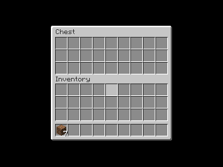

### Compiled screen

```kotlin
import dev.s7a.strata.component.Column
import dev.s7a.strata.component.Grid
import dev.s7a.strata.component.Slot
import dev.s7a.strata.component.SlotBinding
import dev.s7a.strata.component.Slots
import dev.s7a.strata.component.Stack
import dev.s7a.strata.component.Text
import dev.s7a.strata.component.TextStyle
import dev.s7a.strata.layout.Alignment
import dev.s7a.strata.modifier.Modifier
import dev.s7a.strata.modifier.background
import dev.s7a.strata.modifier.containerBackground
import dev.s7a.strata.modifier.menuBackground
import dev.s7a.strata.modifier.padding
import dev.s7a.strata.modifier.size
import dev.s7a.strata.render.ArgbColor
import dev.s7a.strata.screen.ScreenDefinition

/**
 * Builds a generic chest-shaped screen whose lower 36 Slots are bound to the active player's inventory.
 *
 * The upper grid remains empty unless [primaryContainerBinding] is supplied by a server-owned container test.
 * The returned definition requires the Fabric version adapter and is not renderable by the portable-only headless host.
 *
 * @param primaryPlayerBinding binding used by the first hotbar cell.
 * @param primaryContainerBinding optional binding used by the first upper Container cell.
 * @return one-shot screen definition used to verify live item rendering and authoritative container input in a loaded client.
 */
internal fun createInventorySlotScreenDefinition(
    primaryPlayerBinding: SlotBinding = Slots.playerInventory(0),
    primaryContainerBinding: SlotBinding? = null,
): ScreenDefinition =
    ScreenDefinition("Synchronized inventory") {
        Stack(
            modifier =
                Modifier.Empty
                    .size(320, 240)
                    .background(ArgbColor(0xFF000000.toInt()))
                    .menuBackground(),
            contentAlignment = Alignment.Center,
        ) {
            Stack(
                modifier = Modifier.Empty.containerBackground(rows = 3),
                contentAlignment = Alignment.Center,
            ) {
                Column(
                    modifier = Modifier.Empty.size(162, 156),
                    spacing = 3,
                ) {
                    Column(spacing = 2) {
                        Text(
                            "Chest",
                            style = TextStyle.ContainerLabel,
                            modifier = Modifier.Empty.padding(left = 1),
                        )
                        Grid(columns = 9) {
                            repeat(27) { index ->
                                if (index == 0 && primaryContainerBinding != null) {
                                    Slot(bind = primaryContainerBinding)
                                } else {
                                    Slot()
                                }
                            }
                        }
                    }
                    Column {
                        Text(
                            "Inventory",
                            style = TextStyle.ContainerLabel,
                            modifier = Modifier.Empty.padding(left = 1),
                        )
                        Grid(columns = 9, modifier = Modifier.Empty.padding(top = 1)) {
                            repeat(27) { index ->
                                Slot(bind = Slots.playerInventory(9 + index))
                            }
                        }
                        Grid(columns = 9, modifier = Modifier.Empty.padding(top = 4)) {
                            repeat(9) { index ->
                                Slot(
                                    bind =
                                        if (index == 0) {
                                            primaryPlayerBinding
                                        } else {
                                            Slots.playerInventory(index)
                                        },
                                )
                            }
                        }
                    }
                }
            }
        }
    }
```

### Primitive boundary

`Slot` and `SlotBinding` are reusable primitives. The chest-shaped grouping and server menu decide which player, container, ender-chest, furnace, or custom inventory indices each slot binds.

<a id="screen-industrial"></a>

## Industrial controller

A resource-pack-aware Mod controller composes a public custom image, Minecraft text, buttons, and layout primitives into an energy-machine interface.

A loaded Fabric GameTest requires exact ARGB equality between the Strata Fabric screen and the headless frame while resolving assets from Minecraft's active resource manager.

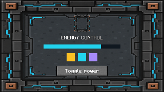

### Compiled screen

```kotlin
import dev.s7a.strata.component.Column
import dev.s7a.strata.component.Grid
import dev.s7a.strata.component.ImageScale
import dev.s7a.strata.component.ImageSource
import dev.s7a.strata.component.Row
import dev.s7a.strata.component.Slot
import dev.s7a.strata.component.SlotBinding
import dev.s7a.strata.component.Slots
import dev.s7a.strata.component.Spacer
import dev.s7a.strata.component.Stack
import dev.s7a.strata.component.Text
import dev.s7a.strata.component.UiScope
import dev.s7a.strata.layout.Alignment
import dev.s7a.strata.layout.Arrangement
import dev.s7a.strata.layout.HorizontalAlignment
import dev.s7a.strata.layout.VerticalAlignment
import dev.s7a.strata.modifier.Modifier
import dev.s7a.strata.modifier.background
import dev.s7a.strata.modifier.imageBackground
import dev.s7a.strata.modifier.menuBackground
import dev.s7a.strata.modifier.padding
import dev.s7a.strata.modifier.size
import dev.s7a.strata.render.ArgbColor
import dev.s7a.strata.resource.ResourceId
import dev.s7a.strata.screen.ScreenDefinition

/**
 * Builds a resource-pack-aware coal generator screen from general-purpose components.
 *
 * The default fuel and charge slots address the active server-owned container while the lower grid addresses the player's inventory through the active menu.
 * Tests that exercise the same pixels without a live menu may supply null bindings without changing the component structure.
 *
 * @param panel active Mod-resource panel source.
 * @param fuelBinding server-owned combustible-input slot.
 * @param chargeBinding server-owned chargeable-item slot.
 * @param playerInventory resolves each logical player-inventory index used by the lower grid.
 * @return one-shot definition containing only reusable layout, image-background, text, gauge, and slot primitives.
 */
internal fun createIndustrialScreenDefinition(
    panel: ImageSource = coalGeneratorPanel,
    fuelBinding: SlotBinding? = Slots.container(0),
    chargeBinding: SlotBinding? = Slots.container(1),
    playerInventory: (Int) -> SlotBinding? = Slots::playerInventory,
): ScreenDefinition =
    ScreenDefinition("Coal Generator") {
        Stack(
            modifier =
                Modifier.Empty
                    .size(320, 180)
                    .background(ArgbColor(0xFF000000.toInt()))
                    .menuBackground(),
            contentAlignment = Alignment.Center,
        ) {
            Stack(
                modifier =
                    Modifier.Empty
                        .size(176, 166)
                        .imageBackground(panel, ImageScale.Stretch),
            ) {
                Column(
                    modifier = Modifier.Empty.padding(left = 7, top = 5, right = 7, bottom = 7),
                    spacing = 5,
                ) {
                    Text("Coal Generator")
                    Row(
                        modifier = Modifier.Empty.size(162, 36),
                        horizontalArrangement = Arrangement.SpaceBetween,
                        verticalAlignment = VerticalAlignment.Center,
                    ) {
                        machineSlot("Fuel", fuelBinding)
                        Column(
                            spacing = 3,
                            horizontalAlignment = HorizontalAlignment.Center,
                        ) {
                            Text("32 E/t")
                            Stack(
                                modifier = Modifier.Empty.size(54, 8).background(bufferTrackColor),
                                contentAlignment = Alignment.CenterStart,
                            ) {
                                Spacer(modifier = Modifier.Empty.size(41, 6).background(bufferFillColor))
                            }
                        }
                        machineSlot("Charge", chargeBinding)
                    }
                    Column(spacing = 1) {
                        Text("Inventory")
                        Grid(columns = 9) {
                            repeat(27) { index ->
                                Slot(bind = playerInventory(9 + index))
                            }
                        }
                        Grid(columns = 9, modifier = Modifier.Empty.padding(top = 4)) {
                            repeat(9) { index ->
                                Slot(bind = playerInventory(index))
                            }
                        }
                    }
                }
            }
        }
    }

private fun UiScope.machineSlot(
    label: String,
    binding: SlotBinding?,
) {
    this.Column(
        spacing = 1,
        horizontalAlignment = HorizontalAlignment.Center,
    ) {
        Text(label)
        Slot(bind = binding)
    }
}

private val coalGeneratorPanel = ImageSource.Resource(ResourceId("strata_test", "textures/gui/coal_generator.png"))
private val bufferTrackColor = ArgbColor(0xFF1A2226.toInt())
private val bufferFillColor = ArgbColor(0xFF20C7DF.toInt())
```

### Primitive boundary

The runtime supplies general image, background, text, button, slot, and input primitives. Energy capacity, charge state, machine recipes, and networking remain application-owned state and server protocol.

<a id="screen-progress"></a>

## Power milestones

An advancement-inspired Mod progression screen composes active vanilla advancement assets with an application-owned downstream graph component.

A loaded Fabric GameTest requires exact ARGB equality between the Strata Fabric screen and the headless frame while resolving assets from Minecraft's active resource manager.

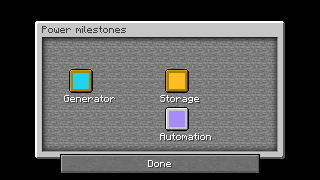

### Compiled screen

```kotlin
import dev.s7a.strata.component.Button
import dev.s7a.strata.component.Column
import dev.s7a.strata.component.Image
import dev.s7a.strata.component.ImageScale
import dev.s7a.strata.component.ImageSource
import dev.s7a.strata.component.Row
import dev.s7a.strata.component.Spacer
import dev.s7a.strata.component.Stack
import dev.s7a.strata.component.Text
import dev.s7a.strata.component.TextStyle
import dev.s7a.strata.component.UiScope
import dev.s7a.strata.element.ElementKey
import dev.s7a.strata.geometry.IntRect
import dev.s7a.strata.layout.Alignment
import dev.s7a.strata.layout.Arrangement
import dev.s7a.strata.layout.HorizontalAlignment
import dev.s7a.strata.layout.VerticalAlignment
import dev.s7a.strata.modifier.Modifier
import dev.s7a.strata.modifier.background
import dev.s7a.strata.modifier.imageBackground
import dev.s7a.strata.modifier.menuBackground
import dev.s7a.strata.modifier.onPress
import dev.s7a.strata.modifier.padding
import dev.s7a.strata.modifier.size
import dev.s7a.strata.render.ArgbColor
import dev.s7a.strata.resource.ResourceId
import dev.s7a.strata.screen.ScreenDefinition

/**
 * Builds one advancement-inspired Mod screen from resource-pack sources and an application-owned component.
 *
 * The standard runtime remains limited to reusable primitives; [ExampleProgressGraph] may encode this Mod's progression domain because it remains downstream application code.
 *
 * @param window active advancement-window source.
 * @param background active advancement-background tile source.
 * @param obtained active obtained task-frame source.
 * @param unobtained active unobtained task-frame source.
 * @return one-shot definition for the verified Fabric and headless screen.
 */
internal fun createProgressScreenDefinition(
    window: ImageSource = advancementWindow,
    background: ImageSource = advancementBackground,
    obtained: ImageSource = obtainedTaskFrame,
    unobtained: ImageSource = unobtainedTaskFrame,
): ScreenDefinition =
    ScreenDefinition("Power milestones") {
        Stack(
            modifier =
                Modifier.Empty
                    .size(320, 180)
                    .background(ArgbColor(0xFF000000.toInt()))
                    .menuBackground(),
            contentAlignment = Alignment.Center,
        ) {
            Stack(modifier = Modifier.Empty.size(252, 140)) {
                Image(window, sourceRegion = IntRect(0, 0, 252, 140))
                Column(
                    modifier = Modifier.Empty.padding(left = 9, top = 6, right = 9, bottom = 9),
                    spacing = 4,
                    horizontalAlignment = HorizontalAlignment.Center,
                ) {
                    Text("Power milestones", style = TextStyle.ContainerLabel)
                    ExampleProgressGraph(background, obtained, unobtained)
                }
            }
            Button(
                "Done",
                width = 200,
                modifier =
                    Modifier.Empty
                        .padding(bottom = 6)
                        .align(Alignment.BottomCenter)
                        .onPress {},
            )
        }
    }

/**
 * Emits one application-owned progression graph by composing only public Strata primitives.
 *
 * This downstream component is deliberately not part of the standard runtime because its node meanings and progression domain belong to the application.
 * It retains no callback or scope after synchronous emission.
 *
 * @receiver active owner-thread UI scope.
 * @param background immutable or resource-backed background tile.
 * @param obtained immutable or resource-backed obtained frame.
 * @param unobtained immutable or resource-backed unobtained frame.
 * @param modifier active behavior surrounding the fixed graph.
 * @param key optional stable sibling identity.
 * @throws IllegalStateException when used from another thread or outside its callback lifetime.
 */
internal fun UiScope.ExampleProgressGraph(
    background: ImageSource,
    obtained: ImageSource,
    unobtained: ImageSource,
    modifier: Modifier = Modifier.Empty,
    key: ElementKey<*>? = null,
) {
    Row(
        modifier = modifier.size(234, 113).imageBackground(background, ImageScale.Tile),
        key = key,
        horizontalArrangement = Arrangement.Center,
        verticalAlignment = VerticalAlignment.Center,
    ) {
        progressNode(obtained, ArgbColor(0xFF22D3EE.toInt()), "Generator")
        Spacer(modifier = Modifier.Empty.size(32, 2).background(connectionColor))
        Column(
            spacing = 4,
            horizontalAlignment = HorizontalAlignment.Center,
        ) {
            progressNode(obtained, ArgbColor(0xFFFBBF24.toInt()), "Storage")
            Spacer(modifier = Modifier.Empty.size(2, 12).background(connectionColor))
            progressNode(unobtained, ArgbColor(0xFFA78BFA.toInt()), "Automation")
        }
    }
}

private fun UiScope.progressNode(
    frame: ImageSource,
    color: ArgbColor,
    label: String,
) {
    this.Column(
        horizontalAlignment = HorizontalAlignment.Center,
        spacing = 1,
    ) {
        Stack(
            modifier = Modifier.Empty.size(26, 26),
            contentAlignment = Alignment.Center,
        ) {
            Image(frame)
            Spacer(modifier = Modifier.Empty.size(16, 16).background(color))
        }
        Text(label)
    }
}

private val advancementWindow = ImageSource.Resource(ResourceId("minecraft", "textures/gui/advancements/window.png"))
private val advancementBackground = ImageSource.Resource(ResourceId("minecraft", "textures/gui/advancements/backgrounds/stone.png"))
private val obtainedTaskFrame = ImageSource.Resource(ResourceId("minecraft", "textures/gui/sprites/advancements/task_frame_obtained.png"))
private val unobtainedTaskFrame = ImageSource.Resource(ResourceId("minecraft", "textures/gui/sprites/advancements/task_frame_unobtained.png"))
private val connectionColor = ArgbColor(0xFF7A7A7A.toInt())
```

### Primitive boundary

`ExampleProgressGraph` deliberately stays in downstream example code because milestone names and graph meaning are specific to this Mod. Images, backgrounds, text, buttons, layout, and pointer actions remain reusable primitives.
