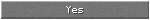

<!-- Generated file. Do not edit. -->

# Button

Button renders verified fixed-height Minecraft sprite and label states, including the native 150- and 200-pixel widths, while reusable input actions live in modifiers.

This image is a 150 by 20 component crop from the exact native/Fabric/headless parity frame recorded in [the verification receipt](minecraft-26.2-parity.properties).



## Compiled example

```kotlin
import dev.s7a.strata.dsl.buildUi
import dev.s7a.strata.element.Element
import dev.s7a.strata.modifier.Modifier
import dev.s7a.strata.modifier.onHover
import dev.s7a.strata.modifier.onPress
import dev.s7a.strata.runtime.minecraft.MinecraftUiContext

/**
 * Builds the pointer Button used by the verified ConfirmScreen action row.
 *
 * @return callback-lifetime content using the implicit Minecraft component context.
 */
internal fun buttonExample(): MinecraftUiContext.() -> Element =
    {
        buildUi {
            Button(
                "Yes",
                modifier =
                    Modifier.Empty
                        .onPress {}
                        .onHover {},
            )
        }
    }
```

## Modifiers

Pointer behavior is active modifier behavior. `onPointerEvent`, `onPress`, `onRelease`, `onMove`, `onDrag`, `onScroll`, and `onHover` can be composed without adding component-specific callback parameters.

## Parent scope

`Button` is a member extension on the active `UiScope`. The runtime supplies `MinecraftUiContext` implicitly, and pointer event modifiers remain valid only through their retained modifier-node lifetime.

<details><summary>Component tree</summary>

The tree shows the featured Minecraft component; platform-neutral layout scaffolding remains visible in the compiled source.

```text
`- Button
```

</details>
