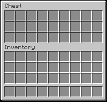

<!-- Generated file. Do not edit. -->

# ContainerBackground

ContainerBackground reproduces the generic chest panel's row-dependent height and exact upper-then-lower `generic_54.png` blits.

This image is a 176 by 168 component crop from the exact native/Fabric/headless parity frame recorded in [the verification receipt](minecraft-26.2-parity.properties).



## Compiled example

```kotlin
import dev.s7a.strata.dsl.Box
import dev.s7a.strata.dsl.buildUi
import dev.s7a.strata.geometry.Insets
import dev.s7a.strata.modifier.Modifier
import dev.s7a.strata.modifier.background
import dev.s7a.strata.modifier.fillMaxSize
import dev.s7a.strata.modifier.padding
import dev.s7a.strata.modifier.size
import dev.s7a.strata.render.ArgbColor
import dev.s7a.strata.runtime.minecraft.MinecraftScreenDefinition
import dev.s7a.strata.runtime.minecraft.MinecraftTextStyle
import dev.s7a.strata.runtime.minecraft.createMinecraftScreenDefinition

/**
 * Builds the draw-command-equivalent unhovered background of an empty three-row Minecraft 26.2 chest screen.
 *
 * Empty unhovered native Slots emit no command, so this component-focused path is pixel-identical to the actual ContainerScreen while retaining only the background and labels that contribute pixels.
 *
 * @return one-shot screen definition reproducing the menu texture, generic container, and native shadow-free labels.
 */
internal fun createContainerBackgroundScreenDefinition(): MinecraftScreenDefinition =
    createMinecraftScreenDefinition("Chest") {
        buildUi {
            Box(
                modifier =
                    Modifier.Empty
                        .size(320, 240)
                        .background(ArgbColor(0xFF000000.toInt())),
            ) {
                MenuBackground(modifier = Modifier.Empty.fillMaxSize())
                ContainerBackground(
                    rows = 3,
                    modifier = Modifier.Empty.padding(Insets(left = 72, top = 36)),
                )
                Text(
                    "Chest",
                    style = MinecraftTextStyle.ContainerLabel,
                    modifier = Modifier.Empty.padding(Insets(left = 80, top = 42)),
                )
                Text(
                    "Inventory",
                    style = MinecraftTextStyle.ContainerLabel,
                    modifier = Modifier.Empty.padding(Insets(left = 80, top = 110)),
                )
            }
        }
    }
```

## Modifiers

Sizing and placement modifiers position the fixed 176-pixel-wide panel; `rows` selects the native one-through-six-row height and texture regions.

## Parent scope

`ContainerBackground` is a leaf member extension on the active `UiScope`. The implicit runtime context supplies the selected `generic_54.png` snapshot, and the component exposes no content scope or parent data.

<details><summary>Component tree</summary>

The tree shows the featured Minecraft component; platform-neutral layout scaffolding remains visible in the compiled source.

```text
`- ContainerBackground [ContainerRows(value=3), Size(width=176, height=168)]
```

</details>
