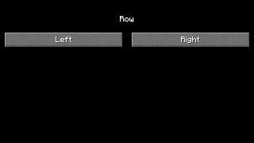

<!-- Generated file. Do not edit. -->

# Row

Row lays out direct children horizontally with typed spacing, arrangement, and vertical alignment.

This image is a 320 by 180 crop from the exact native/Fabric/headless parity frame recorded in [the verification receipt](minecraft-26.2-parity.properties).



## Compiled example

```kotlin
import dev.s7a.strata.dsl.Column
import dev.s7a.strata.dsl.Row
import dev.s7a.strata.dsl.RowScope
import dev.s7a.strata.dsl.Spacer
import dev.s7a.strata.layout.HorizontalAlignment
import dev.s7a.strata.modifier.Modifier
import dev.s7a.strata.modifier.height
import dev.s7a.strata.modifier.size
import dev.s7a.strata.runtime.minecraft.MinecraftUiContext

/**
 * Builds the Row panel used by the native, Fabric, and headless parity paths.
 *
 * @param minecraft callback-lifetime Minecraft component context.
 */
internal fun RowScope.rowPanel(minecraft: MinecraftUiContext) {
    Column(
        modifier = Modifier.Empty.size(320, 180),
        horizontalAlignment = HorizontalAlignment.Center,
    ) {
        Spacer(modifier = Modifier.Empty.height(20))
        with(minecraft) { Text("Row") }
        Spacer(modifier = Modifier.Empty.height(11))
        Row(spacing = 10) {
            with(minecraft) { Button("Left") }
            with(minecraft) { Button("Right") }
        }
    }
}
```

## Modifiers

The compiled panel fixes its outer size, uses Spacer height modifiers for vertical placement, and sets Row spacing to 10. Its Minecraft button children use no RowScope parent data.

## Parent scope

Row's content callback runs with RowScope; weight and vertical align modifiers apply only to direct children while that scope is active.

<details><summary>Component tree</summary>

The tree shows layout components; Minecraft text and pointer-button leaves are omitted and remain visible in the compiled source.

```text
`- Column [Size(width=320, height=180), ColumnDefaultAlignment(alignment=Center)]
  |- Spacer [Height(value=20)]
  |- Spacer [Height(value=11)]
  `- Row [Spacing(value=10)]
```

</details>
