<!-- Generated by :integration:docs:generateReadmeDemo. Do not edit. -->

# Add components. Let the layout make room.

Three players first demonstrate added content, fixed widths, and text alignment; five more then arrive one at a time before scrolling is added.
Every screen is freshly rendered by Strata Headless from the compiled Kotlin example and original Minecraft assets.
Overflow during the five short arrival frames is intentional: ScrollArea then contains the list, and a separately added Scrollbar shares its state.
The GIF compares source revisions; it does not demonstrate hot reload or an in-game invitation service.

[Play the 34-second GIF](demo.gif) · [Render receipt](render.properties)

## 1. Start with a row

Each row takes the width of its contents.

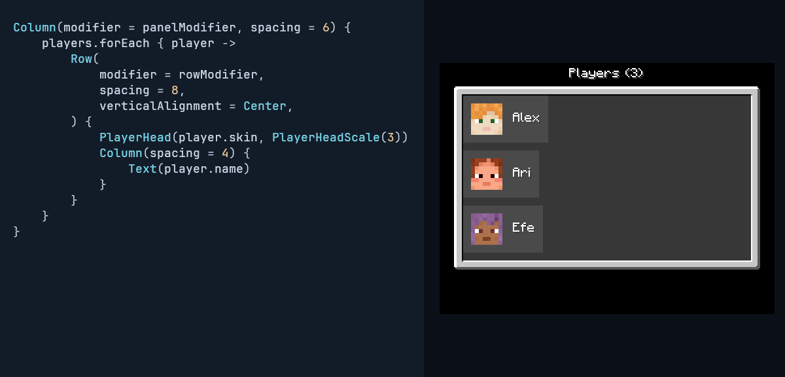

[Complete screen pixels](1-basic-screen.png) · [Compiled source](../../integration/docs/src/readmeExamples/kotlin/dev/s7a/strata/integration/docs/example/BasicPlayersExample.kt)

<details><summary>Source shown in this frame</summary>

```kotlin
Column(modifier = panelModifier, spacing = 6) {
    players.forEach { player ->
        Row(
            modifier = rowModifier,
            spacing = 8,
            verticalAlignment = Center,
        ) {
            PlayerHead(player.skin, PlayerHeadScale(3))
            Column(spacing = 4) {
                Text(player.name)
            }
        }
    }
}
```

</details>

## 2. Add secondary text

One Text adds a role to every player.

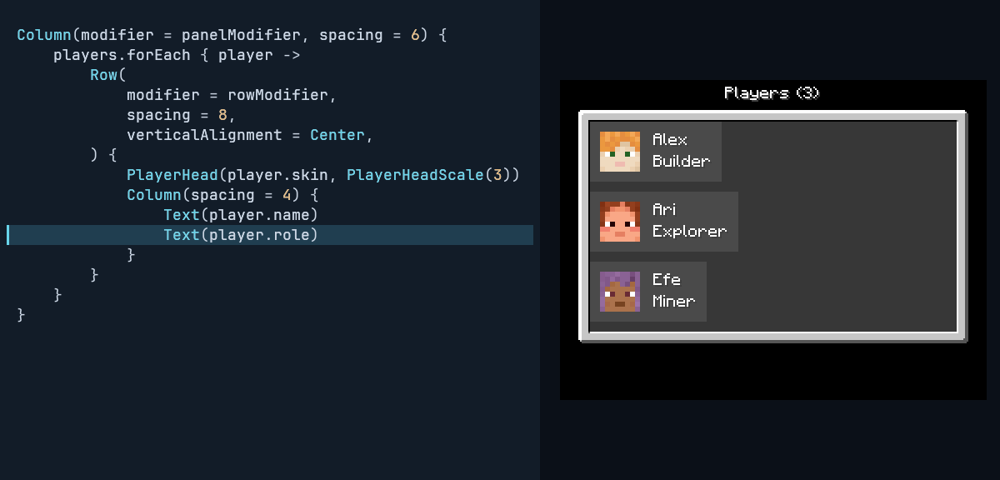

[Complete screen pixels](2-roles-screen.png) · [Compiled source](../../integration/docs/src/readmeExamples/kotlin/dev/s7a/strata/integration/docs/example/RolesPlayersExample.kt)

<details><summary>Source shown in this frame</summary>

```kotlin
Column(modifier = panelModifier, spacing = 6) {
    players.forEach { player ->
        Row(
            modifier = rowModifier,
            spacing = 8,
            verticalAlignment = Center,
        ) {
            PlayerHead(player.skin, PlayerHeadScale(3))
            Column(spacing = 4) {
                Text(player.name)
                Text(player.role)
            }
        }
    }
}
```

</details>

## 3. Add a button

One Button extends every row without calculating its position.

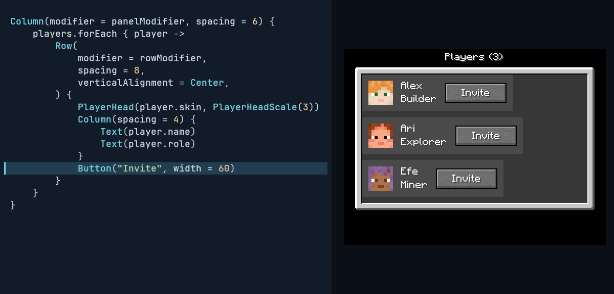

[Complete screen pixels](3-actions-screen.png) · [Compiled source](../../integration/docs/src/readmeExamples/kotlin/dev/s7a/strata/integration/docs/example/ActionsPlayersExample.kt)

<details><summary>Source shown in this frame</summary>

```kotlin
Column(modifier = panelModifier, spacing = 6) {
    players.forEach { player ->
        Row(
            modifier = rowModifier,
            spacing = 8,
            verticalAlignment = Center,
        ) {
            PlayerHead(player.skin, PlayerHeadScale(3))
            Column(spacing = 4) {
                Text(player.name)
                Text(player.role)
            }
            Button("Invite", width = 60)
        }
    }
}
```

</details>

## 4. Fix the row width

Set a fixed row width and give the text the remaining space with weight.

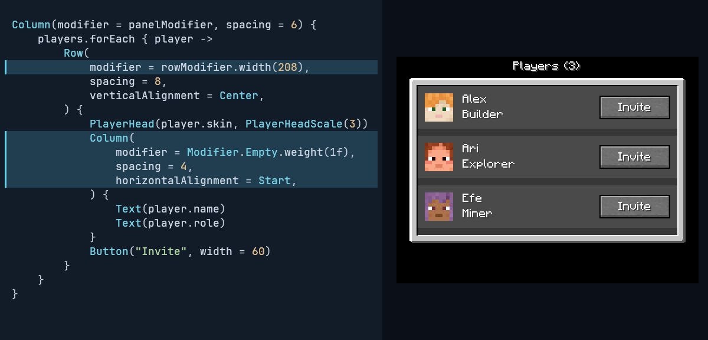

[Complete screen pixels](4-fixed-screen.png) · [Compiled source](../../integration/docs/src/readmeExamples/kotlin/dev/s7a/strata/integration/docs/example/FixedPlayersExample.kt)

<details><summary>Source shown in this frame</summary>

```kotlin
Column(modifier = panelModifier, spacing = 6) {
    players.forEach { player ->
        Row(
            modifier = rowModifier.width(208),
            spacing = 8,
            verticalAlignment = Center,
        ) {
            PlayerHead(player.skin, PlayerHeadScale(3))
            Column(
                modifier = Modifier.Empty.weight(1f),
                spacing = 4,
                horizontalAlignment = Start,
            ) {
                Text(player.name)
                Text(player.role)
            }
            Button("Invite", width = 60)
        }
    }
}
```

</details>

## 5. Align text to the right

End aligns names and roles; row frames, faces, and buttons stay still.

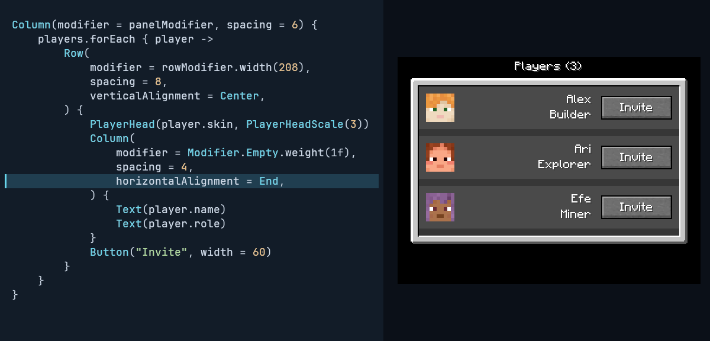

[Complete screen pixels](5-right-screen.png) · [Compiled source](../../integration/docs/src/readmeExamples/kotlin/dev/s7a/strata/integration/docs/example/RightPlayersExample.kt)

<details><summary>Source shown in this frame</summary>

```kotlin
Column(modifier = panelModifier, spacing = 6) {
    players.forEach { player ->
        Row(
            modifier = rowModifier.width(208),
            spacing = 8,
            verticalAlignment = Center,
        ) {
            PlayerHead(player.skin, PlayerHeadScale(3))
            Column(
                modifier = Modifier.Empty.weight(1f),
                spacing = 4,
                horizontalAlignment = End,
            ) {
                Text(player.name)
                Text(player.role)
            }
            Button("Invite", width = 60)
        }
    }
}
```

</details>

## 6. Align text to the left

Start moves only the text back to the left.

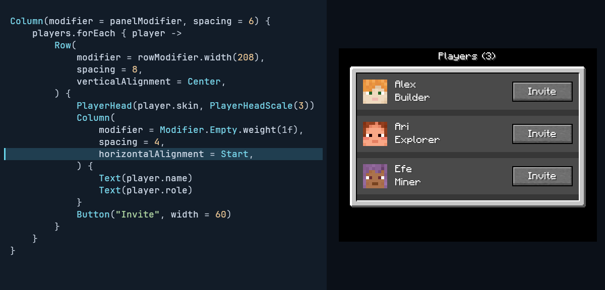

[Complete screen pixels](6-left-screen.png) · [Compiled source](../../integration/docs/src/readmeExamples/kotlin/dev/s7a/strata/integration/docs/example/LeftPlayersExample.kt)

<details><summary>Source shown in this frame</summary>

```kotlin
Column(modifier = panelModifier, spacing = 6) {
    players.forEach { player ->
        Row(
            modifier = rowModifier.width(208),
            spacing = 8,
            verticalAlignment = Center,
        ) {
            PlayerHead(player.skin, PlayerHeadScale(3))
            Column(
                modifier = Modifier.Empty.weight(1f),
                spacing = 4,
                horizontalAlignment = Start,
            ) {
                Text(player.name)
                Text(player.role)
            }
            Button("Invite", width = 60)
        }
    }
}
```

</details>

## 7. Add a fourth player

The same row composition is reused as the list starts to overflow.

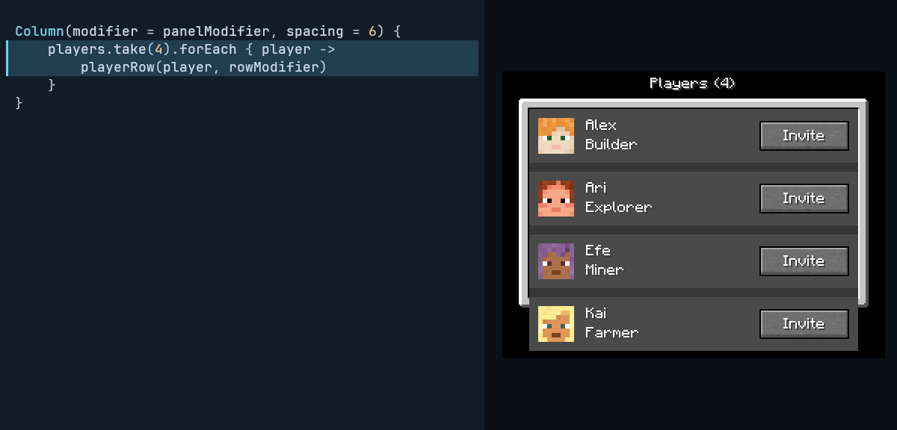

[Complete screen pixels](7-four-screen.png) · [Compiled source](../../integration/docs/src/readmeExamples/kotlin/dev/s7a/strata/integration/docs/example/FourPlayersExample.kt)

<details><summary>Source shown in this frame</summary>

```kotlin
Column(modifier = panelModifier, spacing = 6) {
    players.take(4).forEach { player ->
        playerRow(player, rowModifier)
    }
}
```

</details>

## 8. Add a fifth player

Players arrive one at a time.


[Complete screen pixels](8-five-screen.png) · [Compiled source](../../integration/docs/src/readmeExamples/kotlin/dev/s7a/strata/integration/docs/example/FivePlayersExample.kt)

<details><summary>Source shown in this frame</summary>

```kotlin
Column(modifier = panelModifier, spacing = 6) {
    players.take(5).forEach { player ->
        playerRow(player, rowModifier)
    }
}
```

</details>

## 9. Add a sixth player

The list is now taller than the screen.


[Complete screen pixels](9-six-screen.png) · [Compiled source](../../integration/docs/src/readmeExamples/kotlin/dev/s7a/strata/integration/docs/example/SixPlayersExample.kt)

<details><summary>Source shown in this frame</summary>

```kotlin
Column(modifier = panelModifier, spacing = 6) {
    players.take(6).forEach { player ->
        playerRow(player, rowModifier)
    }
}
```

</details>

## 10. Add a seventh player

Additional rows cannot be reached yet.

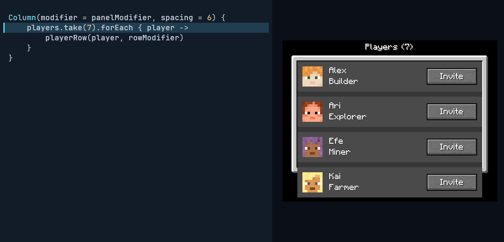

[Complete screen pixels](10-seven-screen.png) · [Compiled source](../../integration/docs/src/readmeExamples/kotlin/dev/s7a/strata/integration/docs/example/SevenPlayersExample.kt)

<details><summary>Source shown in this frame</summary>

```kotlin
Column(modifier = panelModifier, spacing = 6) {
    players.take(7).forEach { player ->
        playerRow(player, rowModifier)
    }
}
```

</details>

## 11. Add an eighth player

Eight players now need a scroll viewport.


[Complete screen pixels](11-eight-screen.png) · [Compiled source](../../integration/docs/src/readmeExamples/kotlin/dev/s7a/strata/integration/docs/example/EightPlayersExample.kt)

<details><summary>Source shown in this frame</summary>

```kotlin
Column(modifier = panelModifier, spacing = 6) {
    players.take(8).forEach { player ->
        playerRow(player, rowModifier)
    }
}
```

</details>

## 12. Add a scroll area

Wrap the existing Column in ScrollArea to contain the list.

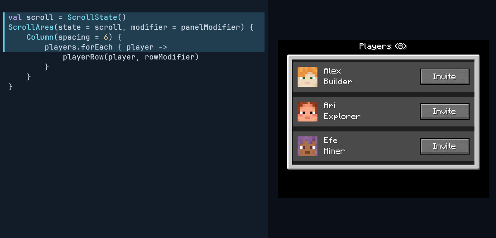

[Complete screen pixels](12-area-screen.png) · [Compiled source](../../integration/docs/src/readmeExamples/kotlin/dev/s7a/strata/integration/docs/example/AreaPlayersExample.kt)

<details><summary>Source shown in this frame</summary>

```kotlin
val scroll = ScrollState()
ScrollArea(state = scroll, modifier = panelModifier) {
    Column(spacing = 6) {
        players.forEach { player ->
            playerRow(player, rowModifier)
        }
    }
}
```

</details>

## 13. Scroll without a bar

Wheel input reaches the final players; no scrollbar has been added yet.

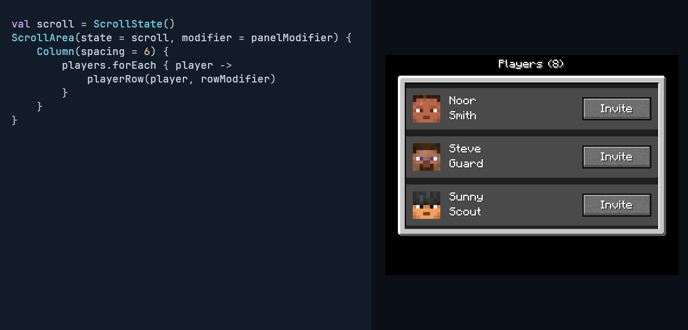

[Complete screen pixels](13-areabottom-screen.png) · [Compiled source](../../integration/docs/src/readmeExamples/kotlin/dev/s7a/strata/integration/docs/example/AreaPlayersExample.kt)

<details><summary>Source shown in this frame</summary>

```kotlin
val scroll = ScrollState()
ScrollArea(state = scroll, modifier = panelModifier) {
    Column(spacing = 6) {
        players.forEach { player ->
            playerRow(player, rowModifier)
        }
    }
}
```

</details>

## 14. Add a linked scrollbar

Pass the same ScrollState to Scrollbar; its thumb reflects the list position.

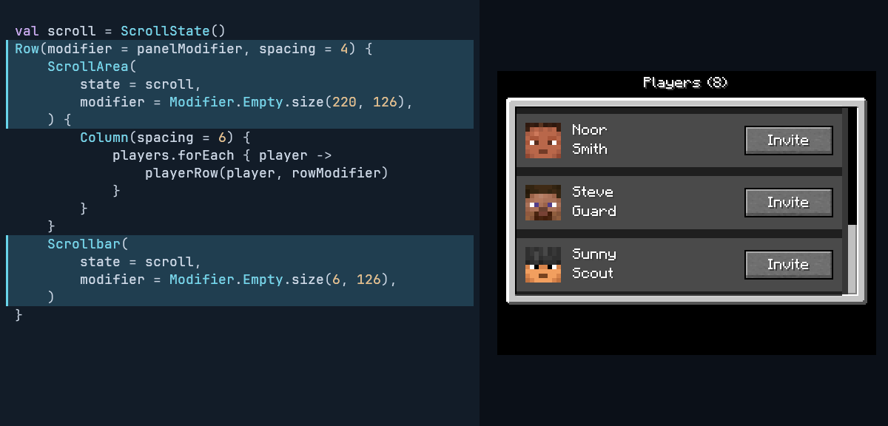

[Complete screen pixels](14-bar-screen.png) · [Compiled source](../../integration/docs/src/readmeExamples/kotlin/dev/s7a/strata/integration/docs/example/ScrollPlayersExample.kt)

<details><summary>Source shown in this frame</summary>

```kotlin
val scroll = ScrollState()
Row(modifier = panelModifier, spacing = 4) {
    ScrollArea(
        state = scroll,
        modifier = Modifier.Empty.size(220, 126),
    ) {
        Column(spacing = 6) {
            players.forEach { player ->
                playerRow(player, rowModifier)
            }
        }
    }
    Scrollbar(
        state = scroll,
        modifier = Modifier.Empty.size(6, 126),
    )
}
```

</details>

## 15. Scroll up together

The list and linked scrollbar move together under wheel input.

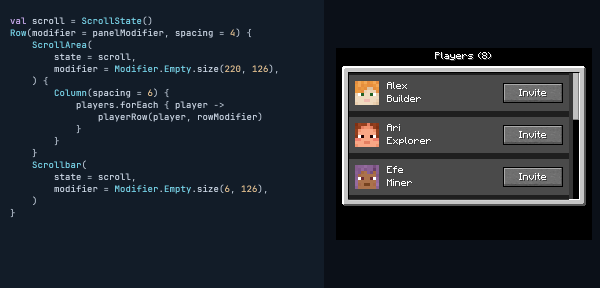

[Complete screen pixels](15-bartop-screen.png) · [Compiled source](../../integration/docs/src/readmeExamples/kotlin/dev/s7a/strata/integration/docs/example/ScrollPlayersExample.kt)

<details><summary>Source shown in this frame</summary>

```kotlin
val scroll = ScrollState()
Row(modifier = panelModifier, spacing = 4) {
    ScrollArea(
        state = scroll,
        modifier = Modifier.Empty.size(220, 126),
    ) {
        Column(spacing = 6) {
            players.forEach { player ->
                playerRow(player, rowModifier)
            }
        }
    }
    Scrollbar(
        state = scroll,
        modifier = Modifier.Empty.size(6, 126),
    )
}
```

</details>

## 16. Scroll down together

The linked thumb follows the list back to its last player.

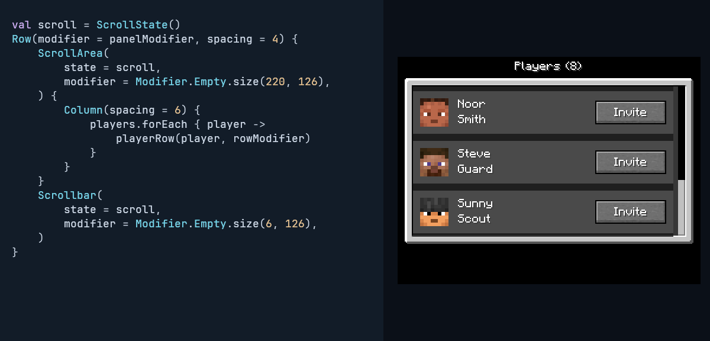

[Complete screen pixels](16-barbottom-screen.png) · [Compiled source](../../integration/docs/src/readmeExamples/kotlin/dev/s7a/strata/integration/docs/example/ScrollPlayersExample.kt)

<details><summary>Source shown in this frame</summary>

```kotlin
val scroll = ScrollState()
Row(modifier = panelModifier, spacing = 4) {
    ScrollArea(
        state = scroll,
        modifier = Modifier.Empty.size(220, 126),
    ) {
        Column(spacing = 6) {
            players.forEach { player ->
                playerRow(player, rowModifier)
            }
        }
    }
    Scrollbar(
        state = scroll,
        modifier = Modifier.Empty.size(6, 126),
    )
}
```

</details>

## Running the example

The final example accepts immutable `ReadmePlayer` values with names, roles, and detached `PlayerSkinSource.Pixels` skins.
Copy [the final screen](../../integration/docs/src/readmeExamples/kotlin/dev/s7a/strata/integration/docs/example/ScrollPlayersExample.kt), [the player model](../../integration/docs/src/readmeExamples/kotlin/dev/s7a/strata/integration/docs/example/ReadmePlayer.kt), [the screen chrome](../../integration/docs/src/readmeExamples/kotlin/dev/s7a/strata/integration/docs/example/ReadmeDemoChrome.kt), [the row composition](../../integration/docs/src/readmeExamples/kotlin/dev/s7a/strata/integration/docs/example/ReadmePlayerRow.kt), and [the colors](../../integration/docs/src/readmeExamples/kotlin/dev/s7a/strata/integration/docs/example/ReadmeDemoColors.kt) into a Mod using Strata, then call `scrollPlayersScreen(players, panel).open()`.
Supply the original Minecraft Social Interactions panel as an `ImageSource` alongside the player data; headless generation supplies detached pixels from the same asset.
The `Invite` button demonstrates layout only; add an `onActivate` modifier to connect application behavior.

See [generation instructions](../development/documentation.md#readme-code-and-screen-demo) for fresh generation and verification.
