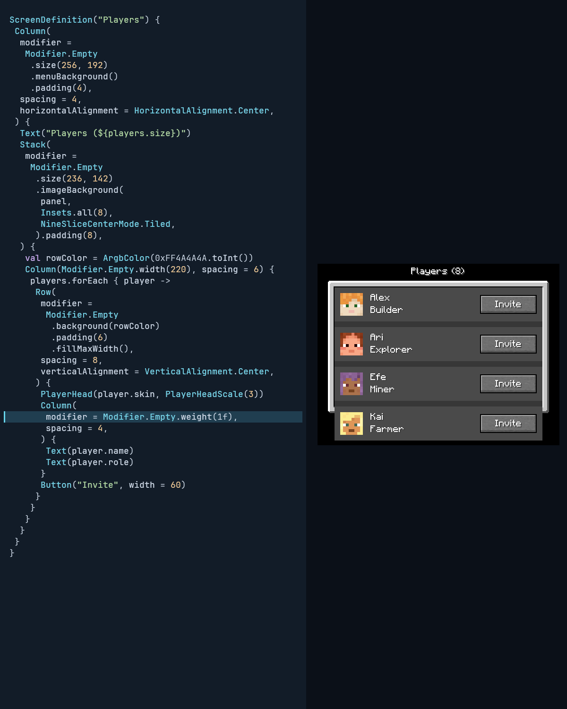
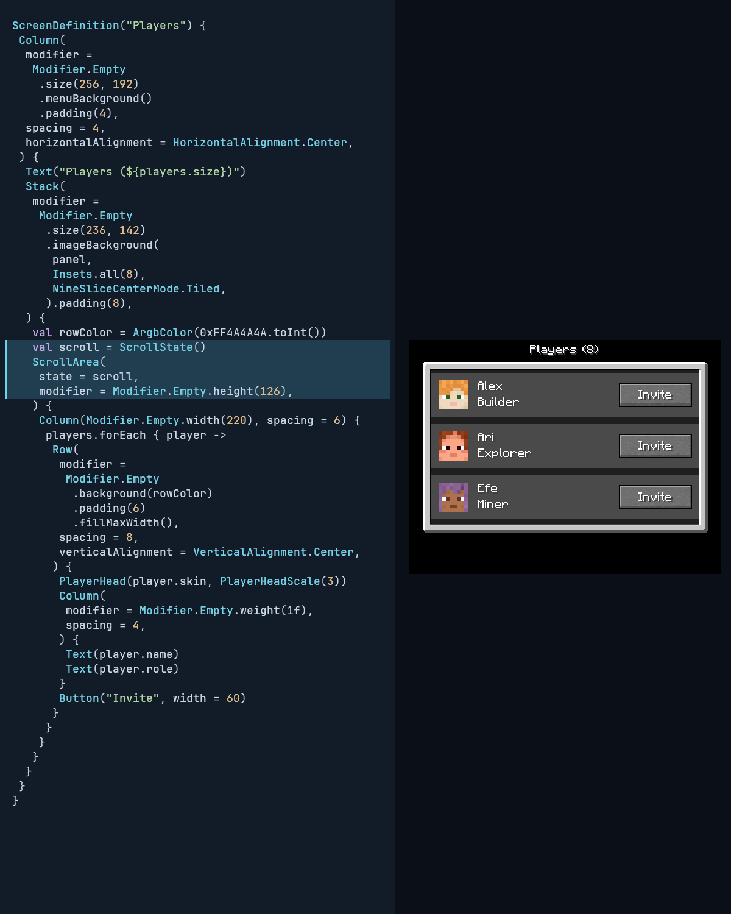
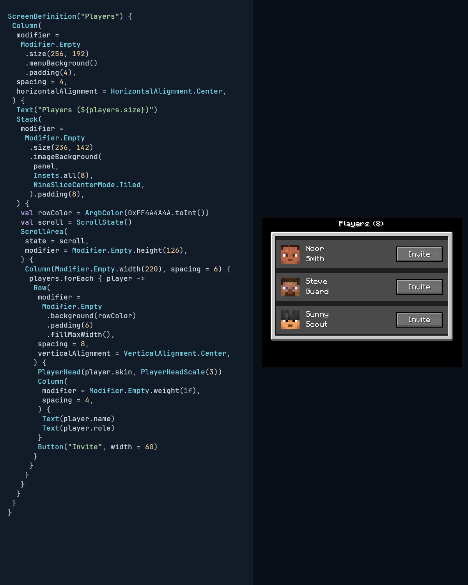
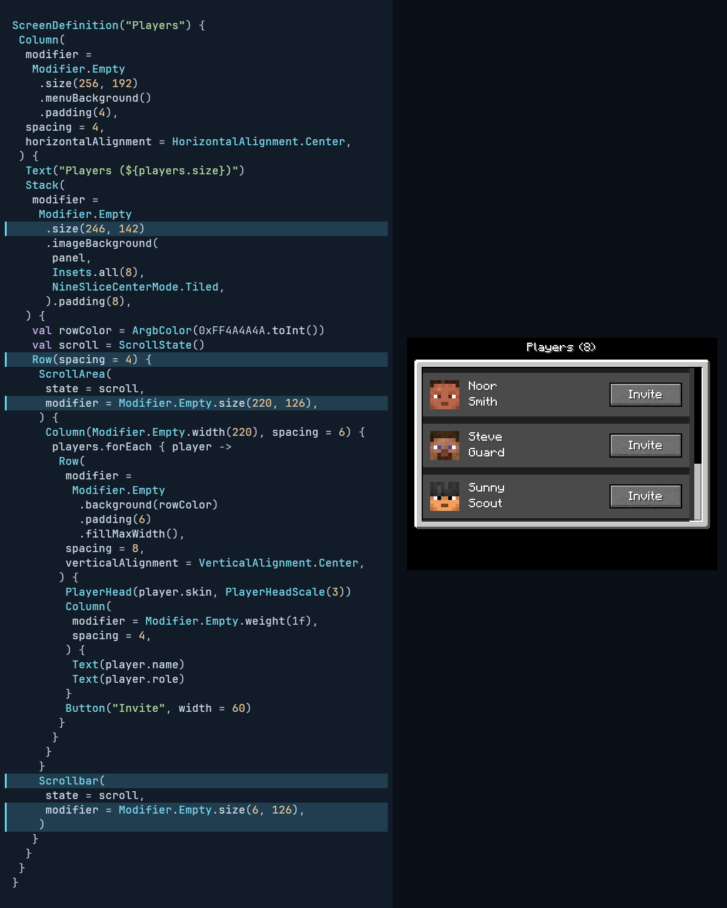
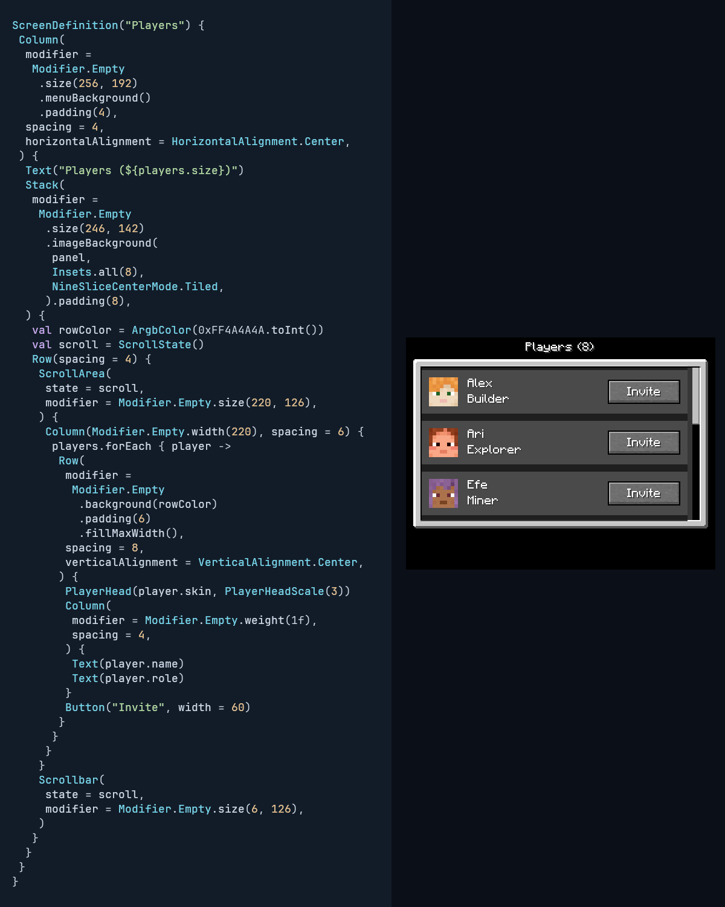
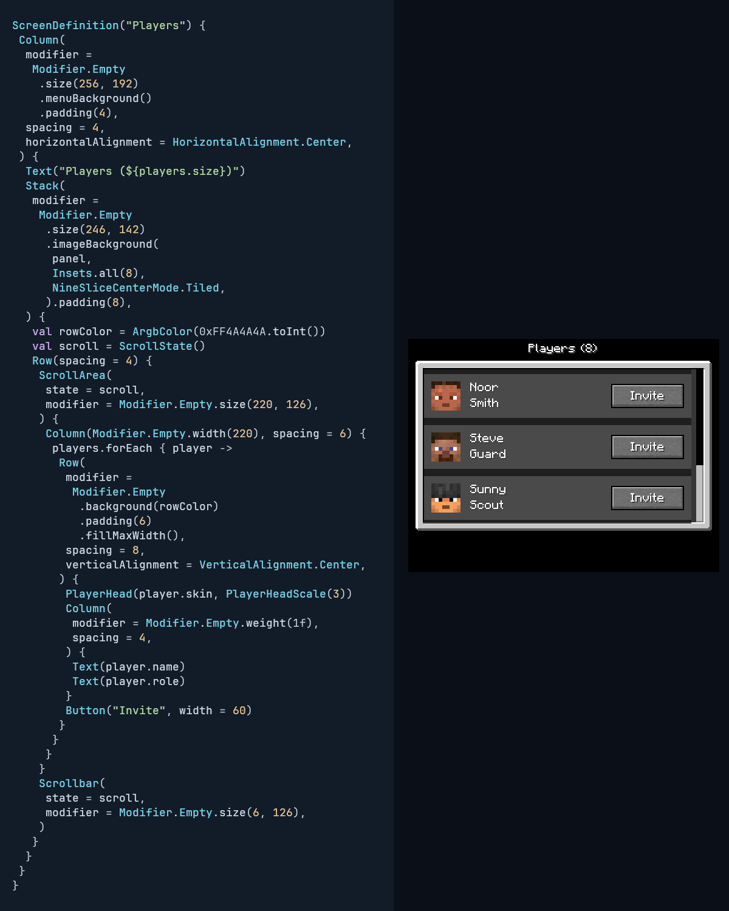

<!-- Generated by :integration:docs:generateReadmeDemo. Do not edit. -->

# Add components. Let the layout make room.

Build a player list step by step: add content, set width and weight, then contain overflow with ScrollArea and a linked Scrollbar.
Each frame pairs compiled source with a fresh headless render from original Minecraft assets.
The GIF compares source revisions, not hot reload.

[Play the 19.25-second GIF](demo.gif) · [Render receipt](render.properties)

## 1. Start with a row

Each row takes the width of its contents.


[Complete screen pixels](1-basic-screen.png) · [Compiled source](../../integration/docs/src/readmeExamples/kotlin/dev/s7a/strata/integration/docs/example/BasicPlayersExample.kt)

<details><summary>Complete source for this stage</summary>

```kotlin
ScreenDefinition("Players") {
    Column(
        modifier =
            Modifier.Empty
                .size(256, 192)
                .menuBackground()
                .padding(4),
        spacing = 4,
        horizontalAlignment = HorizontalAlignment.Center,
    ) {
        Text("Players (${players.size})")
        Stack(
            modifier =
                Modifier.Empty
                    .size(236, 142)
                    .imageBackground(
                        panel,
                        Insets.all(8),
                        NineSliceCenterMode.Tiled,
                    ).padding(8),
        ) {
            val rowColor = ArgbColor(0xFF4A4A4A.toInt())
            Column(spacing = 6) {
                players.forEach { player ->
                    Row(
                        modifier =
                            Modifier.Empty
                                .background(rowColor)
                                .padding(6),
                        spacing = 8,
                        verticalAlignment = VerticalAlignment.Center,
                    ) {
                        PlayerHead(player.skin, PlayerHeadScale(3))
                        Column(spacing = 4) {
                            Text(player.name)
                        }
                    }
                }
            }
        }
    }
}
```

</details>

## 2. Add secondary text

One Text adds a role to every player.


[Complete screen pixels](2-roles-screen.png) · [Compiled source](../../integration/docs/src/readmeExamples/kotlin/dev/s7a/strata/integration/docs/example/RolesPlayersExample.kt)

<details><summary>Complete source for this stage</summary>

```kotlin
ScreenDefinition("Players") {
    Column(
        modifier =
            Modifier.Empty
                .size(256, 192)
                .menuBackground()
                .padding(4),
        spacing = 4,
        horizontalAlignment = HorizontalAlignment.Center,
    ) {
        Text("Players (${players.size})")
        Stack(
            modifier =
                Modifier.Empty
                    .size(236, 142)
                    .imageBackground(
                        panel,
                        Insets.all(8),
                        NineSliceCenterMode.Tiled,
                    ).padding(8),
        ) {
            val rowColor = ArgbColor(0xFF4A4A4A.toInt())
            Column(spacing = 6) {
                players.forEach { player ->
                    Row(
                        modifier =
                            Modifier.Empty
                                .background(rowColor)
                                .padding(6),
                        spacing = 8,
                        verticalAlignment = VerticalAlignment.Center,
                    ) {
                        PlayerHead(player.skin, PlayerHeadScale(3))
                        Column(spacing = 4) {
                            Text(player.name)
                            Text(player.role)
                        }
                    }
                }
            }
        }
    }
}
```

</details>

## 3. Add a button

One Button extends every row without calculating its position.


[Complete screen pixels](3-actions-screen.png) · [Compiled source](../../integration/docs/src/readmeExamples/kotlin/dev/s7a/strata/integration/docs/example/ActionsPlayersExample.kt)

<details><summary>Complete source for this stage</summary>

```kotlin
ScreenDefinition("Players") {
    Column(
        modifier =
            Modifier.Empty
                .size(256, 192)
                .menuBackground()
                .padding(4),
        spacing = 4,
        horizontalAlignment = HorizontalAlignment.Center,
    ) {
        Text("Players (${players.size})")
        Stack(
            modifier =
                Modifier.Empty
                    .size(236, 142)
                    .imageBackground(
                        panel,
                        Insets.all(8),
                        NineSliceCenterMode.Tiled,
                    ).padding(8),
        ) {
            val rowColor = ArgbColor(0xFF4A4A4A.toInt())
            Column(spacing = 6) {
                players.forEach { player ->
                    Row(
                        modifier =
                            Modifier.Empty
                                .background(rowColor)
                                .padding(6),
                        spacing = 8,
                        verticalAlignment = VerticalAlignment.Center,
                    ) {
                        PlayerHead(player.skin, PlayerHeadScale(3))
                        Column(spacing = 4) {
                            Text(player.name)
                            Text(player.role)
                        }
                        Button("Invite", width = 60)
                    }
                }
            }
        }
    }
}
```

</details>

## 4. Fix the list width

Set the outer Column width once; every row fills it.


[Complete screen pixels](4-fixed-screen.png) · [Compiled source](../../integration/docs/src/readmeExamples/kotlin/dev/s7a/strata/integration/docs/example/FixedPlayersExample.kt)

<details><summary>Complete source for this stage</summary>

```kotlin
ScreenDefinition("Players") {
    Column(
        modifier =
            Modifier.Empty
                .size(256, 192)
                .menuBackground()
                .padding(4),
        spacing = 4,
        horizontalAlignment = HorizontalAlignment.Center,
    ) {
        Text("Players (${players.size})")
        Stack(
            modifier =
                Modifier.Empty
                    .size(236, 142)
                    .imageBackground(
                        panel,
                        Insets.all(8),
                        NineSliceCenterMode.Tiled,
                    ).padding(8),
        ) {
            val rowColor = ArgbColor(0xFF4A4A4A.toInt())
            Column(Modifier.Empty.width(220), spacing = 6) {
                players.forEach { player ->
                    Row(
                        modifier =
                            Modifier.Empty
                                .background(rowColor)
                                .padding(6)
                                .fillMaxWidth(),
                        spacing = 8,
                        verticalAlignment = VerticalAlignment.Center,
                    ) {
                        PlayerHead(player.skin, PlayerHeadScale(3))
                        Column(spacing = 4) {
                            Text(player.name)
                            Text(player.role)
                        }
                        Button("Invite", width = 60)
                    }
                }
            }
        }
    }
}
```

</details>

## 5. Give text the remaining space

Weight expands the text column and lines up the buttons.



[Complete screen pixels](5-weighted-screen.png) · [Compiled source](../../integration/docs/src/readmeExamples/kotlin/dev/s7a/strata/integration/docs/example/WeightedPlayersExample.kt)

<details><summary>Complete source for this stage</summary>

```kotlin
ScreenDefinition("Players") {
    Column(
        modifier =
            Modifier.Empty
                .size(256, 192)
                .menuBackground()
                .padding(4),
        spacing = 4,
        horizontalAlignment = HorizontalAlignment.Center,
    ) {
        Text("Players (${players.size})")
        Stack(
            modifier =
                Modifier.Empty
                    .size(236, 142)
                    .imageBackground(
                        panel,
                        Insets.all(8),
                        NineSliceCenterMode.Tiled,
                    ).padding(8),
        ) {
            val rowColor = ArgbColor(0xFF4A4A4A.toInt())
            Column(Modifier.Empty.width(220), spacing = 6) {
                players.forEach { player ->
                    Row(
                        modifier =
                            Modifier.Empty
                                .background(rowColor)
                                .padding(6)
                                .fillMaxWidth(),
                        spacing = 8,
                        verticalAlignment = VerticalAlignment.Center,
                    ) {
                        PlayerHead(player.skin, PlayerHeadScale(3))
                        Column(
                            modifier = Modifier.Empty.weight(1f),
                            spacing = 4,
                        ) {
                            Text(player.name)
                            Text(player.role)
                        }
                        Button("Invite", width = 60)
                    }
                }
            }
        }
    }
}
```

</details>

## 6. Add a scroll area

Wrap the existing Column in ScrollArea to contain the list.



[Complete screen pixels](6-area-screen.png) · [Compiled source](../../integration/docs/src/readmeExamples/kotlin/dev/s7a/strata/integration/docs/example/AreaPlayersExample.kt)

<details><summary>Complete source for this stage</summary>

```kotlin
ScreenDefinition("Players") {
    Column(
        modifier =
            Modifier.Empty
                .size(256, 192)
                .menuBackground()
                .padding(4),
        spacing = 4,
        horizontalAlignment = HorizontalAlignment.Center,
    ) {
        Text("Players (${players.size})")
        Stack(
            modifier =
                Modifier.Empty
                    .size(236, 142)
                    .imageBackground(
                        panel,
                        Insets.all(8),
                        NineSliceCenterMode.Tiled,
                    ).padding(8),
        ) {
            val rowColor = ArgbColor(0xFF4A4A4A.toInt())
            val scroll = ScrollState()
            ScrollArea(
                state = scroll,
                modifier = Modifier.Empty.height(126),
            ) {
                Column(Modifier.Empty.width(220), spacing = 6) {
                    players.forEach { player ->
                        Row(
                            modifier =
                                Modifier.Empty
                                    .background(rowColor)
                                    .padding(6)
                                    .fillMaxWidth(),
                            spacing = 8,
                            verticalAlignment = VerticalAlignment.Center,
                        ) {
                            PlayerHead(player.skin, PlayerHeadScale(3))
                            Column(
                                modifier = Modifier.Empty.weight(1f),
                                spacing = 4,
                            ) {
                                Text(player.name)
                                Text(player.role)
                            }
                            Button("Invite", width = 60)
                        }
                    }
                }
            }
        }
    }
}
```

</details>

## 7. Scroll without a bar

Wheel input reaches the final players; no scrollbar has been added yet.



[Complete screen pixels](7-areabottom-screen.png) · [Compiled source](../../integration/docs/src/readmeExamples/kotlin/dev/s7a/strata/integration/docs/example/AreaPlayersExample.kt)

<details><summary>Complete source for this stage</summary>

```kotlin
ScreenDefinition("Players") {
    Column(
        modifier =
            Modifier.Empty
                .size(256, 192)
                .menuBackground()
                .padding(4),
        spacing = 4,
        horizontalAlignment = HorizontalAlignment.Center,
    ) {
        Text("Players (${players.size})")
        Stack(
            modifier =
                Modifier.Empty
                    .size(236, 142)
                    .imageBackground(
                        panel,
                        Insets.all(8),
                        NineSliceCenterMode.Tiled,
                    ).padding(8),
        ) {
            val rowColor = ArgbColor(0xFF4A4A4A.toInt())
            val scroll = ScrollState()
            ScrollArea(
                state = scroll,
                modifier = Modifier.Empty.height(126),
            ) {
                Column(Modifier.Empty.width(220), spacing = 6) {
                    players.forEach { player ->
                        Row(
                            modifier =
                                Modifier.Empty
                                    .background(rowColor)
                                    .padding(6)
                                    .fillMaxWidth(),
                            spacing = 8,
                            verticalAlignment = VerticalAlignment.Center,
                        ) {
                            PlayerHead(player.skin, PlayerHeadScale(3))
                            Column(
                                modifier = Modifier.Empty.weight(1f),
                                spacing = 4,
                            ) {
                                Text(player.name)
                                Text(player.role)
                            }
                            Button("Invite", width = 60)
                        }
                    }
                }
            }
        }
    }
}
```

</details>

## 8. Add a linked scrollbar

Pass the same ScrollState to Scrollbar; its thumb reflects the list position.



[Complete screen pixels](8-bar-screen.png) · [Compiled source](../../integration/docs/src/readmeExamples/kotlin/dev/s7a/strata/integration/docs/example/ScrollPlayersExample.kt)

<details><summary>Complete source for this stage</summary>

```kotlin
ScreenDefinition("Players") {
    Column(
        modifier =
            Modifier.Empty
                .size(256, 192)
                .menuBackground()
                .padding(4),
        spacing = 4,
        horizontalAlignment = HorizontalAlignment.Center,
    ) {
        Text("Players (${players.size})")
        Stack(
            modifier =
                Modifier.Empty
                    .size(246, 142)
                    .imageBackground(
                        panel,
                        Insets.all(8),
                        NineSliceCenterMode.Tiled,
                    ).padding(8),
        ) {
            val rowColor = ArgbColor(0xFF4A4A4A.toInt())
            val scroll = ScrollState()
            Row(spacing = 4) {
                ScrollArea(
                    state = scroll,
                    modifier = Modifier.Empty.size(220, 126),
                ) {
                    Column(Modifier.Empty.width(220), spacing = 6) {
                        players.forEach { player ->
                            Row(
                                modifier =
                                    Modifier.Empty
                                        .background(rowColor)
                                        .padding(6)
                                        .fillMaxWidth(),
                                spacing = 8,
                                verticalAlignment = VerticalAlignment.Center,
                            ) {
                                PlayerHead(player.skin, PlayerHeadScale(3))
                                Column(
                                    modifier = Modifier.Empty.weight(1f),
                                    spacing = 4,
                                ) {
                                    Text(player.name)
                                    Text(player.role)
                                }
                                Button("Invite", width = 60)
                            }
                        }
                    }
                }
                Scrollbar(
                    state = scroll,
                    modifier = Modifier.Empty.size(6, 126),
                )
            }
        }
    }
}
```

</details>

## 9. Scroll up together

The list and linked scrollbar move together under wheel input.



[Complete screen pixels](9-bartop-screen.png) · [Compiled source](../../integration/docs/src/readmeExamples/kotlin/dev/s7a/strata/integration/docs/example/ScrollPlayersExample.kt)

<details><summary>Complete source for this stage</summary>

```kotlin
ScreenDefinition("Players") {
    Column(
        modifier =
            Modifier.Empty
                .size(256, 192)
                .menuBackground()
                .padding(4),
        spacing = 4,
        horizontalAlignment = HorizontalAlignment.Center,
    ) {
        Text("Players (${players.size})")
        Stack(
            modifier =
                Modifier.Empty
                    .size(246, 142)
                    .imageBackground(
                        panel,
                        Insets.all(8),
                        NineSliceCenterMode.Tiled,
                    ).padding(8),
        ) {
            val rowColor = ArgbColor(0xFF4A4A4A.toInt())
            val scroll = ScrollState()
            Row(spacing = 4) {
                ScrollArea(
                    state = scroll,
                    modifier = Modifier.Empty.size(220, 126),
                ) {
                    Column(Modifier.Empty.width(220), spacing = 6) {
                        players.forEach { player ->
                            Row(
                                modifier =
                                    Modifier.Empty
                                        .background(rowColor)
                                        .padding(6)
                                        .fillMaxWidth(),
                                spacing = 8,
                                verticalAlignment = VerticalAlignment.Center,
                            ) {
                                PlayerHead(player.skin, PlayerHeadScale(3))
                                Column(
                                    modifier = Modifier.Empty.weight(1f),
                                    spacing = 4,
                                ) {
                                    Text(player.name)
                                    Text(player.role)
                                }
                                Button("Invite", width = 60)
                            }
                        }
                    }
                }
                Scrollbar(
                    state = scroll,
                    modifier = Modifier.Empty.size(6, 126),
                )
            }
        }
    }
}
```

</details>

## 10. Scroll down together

The linked thumb follows the list back to its last player.



[Complete screen pixels](10-barbottom-screen.png) · [Compiled source](../../integration/docs/src/readmeExamples/kotlin/dev/s7a/strata/integration/docs/example/ScrollPlayersExample.kt)

<details><summary>Complete source for this stage</summary>

```kotlin
ScreenDefinition("Players") {
    Column(
        modifier =
            Modifier.Empty
                .size(256, 192)
                .menuBackground()
                .padding(4),
        spacing = 4,
        horizontalAlignment = HorizontalAlignment.Center,
    ) {
        Text("Players (${players.size})")
        Stack(
            modifier =
                Modifier.Empty
                    .size(246, 142)
                    .imageBackground(
                        panel,
                        Insets.all(8),
                        NineSliceCenterMode.Tiled,
                    ).padding(8),
        ) {
            val rowColor = ArgbColor(0xFF4A4A4A.toInt())
            val scroll = ScrollState()
            Row(spacing = 4) {
                ScrollArea(
                    state = scroll,
                    modifier = Modifier.Empty.size(220, 126),
                ) {
                    Column(Modifier.Empty.width(220), spacing = 6) {
                        players.forEach { player ->
                            Row(
                                modifier =
                                    Modifier.Empty
                                        .background(rowColor)
                                        .padding(6)
                                        .fillMaxWidth(),
                                spacing = 8,
                                verticalAlignment = VerticalAlignment.Center,
                            ) {
                                PlayerHead(player.skin, PlayerHeadScale(3))
                                Column(
                                    modifier = Modifier.Empty.weight(1f),
                                    spacing = 4,
                                ) {
                                    Text(player.name)
                                    Text(player.role)
                                }
                                Button("Invite", width = 60)
                            }
                        }
                    }
                }
                Scrollbar(
                    state = scroll,
                    modifier = Modifier.Empty.size(6, 126),
                )
            }
        }
    }
}
```

</details>

## Running the example

The final example accepts immutable `ReadmePlayer` values with names, roles, and detached `PlayerSkinSource.Pixels` skins.
Copy [the final screen](../../integration/docs/src/readmeExamples/kotlin/dev/s7a/strata/integration/docs/example/ScrollPlayersExample.kt) and [the player model](../../integration/docs/src/readmeExamples/kotlin/dev/s7a/strata/integration/docs/example/ReadmePlayer.kt) into a Mod using Strata, then call `scrollPlayersScreen(players, panel).open()`.
Supply the original Minecraft Social Interactions panel as an `ImageSource` alongside the player data; headless generation supplies detached pixels from the same asset.
The `Invite` button demonstrates layout only; add an `onActivate` modifier to connect application behavior.

See [generation instructions](../development/documentation.md#readme-code-and-screen-demo) for fresh generation and verification.
