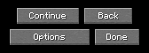
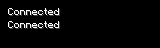
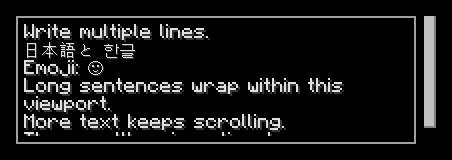
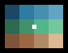

<!-- Generated file. Do not edit. -->

# Component catalog

Choose components by the responsibility they serve in your screen.
Each entry shows a rendered example, practical composition guidance, and a link to the API reference for signatures and overloads.
Use the [complete screen examples](../examples/screens.md) to see how these primitives work together.

## Choose a component

### Layout

| Component | Choose it for | API |
| --- | --- | --- |
| [Row](#row) | Arrange siblings horizontally on one line. | [Reference](https://gh.s7a.dev/strata/api/dev.s7a.strata.component/-row.html) |
| [FlowRow](#flow-row) | Wrap horizontal siblings when the available width changes. | [Reference](https://gh.s7a.dev/strata/api/dev.s7a.strata.component/-flow-row.html) |
| [Column](#column) | Arrange siblings vertically. | [Reference](https://gh.s7a.dev/strata/api/dev.s7a.strata.component/-column.html) |
| [Stack](#stack) | Overlap children intentionally within one rectangle. | [Reference](https://gh.s7a.dev/strata/api/dev.s7a.strata.component/-stack.html) |
| [Grid](#grid) | Align repeated content in a fixed number of columns. | [Reference](https://gh.s7a.dev/strata/api/dev.s7a.strata.component/-grid.html) |
| [Spacer](#spacer) | Reserve an intentional gap or flexible space in a layout. | [Reference](https://gh.s7a.dev/strata/api/dev.s7a.strata.component/-spacer.html) |
| [Observe](#observe) | Update one retained region when explicitly supplied sources change. | [Reference](https://gh.s7a.dev/strata/api/dev.s7a.strata.component/-observe.html) |

### Text and editing

| Component | Choose it for | API |
| --- | --- | --- |
| [Text](#text) | Display labels, messages, or wrapped read-only text. | [Reference](https://gh.s7a.dev/strata/api/dev.s7a.strata.component/-text.html) |
| [TextField](#text-field) | Edit a single line of caller-owned text. | [Reference](https://gh.s7a.dev/strata/api/dev.s7a.strata.component/-text-field.html) |
| [TextArea](#text-area) | Edit multiline text inside a scrollable viewport. | [Reference](https://gh.s7a.dev/strata/api/dev.s7a.strata.component/-text-area.html) |

### Actions and choices

| Component | Choose it for | API |
| --- | --- | --- |
| [Button](#button) | Present an action with activation supplied by modifiers. | [Reference](https://gh.s7a.dev/strata/api/dev.s7a.strata.component/-button.html) |
| [Checkbox](#checkbox) | Let the user toggle a boolean value. | [Reference](https://gh.s7a.dev/strata/api/dev.s7a.strata.component/-checkbox.html) |
| [CycleButton](#cycle-button) | Cycle through a finite set of choices. | [Reference](https://gh.s7a.dev/strata/api/dev.s7a.strata.component/-cycle-button.html) |
| [Slider](#slider) | Adjust a value within a bounded numeric range. | [Reference](https://gh.s7a.dev/strata/api/dev.s7a.strata.component/-slider.html) |
| [Tab](#tab) | Present an externally selected navigation option. | [Reference](https://gh.s7a.dev/strata/api/dev.s7a.strata.component/-tab.html) |

### Scrolling and lists

| Component | Choose it for | API |
| --- | --- | --- |
| [ScrollArea](#scroll-area) | Scroll content that extends beyond its viewport. | [Reference](https://gh.s7a.dev/strata/api/dev.s7a.strata.component/-scroll-area.html) |
| [Scrollbar](#scrollbar) | Show and control the position of a shared scroll state. | [Reference](https://gh.s7a.dev/strata/api/dev.s7a.strata.component/-scrollbar.html) |
| [VirtualList](#virtual-list) | Build only the visible rows of a large or loadable list. | [Reference](https://gh.s7a.dev/strata/api/dev.s7a.strata.component/-virtual-list.html) |
| [SelectionList](#selection-list) | Select entries in a virtualized list. | [Reference](https://gh.s7a.dev/strata/api/dev.s7a.strata.component/-selection-list.html) |

### Images and external rendering

| Component | Choose it for | API |
| --- | --- | --- |
| [Image](#image) | Display an immutable image or a region of that image. | [Reference](https://gh.s7a.dev/strata/api/dev.s7a.strata.component/-image.html) |
| [Canvas](#canvas) | Present frames from an external renderer or image producer. | [Reference](https://gh.s7a.dev/strata/api/dev.s7a.strata.component/-canvas.html) |
| [TiledImage](#tiled-image) | Navigate large maps or images supplied as independent tiles. | [Reference](https://gh.s7a.dev/strata/api/dev.s7a.strata.component/-tiled-image.html) |
| [PlayerHead](#player-head) | Display a player's skin face and hat layers. | [Reference](https://gh.s7a.dev/strata/api/dev.s7a.strata.component/-player-head.html) |

### Inventory

| Component | Choose it for | API |
| --- | --- | --- |
| [Slot](#slot) | Show an inventory slot bound to a typed slot source. | [Reference](https://gh.s7a.dev/strata/api/dev.s7a.strata.component/-slot.html) |

### Progress feedback

| Component | Choose it for | API |
| --- | --- | --- |
| [LoadingIndicator](#loading-indicator) | Show that work is in progress when no completion value is available. | [Reference](https://gh.s7a.dev/strata/api/dev.s7a.strata.component/-loading-indicator.html) |
| [ProgressBar](#progress-bar) | Show progress toward a known completion value. | [Reference](https://gh.s7a.dev/strata/api/dev.s7a.strata.component/-progress-bar.html) |

## Rendered examples

Images come from the compiled examples included with Strata.
Expand an entry for its source, modifier and parent-scope guidance, or component tree.
Menu and container backgrounds are modifiers on layout components.

<a id="row"></a>

## Row

Arrange siblings horizontally on one line.


[API reference](https://gh.s7a.dev/strata/api/dev.s7a.strata.component/-row.html)

<details><summary>Usage and compiled example</summary>

Row places an ordered sibling sequence on one horizontal main axis, with typed arrangement, spacing, default vertical alignment, and direct-child overrides.

### Compiled example

```kotlin
import dev.s7a.strata.component.Button
import dev.s7a.strata.component.Row
import dev.s7a.strata.layout.Arrangement
import dev.s7a.strata.layout.VerticalAlignment
import dev.s7a.strata.modifier.Modifier
import dev.s7a.strata.modifier.background
import dev.s7a.strata.modifier.size
import dev.s7a.strata.render.ArgbColor
import dev.s7a.strata.screen.ScreenDefinition

/**
 * Builds a self-contained Row showcase whose complete frame demonstrates horizontal placement.
 *
 * @return one-shot definition containing two Minecraft-profile buttons centered by the Row itself.
 */
internal fun createRowShowcaseScreenDefinition(): ScreenDefinition =
    ScreenDefinition("Row showcase") {
        Row(
            modifier =
                Modifier.Empty
                    .size(136, 64)
                    .background(ArgbColor(0xFF000000.toInt())),
            spacing = 4,
            horizontalArrangement = Arrangement.Center,
            verticalAlignment = VerticalAlignment.Center,
        ) {
            Button("Yes", width = 60)
            Button("No", width = 60)
        }
    }
```

### Modifiers

Apply sizing, padding, backgrounds, and input to the Row. Use `spacing` and `horizontalArrangement` for sibling structure.

### Parent scope

`RowScope` exposes vertical `align` and `weight` for direct children; the scope expires with its callback.

</details>

<details><summary>Component tree</summary>

```text
`- Row [Size(width=136, height=64), Background(color=0xFF000000), Spacing(value=4), Arrangement(value=Center), RowDefaultAlignment(alignment=Center)]
  |- Button [Size(width=60, height=20)]
  `- Button [Size(width=60, height=20)]
```

</details>

<details><summary>Image verification</summary>

136 by 64 PNG; 136 by 64 logical viewport at GUI scale 1. [Image verification](#image-verification).

</details>

<a id="flow-row"></a>

## FlowRow

Wrap horizontal siblings when the available width changes.



[API reference](https://gh.s7a.dev/strata/api/dev.s7a.strata.component/-flow-row.html)

<details><summary>Usage and compiled example</summary>

FlowRow wraps an ordered sibling sequence at the available width and arranges each row independently.

### Compiled example

```kotlin
import dev.s7a.strata.component.Button
import dev.s7a.strata.component.FlowRow
import dev.s7a.strata.layout.Arrangement
import dev.s7a.strata.layout.VerticalAlignment
import dev.s7a.strata.modifier.Modifier
import dev.s7a.strata.modifier.background
import dev.s7a.strata.modifier.padding
import dev.s7a.strata.modifier.size
import dev.s7a.strata.render.ArgbColor
import dev.s7a.strata.screen.ScreenDefinition

/**
 * Builds a self-contained FlowRow showcase with four differently sized Minecraft-profile buttons.
 *
 * @return one-shot definition whose 168 by 60 root captures two independently centered rows without synthetic row parents.
 */
internal fun createFlowRowShowcaseScreenDefinition(): ScreenDefinition =
    ScreenDefinition("FlowRow showcase") {
        FlowRow(
            modifier =
                Modifier.Empty
                    .size(168, 60)
                    .background(ArgbColor(0xFF000000.toInt()))
                    .padding(8),
            horizontalSpacing = 4,
            verticalSpacing = 4,
            horizontalArrangement = Arrangement.Center,
            verticalAlignment = VerticalAlignment.Center,
        ) {
            Button("Continue", width = 72)
            Button("Back", width = 56)
            Button("Options", width = 92)
            Button("Done", width = 52)
        }
    }
```

### Modifiers

Use `fillMaxWidth()` to arrange rows across the available width; `horizontalSpacing` and `verticalSpacing` set gaps. `FlowRowScope.align` overrides one child's vertical alignment.

### Parent scope

`FlowRow` evaluates a callback-lifetime `FlowRowScope` and exposes only vertical alignment parent data. Wrapping preserves its direct children's retained identity and focus without synthetic Row parents. It has no weight, row-count limit, implicit clipping, or truncation; with unbounded width it produces one row.

</details>

<details><summary>Component tree</summary>

```text
`- FlowRow [Size(width=168, height=60), Background(color=0xFF000000), Padding(all=8), FlowRowSpacing(horizontal=4, vertical=4), Arrangement(value=Center), FlowRowDefaultAlignment(alignment=Center)]
  |- Button [Size(width=72, height=20)]
  |- Button [Size(width=56, height=20)]
  |- Button [Size(width=92, height=20)]
  `- Button [Size(width=52, height=20)]
```

</details>

<details><summary>Image verification</summary>

168 by 60 PNG; 168 by 60 logical viewport at GUI scale 1. [Image verification](#image-verification).

</details>

<a id="column"></a>

## Column

Arrange siblings vertically.


[API reference](https://gh.s7a.dev/strata/api/dev.s7a.strata.component/-column.html)

<details><summary>Usage and compiled example</summary>

Column places an ordered sibling sequence on one vertical main axis, with typed arrangement, spacing, default horizontal alignment, and direct-child overrides.

### Compiled example

```kotlin
import dev.s7a.strata.component.Button
import dev.s7a.strata.component.Column
import dev.s7a.strata.layout.Arrangement
import dev.s7a.strata.layout.HorizontalAlignment
import dev.s7a.strata.modifier.Modifier
import dev.s7a.strata.modifier.background
import dev.s7a.strata.modifier.size
import dev.s7a.strata.render.ArgbColor
import dev.s7a.strata.screen.ScreenDefinition

/**
 * Builds a self-contained Column showcase whose complete frame demonstrates vertical placement.
 *
 * @return one-shot definition containing two Minecraft-profile buttons centered by the Column itself.
 */
internal fun createColumnShowcaseScreenDefinition(): ScreenDefinition =
    ScreenDefinition("Column showcase") {
        Column(
            modifier =
                Modifier.Empty
                    .size(120, 64)
                    .background(ArgbColor(0xFF000000.toInt())),
            spacing = 4,
            verticalArrangement = Arrangement.Center,
            horizontalAlignment = HorizontalAlignment.Center,
        ) {
            Button("First", width = 96)
            Button("Second", width = 96)
        }
    }
```

### Modifiers

Apply sizing, padding, backgrounds, and input to the Column. Use `spacing` and `verticalArrangement` for sibling structure.

### Parent scope

`ColumnScope` exposes horizontal `align` and `weight` for direct children; the scope expires with its callback.

</details>

<details><summary>Component tree</summary>

```text
`- Column [Size(width=120, height=64), Background(color=0xFF000000), Spacing(value=4), Arrangement(value=Center), ColumnDefaultAlignment(alignment=Center)]
  |- Button [Size(width=96, height=20)]
  `- Button [Size(width=96, height=20)]
```

</details>

<details><summary>Image verification</summary>

120 by 64 PNG; 120 by 64 logical viewport at GUI scale 1. [Image verification](#image-verification).

</details>

<a id="stack"></a>

## Stack

Overlap children intentionally within one rectangle.


[API reference](https://gh.s7a.dev/strata/api/dev.s7a.strata.component/-stack.html)

<details><summary>Usage and compiled example</summary>

Stack is the explicit overlay primitive: children share one content rectangle, receive two-axis alignment, and paint in declaration order. It is not a generic div-like container.

### Compiled example

```kotlin
import dev.s7a.strata.component.Button
import dev.s7a.strata.component.Spacer
import dev.s7a.strata.component.Stack
import dev.s7a.strata.layout.Alignment
import dev.s7a.strata.modifier.Modifier
import dev.s7a.strata.modifier.background
import dev.s7a.strata.modifier.size
import dev.s7a.strata.render.ArgbColor
import dev.s7a.strata.screen.ScreenDefinition

/**
 * Builds a self-contained Stack showcase with a status badge painted over a Minecraft-profile button.
 *
 * @return one-shot definition demonstrating declaration-order painting from the button to the foreground badge.
 */
internal fun createStackShowcaseScreenDefinition(): ScreenDefinition =
    ScreenDefinition("Stack showcase") {
        Stack(
            modifier =
                Modifier.Empty
                    .size(64, 64)
                    .background(ArgbColor(0xFF000000.toInt())),
            contentAlignment = Alignment.Center,
        ) {
            Button("Open", width = 56)
            Spacer(
                modifier =
                    Modifier.Empty
                        .size(10, 10)
                        .background(ArgbColor(0xFFE53935.toInt()))
                        .align(Alignment.CenterEnd),
            )
        }
    }
```

### Modifiers

Use Stack only when children intentionally overlap. Ordinary sizing and background modifiers belong on the Stack; `StackScope.align` positions an individual overlay child without coordinate padding.

### Parent scope

`StackScope.align` positions direct overlays, which paint in declaration order.

</details>

<details><summary>Component tree</summary>

```text
`- Stack [Size(width=64, height=64), Background(color=0xFF000000), StackContentAlignment(alignment=Center)]
  |- Button [Size(width=56, height=20)]
  `- Spacer [Size(width=10, height=10), Background(color=0xFFE53935), StackAlign(alignment=CenterEnd)]
```

</details>

<details><summary>Image verification</summary>

64 by 64 PNG; 64 by 64 logical viewport at GUI scale 1. [Image verification](#image-verification).

</details>

<a id="grid"></a>

## Grid

Align repeated content in a fixed number of columns.


[API reference](https://gh.s7a.dev/strata/api/dev.s7a.strata.component/-grid.html)

<details><summary>Usage and compiled example</summary>

Grid assigns children row-major to a fixed column count, measures each column and row from its largest member, and supports an incomplete final row without placeholders.

### Compiled example

```kotlin
import dev.s7a.strata.component.Button
import dev.s7a.strata.component.Grid
import dev.s7a.strata.modifier.Modifier
import dev.s7a.strata.modifier.background
import dev.s7a.strata.modifier.size
import dev.s7a.strata.render.ArgbColor
import dev.s7a.strata.screen.ScreenDefinition

/**
 * Builds a self-contained Grid showcase with a complete three-by-three set of Minecraft-profile buttons.
 *
 * @return one-shot definition whose 64 by 64 root is also the complete captured frame.
 */
internal fun createGridShowcaseScreenDefinition(): ScreenDefinition =
    ScreenDefinition("Grid showcase") {
        Grid(
            columns = 3,
            modifier =
                Modifier.Empty
                    .size(64, 64)
                    .background(ArgbColor(0xFF000000.toInt())),
            horizontalSpacing = 2,
            verticalSpacing = 2,
        ) {
            repeat(9) { index ->
                Button((index + 1).toString(), width = 20)
            }
        }
    }
```

### Modifiers

Sizing, padding, and paint modifiers apply to the Grid. Fixed columns, independent horizontal and vertical spacing, and `GridScope.align` replace repeated Row declarations and per-cell coordinate padding.

### Parent scope

`GridScope.align` positions a direct child within its measured cell.

</details>

<details><summary>Component tree</summary>

```text
`- Grid [Size(width=64, height=64), Background(color=0xFF000000), GridColumns(value=3), GridSpacing(horizontal=2, vertical=2)]
  |- Button [Size(width=20, height=20)]
  |- Button [Size(width=20, height=20)]
  |- Button [Size(width=20, height=20)]
  |- Button [Size(width=20, height=20)]
  |- Button [Size(width=20, height=20)]
  |- Button [Size(width=20, height=20)]
  |- Button [Size(width=20, height=20)]
  |- Button [Size(width=20, height=20)]
  `- Button [Size(width=20, height=20)]
```

</details>

<details><summary>Image verification</summary>

64 by 64 PNG; 64 by 64 logical viewport at GUI scale 1. [Image verification](#image-verification).

</details>

<a id="spacer"></a>

## Spacer

Reserve an intentional gap or flexible space in a layout.


[API reference](https://gh.s7a.dev/strata/api/dev.s7a.strata.component/-spacer.html)

<details><summary>Usage and compiled example</summary>

Spacer is an empty measurable primitive for genuine visual separators, connectors, and weighted empty regions; it carries no screen-specific meaning.

### Compiled example

```kotlin
import dev.s7a.strata.component.Button
import dev.s7a.strata.component.Row
import dev.s7a.strata.component.Spacer
import dev.s7a.strata.layout.Arrangement
import dev.s7a.strata.layout.VerticalAlignment
import dev.s7a.strata.modifier.Modifier
import dev.s7a.strata.modifier.background
import dev.s7a.strata.modifier.size
import dev.s7a.strata.render.ArgbColor
import dev.s7a.strata.screen.ScreenDefinition

/**
 * Builds a self-contained Spacer showcase that reserves visible space between two siblings.
 *
 * @return one-shot definition in which the Spacer, rather than parent spacing or child padding, owns the 16-pixel gap.
 */
internal fun createSpacerShowcaseScreenDefinition(): ScreenDefinition =
    ScreenDefinition("Spacer showcase") {
        Row(
            modifier =
                Modifier.Empty
                    .size(160, 64)
                    .background(ArgbColor(0xFF000000.toInt())),
            horizontalArrangement = Arrangement.Center,
            verticalAlignment = VerticalAlignment.Center,
        ) {
            Button("Left", width = 60)
            Spacer(modifier = Modifier.Empty.size(16, 20))
            Button("Right", width = 60)
        }
    }
```

### Modifiers

Sizing, weight, and paint modifiers give Spacer a deliberate empty footprint, such as a separator or progress connector; ordinary parent spacing and alignment should remain layout arguments rather than placeholder children.

### Parent scope

No children or content scope; modifiers define its empty footprint.

</details>

<details><summary>Component tree</summary>

```text
`- Row [Size(width=160, height=64), Background(color=0xFF000000), Arrangement(value=Center), RowDefaultAlignment(alignment=Center)]
  |- Button [Size(width=60, height=20)]
  |- Spacer [Size(width=16, height=20)]
  `- Button [Size(width=60, height=20)]
```

</details>

<details><summary>Image verification</summary>

160 by 64 PNG; 160 by 64 logical viewport at GUI scale 1. [Image verification](#image-verification).

</details>

<a id="observe"></a>

## Observe

Update one retained region when explicitly supplied sources change.



[API reference](https://gh.s7a.dev/strata/api/dev.s7a.strata.component/-observe.html)

<details><summary>Usage and compiled example</summary>

Observe recomputes one region from up to 22 typed StateSource values, for conditional children or layout/style changes. Compatible keyed nodes survive reevaluation.

### Compiled example

```kotlin
import dev.s7a.strata.component.Column
import dev.s7a.strata.component.Observe
import dev.s7a.strata.component.Text
import dev.s7a.strata.modifier.Modifier
import dev.s7a.strata.modifier.background
import dev.s7a.strata.modifier.padding
import dev.s7a.strata.modifier.size
import dev.s7a.strata.render.ArgbColor
import dev.s7a.strata.screen.ScreenDefinition
import dev.s7a.strata.state.StateRevision
import dev.s7a.strata.state.StateSnapshot
import dev.s7a.strata.state.StateSource
import dev.s7a.strata.state.StateSubscription

/**
 * Creates a deterministic observed status region; live applications supply their own revisioned sources.
 */
internal fun createObserveShowcaseScreenDefinition(): ScreenDefinition {
    val status =
        StateSource<String> {
            StateSubscription(StateSnapshot(StateRevision(0), "Connected")) {}
        }
    return ScreenDefinition("Observe showcase") {
        Observe(
            status,
            modifier =
                Modifier.Empty
                    .size(160, 48)
                    .background(ArgbColor(0xFF000000.toInt()))
                    .padding(8),
        ) { value ->
            Column(spacing = 4) {
                Text(value)
                Text(status)
            }
        }
    }
}
```

### Modifiers

Observe is one child of its containing layout. Apply weight, alignment, sizing, and event modifiers to the region itself. Content emits zero or one root; use an inner Row or Column for multiple children. Empty content has zero natural size and still obeys incoming constraints.

### Parent scope

Content emits zero or one root on the owner thread. Keep editing and navigation state outside reevaluation.

</details>

<details><summary>Component tree</summary>

```text
`- Observe [Size(width=160, height=48), Background(color=0xFF000000), Padding(all=8)]
  `- Column [Spacing(value=4)]
    |- Text
    `- Text
```

</details>

<details><summary>Image verification</summary>

160 by 48 PNG; 160 by 48 logical viewport at GUI scale 1. [Image verification](#image-verification).

</details>

<a id="text"></a>

## Text

Display labels, messages, or wrapped read-only text.


[API reference](https://gh.s7a.dev/strata/api/dev.s7a.strata.component/-text.html)

<details><summary>Usage and compiled example</summary>

Text renders Unicode literals and composed text from the selected resource pack. Use `TextLayout.Multiline` for hard breaks, wrapping, line limits, and overflow.

### Compiled example

```kotlin
import dev.s7a.strata.component.Stack
import dev.s7a.strata.component.Text
import dev.s7a.strata.layout.Alignment
import dev.s7a.strata.modifier.Modifier
import dev.s7a.strata.modifier.background
import dev.s7a.strata.modifier.padding
import dev.s7a.strata.modifier.size
import dev.s7a.strata.render.ArgbColor
import dev.s7a.strata.screen.ScreenDefinition
import dev.s7a.strata.text.TextLayout
import dev.s7a.strata.text.TextOverflow
import dev.s7a.strata.text.TextWrap

/**
 * Builds a complete resource-font Text showcase with explicit line breaks and bounded wrapping.
 *
 * The active profile must provide resource fonts for the illustrated Japanese, Korean, and emoji glyphs.
 * @return one-shot definition whose complete frame shows at most four lines without changing the original semantic label.
 */
internal fun createTextShowcaseScreenDefinition(): ScreenDefinition =
    ScreenDefinition("Text showcase") {
        Stack(
            modifier =
                Modifier.Empty
                    .size(192, 88)
                    .background(ArgbColor(0xFF000000.toInt()))
                    .padding(8),
            contentAlignment = Alignment.Center,
        ) {
            Text(
                "日本語 / 한글 / 🙂\n" +
                    "This paragraph wraps to the available width.\n" +
                    "Explicit newlines stay separate.\n" +
                    "Only four lines are visible; extra text receives an ellipsis.",
                layout = TextLayout.Multiline(wrap = TextWrap.Word, maxLines = 4, overflow = TextOverflow.Ellipsis, lineSpacing = 2),
            )
        }
    }
```

### Modifiers

Use `TextLayout.Multiline` to fit reserved text rectangles. Set wrapping, overflow, and line spacing on Text; `UiText.withFont` selects fonts within composed labels, with inner selections taking precedence.

### Parent scope

No children. Fixed and source-backed labels share font and geometry rules; source values commit at frame boundaries.

</details>

<details><summary>Component tree</summary>

```text
`- Stack [Size(width=192, height=88), Background(color=0xFF000000), Padding(all=8), StackContentAlignment(alignment=Center)]
  `- Text [TextLayout.Multiline(wrap=Word, maxLines=4, overflow=Ellipsis, lineSpacing=2)]
```

</details>

<details><summary>Image verification</summary>

384 by 176 PNG; 192 by 88 logical viewport at GUI scale 2. [Image verification](#image-verification).

</details>

<a id="text-field"></a>

## TextField

Edit a single line of caller-owned text.


[API reference](https://gh.s7a.dev/strata/api/dev.s7a.strata.component/-text-field.html)

<details><summary>Usage and compiled example</summary>

TextField uses the 200 by 20 Minecraft EditBox sprites with Unicode scalar editing and inline IME composition.

### Compiled example

```kotlin
import dev.s7a.strata.component.Stack
import dev.s7a.strata.component.TextField
import dev.s7a.strata.component.TextFieldState
import dev.s7a.strata.layout.Alignment
import dev.s7a.strata.modifier.Modifier
import dev.s7a.strata.modifier.background
import dev.s7a.strata.modifier.size
import dev.s7a.strata.render.ArgbColor
import dev.s7a.strata.screen.ScreenDefinition

/**
 * Builds a self-contained TextField showcase from one caller-selected initial value.
 *
 * @param initialValue well-formed single-line Unicode value copied into owner-thread field state before the definition is retained.
 * @return one-shot definition containing the complete Minecraft-profile text-field frame.
 * @throws IllegalArgumentException when [initialValue] is unsupported or exceeds the showcase limit.
 */
internal fun createTextFieldShowcaseScreenDefinition(
    initialValue: String = "play.example.net",
): ScreenDefinition {
    val state = TextFieldState(initialValue, maxLength = 128)
    return ScreenDefinition("TextField showcase") {
        Stack(
            modifier =
                Modifier.Empty
                    .size(216, 64)
                    .background(ArgbColor(0xFF000000.toInt())),
            contentAlignment = Alignment.Center,
        ) {
            TextField(state)
        }
    }
}
```

### Modifiers

Pointer, keyboard, committed-character, preedit, and focus modifiers run as active retained behavior around `TextField`; a consuming focused modifier overrides built-in editing. The `font: ResourceId` overload changes metrics and drawing together, including cursor placement and horizontal scrolling.

### Parent scope

Keep caller-owned `TextFieldState` on its owner thread with a positive UTF-16 maximum length. Editing uses scalars, not grapheme clusters. Preedit stays separate until committed; it does not reproduce Minecraft's native IME popup.

</details>

<details><summary>Component tree</summary>

```text
`- Stack [Size(width=216, height=64), Background(color=0xFF000000), StackContentAlignment(alignment=Center)]
  `- TextField [Size(width=200, height=20)]
```

</details>

<details><summary>Image verification</summary>

432 by 128 PNG; 216 by 64 logical viewport at GUI scale 2. [Image verification](#image-verification).

</details>

<a id="text-area"></a>

## TextArea

Edit multiline text inside a scrollable viewport.



[API reference](https://gh.s7a.dev/strata/api/dev.s7a.strata.component/-text-area.html)

<details><summary>Usage and compiled example</summary>

TextArea supports note editing and message drafts with multiline scalar navigation, inline IME composition, and independent scrolling.

### Compiled example

```kotlin
import dev.s7a.strata.component.Row
import dev.s7a.strata.component.Scrollbar
import dev.s7a.strata.component.TextArea
import dev.s7a.strata.component.TextAreaState
import dev.s7a.strata.component.TextAreaViewport
import dev.s7a.strata.geometry.IntSize
import dev.s7a.strata.layout.Arrangement
import dev.s7a.strata.layout.VerticalAlignment
import dev.s7a.strata.modifier.Modifier
import dev.s7a.strata.modifier.background
import dev.s7a.strata.modifier.size
import dev.s7a.strata.render.ArgbColor
import dev.s7a.strata.screen.ScreenDefinition

/**
 * Builds one complete multiline editor frame with an independently placed scrollbar.
 *
 * The caller creates this definition on the editor's owner thread; the captured state owns committed text and vertical scrolling.
 * The resource-font profile supplies the illustrated Unicode glyphs, while soft wrapping leaves the stored value unchanged.
 * @return one-shot definition containing a 200 by 64 editor and its separately composed scrollbar.
 */
internal fun createTextAreaShowcaseScreenDefinition(): ScreenDefinition {
    val size = IntSize(200, 64)
    val state =
        TextAreaState(
            initialValue =
                "Write multiple lines.\n" +
                    "日本語と 한글\n" +
                    "Emoji: 🙂\n" +
                    "Long sentences wrap within this viewport.\n" +
                    "More text keeps scrolling.\n" +
                    "The scrollbar is optional.\n" +
                    "The original value keeps its newlines.",
            maxLength = 2048,
        )
    return ScreenDefinition("TextArea showcase") {
        Row(
            modifier = Modifier.Empty.size(226, 80).background(ArgbColor(0xFF000000.toInt())),
            spacing = 4,
            horizontalArrangement = Arrangement.Center,
            verticalAlignment = VerticalAlignment.Center,
        ) {
            TextArea(state, viewport = TextAreaViewport.Size(size))
            Scrollbar(state.scrollState, modifier = Modifier.Empty.size(6, size.height))
        }
    }
}
```

### Modifiers

Choose `TextAreaViewport.Size` or `Lines`; the fixed 9-pixel logical line box has optional extra spacing and four-pixel frame insets. Link an optional `Scrollbar(state.scrollState)` independently.

### Parent scope

One attached editor per owner-thread `TextAreaState`; reuse after detach is allowed. State stores LF text and a positive UTF-16 limit. `SemanticsRole.TextArea` and `Semantics.value` expose committed text; selection, clipboard, typed accessibility edit actions, and grapheme editing are unavailable.

</details>

<details><summary>Component tree</summary>

```text
`- Row [Size(width=226, height=80), Background(color=0xFF000000), Spacing(value=4), Arrangement(value=Center), RowDefaultAlignment(alignment=Center)]
  |- TextArea [Size(width=200, height=64)]
  `- Scrollbar [Size(width=6, height=64)]
```

</details>

<details><summary>Image verification</summary>

452 by 160 PNG; 226 by 80 logical viewport at GUI scale 2. [Image verification](#image-verification).

</details>

<a id="button"></a>

## Button

Present an action with activation supplied by modifiers.


[API reference](https://gh.s7a.dev/strata/api/dev.s7a.strata.component/-button.html)

<details><summary>Usage and compiled example</summary>

Button renders a label and enabled state. It owns no implicit focus or activation; reusable input actions live in modifiers.

### Compiled example

```kotlin
import dev.s7a.strata.component.Button
import dev.s7a.strata.component.Stack
import dev.s7a.strata.layout.Alignment
import dev.s7a.strata.modifier.Modifier
import dev.s7a.strata.modifier.background
import dev.s7a.strata.modifier.onActivate
import dev.s7a.strata.modifier.onHover
import dev.s7a.strata.modifier.size
import dev.s7a.strata.render.ArgbColor
import dev.s7a.strata.screen.ScreenDefinition

/**
 * Builds a self-contained Button showcase with shared pointer and keyboard activation attached through its modifier.
 *
 * @return one-shot definition containing the complete normal Button frame and no surrounding application screen.
 */
internal fun createButtonShowcaseScreenDefinition(): ScreenDefinition =
    ScreenDefinition("Button showcase") {
        val enabled = true
        Stack(
            modifier =
                Modifier.Empty
                    .size(166, 64)
                    .background(ArgbColor(0xFF000000.toInt())),
            contentAlignment = Alignment.Center,
        ) {
            Button(
                "Continue",
                enabled = enabled,
                modifier =
                    Modifier.Empty
                        .onActivate(enabled) {}
                        .onHover {},
            )
        }
    }
```

### Modifiers

Compose `onActivate` with the component's enabled state when a primary pointer press and each focused Enter or Space press represent the same action; false adds no input or focus node. `onPointerEvent`, `onPress`, `onRelease`, `onMove`, `onDrag`, `onScroll`, and `onHover` remain available for pointer-specific behavior without component callback parameters.

### Parent scope

The screen runtime installs its selected Minecraft profile only for the definition callback. Button has no child scope.

</details>

<details><summary>Component tree</summary>

```text
`- Stack [Size(width=166, height=64), Background(color=0xFF000000), StackContentAlignment(alignment=Center)]
  `- Button [Size(width=150, height=20)]
```

</details>

<details><summary>Image verification</summary>

166 by 64 PNG; 166 by 64 logical viewport at GUI scale 1. [Image verification](#image-verification).

</details>

<a id="checkbox"></a>

## Checkbox

Let the user toggle a boolean value.


[API reference](https://gh.s7a.dev/strata/api/dev.s7a.strata.component/-checkbox.html)

<details><summary>Usage and compiled example</summary>

Checkbox reproduces the verified 20-pixel Minecraft checkbox surface, label spacing, focused input, checked semantics, and caller-owned boolean state.

### Compiled example

```kotlin
import dev.s7a.strata.component.Checkbox
import dev.s7a.strata.component.CheckboxState
import dev.s7a.strata.component.Stack
import dev.s7a.strata.layout.Alignment
import dev.s7a.strata.modifier.Modifier
import dev.s7a.strata.modifier.background
import dev.s7a.strata.modifier.size
import dev.s7a.strata.render.ArgbColor
import dev.s7a.strata.screen.ScreenDefinition

/** Builds the complete minimal Checkbox showcase frame. */
internal fun createCheckboxShowcaseScreenDefinition(): ScreenDefinition {
    val state = CheckboxState(initialChecked = true)
    return ScreenDefinition("Checkbox showcase") {
        Stack(
            modifier = Modifier.Empty.size(166, 36).background(ArgbColor(0xFF000000.toInt())),
            contentAlignment = Alignment.Center,
        ) {
            Checkbox("Allow invites", state)
        }
    }
}
```

### Modifiers

Use typed checked-change modifiers with caller-owned boolean state.

### Parent scope

No children. Retain `CheckboxState` on its owner thread.

</details>

<details><summary>Component tree</summary>

```text
`- Stack [Size(width=166, height=36), Background(color=0xFF000000), StackContentAlignment(alignment=Center)]
  `- Checkbox [Size(width=150, height=20)]
```

</details>

<details><summary>Image verification</summary>

166 by 36 PNG; 166 by 36 logical viewport at GUI scale 1. [Image verification](#image-verification).

</details>

<a id="cycle-button"></a>

## CycleButton

Cycle through a finite set of choices.


[API reference](https://gh.s7a.dev/strata/api/dev.s7a.strata.component/-cycle-button.html)

<details><summary>Usage and compiled example</summary>

CycleButton reuses the verified button surface for a finite generic option sequence with forward, backward, wheel, and keyboard navigation.

### Compiled example

```kotlin
import dev.s7a.strata.component.CycleButton
import dev.s7a.strata.component.CycleButtonState
import dev.s7a.strata.component.Stack
import dev.s7a.strata.layout.Alignment
import dev.s7a.strata.modifier.Modifier
import dev.s7a.strata.modifier.background
import dev.s7a.strata.modifier.size
import dev.s7a.strata.render.ArgbColor
import dev.s7a.strata.screen.ScreenDefinition

/** Difficulty options rendered by the typed CycleButton showcase. */
private enum class Difficulty(
    val label: String,
) {
    Peaceful("Peaceful"),
    Easy("Easy"),
    Normal("Normal"),
    Hard("Hard"),
}

/** Builds the complete minimal CycleButton showcase frame. */
internal fun createCycleButtonShowcaseScreenDefinition(): ScreenDefinition {
    val state = CycleButtonState(Difficulty.Normal) { value -> "Difficulty: ${value.label}" }
    return ScreenDefinition("CycleButton showcase") {
        Stack(
            modifier = Modifier.Empty.size(166, 36).background(ArgbColor(0xFF000000.toInt())),
            contentAlignment = Alignment.Center,
        ) {
            CycleButton(state = state)
        }
    }
}
```

### Modifiers

Use typed change modifiers with an immutable finite option set.

### Parent scope

No children. Labels are snapshotted for the validated option set.

</details>

<details><summary>Component tree</summary>

```text
`- Stack [Size(width=166, height=36), Background(color=0xFF000000), StackContentAlignment(alignment=Center)]
  `- CycleButton [Size(width=150, height=20)]
```

</details>

<details><summary>Image verification</summary>

166 by 36 PNG; 166 by 36 logical viewport at GUI scale 1. [Image verification](#image-verification).

</details>

<a id="slider"></a>

## Slider

Adjust a value within a bounded numeric range.


[API reference](https://gh.s7a.dev/strata/api/dev.s7a.strata.component/-slider.html)

<details><summary>Usage and compiled example</summary>

Slider reproduces Minecraft's profile-backed track and handle while normalizing finite numeric ranges and optional discrete steps in caller-owned state.

### Compiled example

```kotlin
import dev.s7a.strata.component.Slider
import dev.s7a.strata.component.SliderState
import dev.s7a.strata.component.Stack
import dev.s7a.strata.layout.Alignment
import dev.s7a.strata.modifier.Modifier
import dev.s7a.strata.modifier.background
import dev.s7a.strata.modifier.size
import dev.s7a.strata.render.ArgbColor
import dev.s7a.strata.screen.ScreenDefinition

/** Builds the complete minimal Slider showcase frame. */
internal fun createSliderShowcaseScreenDefinition(): ScreenDefinition {
    val state = SliderState(initialValue = 0.65)
    return ScreenDefinition("Slider showcase") {
        Stack(
            modifier = Modifier.Empty.size(166, 36).background(ArgbColor(0xFF000000.toInt())),
            contentAlignment = Alignment.Center,
        ) {
            Slider("Volume", state)
        }
    }
}
```

### Modifiers

Use typed value-change modifiers with caller-owned range and step state.

### Parent scope

No children. `SliderState` owns normalization and quantization.

</details>

<details><summary>Component tree</summary>

```text
`- Stack [Size(width=166, height=36), Background(color=0xFF000000), StackContentAlignment(alignment=Center)]
  `- Slider [Size(width=150, height=20)]
```

</details>

<details><summary>Image verification</summary>

166 by 36 PNG; 166 by 36 logical viewport at GUI scale 1. [Image verification](#image-verification).

</details>

<a id="tab"></a>

## Tab

Present an externally selected navigation option.


[API reference](https://gh.s7a.dev/strata/api/dev.s7a.strata.component/-tab.html)

<details><summary>Usage and compiled example</summary>

Tab combines the verified button surface with external selection semantics and a reusable underline or caller-defined selected indicator, without encoding a particular screen's tab model or owning implicit focus and activation.

### Compiled example

```kotlin
import dev.s7a.strata.component.Row
import dev.s7a.strata.component.Tab
import dev.s7a.strata.component.TabSelectionIndicator
import dev.s7a.strata.layout.Arrangement
import dev.s7a.strata.layout.VerticalAlignment
import dev.s7a.strata.modifier.Modifier
import dev.s7a.strata.modifier.background
import dev.s7a.strata.modifier.onActivate
import dev.s7a.strata.modifier.size
import dev.s7a.strata.render.ArgbColor
import dev.s7a.strata.screen.ScreenDefinition

/**
 * Builds a self-contained Tab showcase with selected and unselected states side by side.
 *
 * @return one-shot definition whose selected All tab displays the standard underline indicator.
 */
internal fun createTabShowcaseScreenDefinition(): ScreenDefinition =
    ScreenDefinition("Tab showcase") {
        Row(
            modifier =
                Modifier.Empty
                    .size(160, 64)
                    .background(ArgbColor(0xFF000000.toInt())),
            spacing = 1,
            horizontalArrangement = Arrangement.Center,
            verticalAlignment = VerticalAlignment.Center,
        ) {
            Tab(
                "All",
                selected = true,
                width = 73,
                indicator = TabSelectionIndicator.Underline,
                modifier = Modifier.Empty.onActivate {},
            )
            Tab(
                "Hidden",
                selected = false,
                width = 73,
                modifier = Modifier.Empty.onActivate {},
            )
        }
    }
```

### Modifiers

Selection is caller-owned data, while `Underline` or `Custom` controls its reusable selected-state presentation. Compose `onActivate(enabled)` for shared primary-pointer and focused Enter-or-Space activation; raw pointer actions remain ordinary event modifiers.

### Parent scope

`Tab` is a top-level extension on the active `UiScope`. A custom selected indicator emits exactly one nested root; the selected value and event actions remain application-owned.

</details>

<details><summary>Component tree</summary>

```text
`- Row [Size(width=160, height=64), Background(color=0xFF000000), Spacing(value=1), Arrangement(value=Center), RowDefaultAlignment(alignment=Center)]
  |- Tab [Size(width=73, height=20)]
  `- Tab [Size(width=73, height=20)]
```

</details>

<details><summary>Image verification</summary>

160 by 64 PNG; 160 by 64 logical viewport at GUI scale 1. [Image verification](#image-verification).

</details>

<a id="scroll-area"></a>

## ScrollArea

Scroll content that extends beyond its viewport.


[API reference](https://gh.s7a.dev/strata/api/dev.s7a.strata.component/-scroll-area.html)

<details><summary>Usage and compiled example</summary>

ScrollArea reproduces the verified Minecraft menu-list background, clipping, separators, and wheel behavior without owning or positioning a scrollbar.

### Compiled example

```kotlin
import dev.s7a.strata.component.Column
import dev.s7a.strata.component.ScrollArea
import dev.s7a.strata.component.ScrollState
import dev.s7a.strata.component.Text
import dev.s7a.strata.layout.HorizontalAlignment
import dev.s7a.strata.modifier.Modifier
import dev.s7a.strata.modifier.background
import dev.s7a.strata.modifier.size
import dev.s7a.strata.render.ArgbColor
import dev.s7a.strata.screen.ScreenDefinition

/** Builds a ScrollArea showcase without a scrollbar. */
internal fun createScrollAreaShowcaseScreenDefinition(): ScreenDefinition {
    val state = ScrollState()
    return ScreenDefinition("ScrollArea showcase") {
        ScrollArea(
            state = state,
            modifier = Modifier.Empty.size(120, 48).background(ArgbColor(0xFF000000.toInt())),
        ) {
            Column(modifier = Modifier.Empty.size(120, 72), horizontalAlignment = HorizontalAlignment.Center) {
                repeat(4) { index -> Text("Entry ${index + 1}") }
            }
        }
    }
}
```

### Modifiers

Ordinary sizing and placement modifiers define only the clipped viewport. The shared `ScrollState` links optional external controls without forcing a scrollbar into the component tree.

### Parent scope

`ScrollArea` evaluates a callback-lifetime `UiScope` that emits exactly one content root; the caller owns the linked state and may omit a scrollbar.

</details>

<details><summary>Component tree</summary>

```text
`- ScrollArea [Size(width=120, height=48), Background(color=0xFF000000), ScrollRate(value=9)]
  `- Column [Size(width=120, height=72), ColumnDefaultAlignment(alignment=Center)]
    |- Text
    |- Text
    |- Text
    `- Text
```

</details>

<details><summary>Image verification</summary>

120 by 48 PNG; 120 by 48 logical viewport at GUI scale 1. [Image verification](#image-verification).

</details>

<a id="scrollbar"></a>

## Scrollbar

Show and control the position of a shared scroll state.


[API reference](https://gh.s7a.dev/strata/api/dev.s7a.strata.component/-scrollbar.html)

<details><summary>Usage and compiled example</summary>

Scrollbar reproduces the verified tiled track and proportional thumb while remaining an independently placed observer of shared scroll metrics.

### Compiled example

```kotlin
import dev.s7a.strata.component.Column
import dev.s7a.strata.component.Row
import dev.s7a.strata.component.ScrollArea
import dev.s7a.strata.component.ScrollState
import dev.s7a.strata.component.Scrollbar
import dev.s7a.strata.component.Text
import dev.s7a.strata.modifier.Modifier
import dev.s7a.strata.modifier.background
import dev.s7a.strata.modifier.size
import dev.s7a.strata.render.ArgbColor
import dev.s7a.strata.screen.ScreenDefinition

/** Builds a Scrollbar with the smallest linked viewport needed to establish its metrics. */
internal fun createScrollbarShowcaseScreenDefinition(): ScreenDefinition {
    val state = ScrollState(initialOffset = 18.0)
    return ScreenDefinition("Scrollbar showcase") {
        Row(
            spacing = 8,
            modifier = Modifier.Empty.size(94, 48).background(ArgbColor(0xFF000000.toInt())),
        ) {
            ScrollArea(state = state, modifier = Modifier.Empty.size(80, 48)) {
                Column(modifier = Modifier.Empty.size(80, 96)) {
                    repeat(6) { index -> Text("Row ${index + 1}") }
                }
            }
            Scrollbar(state = state, modifier = Modifier.Empty.size(6, 48))
        }
    }
}
```

### Modifiers

Sizing and parent placement modifiers position `Scrollbar` independently from its viewport; sharing `ScrollState` is the only link required.

### Parent scope

An independent leaf observing caller-owned `ScrollState`; disposal releases that observation.

</details>

<details><summary>Component tree</summary>

```text
`- Row [Size(width=94, height=48), Background(color=0xFF000000), Spacing(value=8)]
  |- ScrollArea [Size(width=80, height=48), ScrollRate(value=9)]
  | `- Column [Size(width=80, height=96)]
  |   |- Text
  |   |- Text
  |   |- Text
  |   |- Text
  |   |- Text
  |   `- Text
  `- Scrollbar [Size(width=6, height=48)]
```

</details>

<details><summary>Image verification</summary>

94 by 48 PNG; 94 by 48 logical viewport at GUI scale 1. [Image verification](#image-verification).

</details>

<a id="virtual-list"></a>

## VirtualList

Build only the visible rows of a large or loadable list.


[API reference](https://gh.s7a.dev/strata/api/dev.s7a.strata.component/-virtual-list.html)

<details><summary>Usage and compiled example</summary>

VirtualList retains only visible fixed-height rows plus bounded overscan, supports prepended and appended loading, and can jump by index or stable key.

### Compiled example

```kotlin
import dev.s7a.strata.component.Stack
import dev.s7a.strata.component.Text
import dev.s7a.strata.component.VirtualList
import dev.s7a.strata.component.VirtualListState
import dev.s7a.strata.geometry.IntSize
import dev.s7a.strata.layout.Alignment
import dev.s7a.strata.modifier.Modifier
import dev.s7a.strata.modifier.background
import dev.s7a.strata.modifier.size
import dev.s7a.strata.render.ArgbColor
import dev.s7a.strata.screen.ScreenDefinition

/** Builds a finite VirtualList while materializing only visible rows. */
internal fun createVirtualListShowcaseScreenDefinition(): ScreenDefinition {
    val items = (1..100).map { index -> "Log entry $index" }
    val state = VirtualListState<String>()
    return ScreenDefinition("VirtualList showcase") {
        VirtualList(items, { item -> item }, state, IntSize(120, 48), rowHeight = 16) { item ->
            Stack(
                modifier = Modifier.Empty.size(120, 16).background(ArgbColor(0xFF202020.toInt())),
                contentAlignment = Alignment.CenterStart,
            ) {
                Text(item)
            }
        }
    }
}
```

### Modifiers

Sizing is expressed by `viewportSize`; modifier actions receive leading and trailing load requests while caller-owned state supports index, key, and boundary navigation.

### Parent scope

`VirtualList` evaluates row callbacks only for visible rows plus bounded overscan; stable keys preserve retained identity while the caller owns source and navigation state.

</details>

<details><summary>Component tree</summary>

```text
`- VirtualList [Size(width=120, height=48)]
```

</details>

<details><summary>Image verification</summary>

120 by 48 PNG; 120 by 48 logical viewport at GUI scale 1. [Image verification](#image-verification).

</details>

<a id="selection-list"></a>

## SelectionList

Select entries in a virtualized list.


[API reference](https://gh.s7a.dev/strata/api/dev.s7a.strata.component/-selection-list.html)

<details><summary>Usage and compiled example</summary>

SelectionList adds caller-owned selection and typed change actions to virtual rows.

### Compiled example

```kotlin
import dev.s7a.strata.component.SelectionList
import dev.s7a.strata.component.SelectionListState
import dev.s7a.strata.component.Stack
import dev.s7a.strata.component.Text
import dev.s7a.strata.geometry.IntSize
import dev.s7a.strata.layout.Alignment
import dev.s7a.strata.modifier.Modifier
import dev.s7a.strata.modifier.background
import dev.s7a.strata.modifier.size
import dev.s7a.strata.render.ArgbColor
import dev.s7a.strata.screen.ScreenDefinition

/** Builds a selected-row SelectionList showcase. */
internal fun createSelectionListShowcaseScreenDefinition(): ScreenDefinition {
    val items = listOf("Friends", "Blocked", "Invites", "Recent")
    val state = SelectionListState(initialSelection = "Blocked")
    return ScreenDefinition("SelectionList showcase") {
        SelectionList(items, { item -> item }, state, IntSize(120, 48), rowHeight = 16) { item ->
            val color = if (state.selectedKey == item) ArgbColor(0xFF4A4A4A.toInt()) else ArgbColor(0xFF202020.toInt())
            Stack(
                modifier = Modifier.Empty.size(120, 16).background(color),
                contentAlignment = Alignment.CenterStart,
            ) {
                Text(item)
            }
        }
    }
}
```

### Modifiers

Viewport behavior composes with typed selection actions and caller-owned selection state; row visuals remain application composition rather than a screen-specific built-in.

### Parent scope

`SelectionList` wraps visible virtual rows with generic selection semantics and press handling while leaving each row's single content root to the caller.

</details>

<details><summary>Component tree</summary>

```text
`- SelectionList [Size(width=120, height=48)]
```

</details>

<details><summary>Image verification</summary>

120 by 48 PNG; 120 by 48 logical viewport at GUI scale 1. [Image verification](#image-verification).

</details>

<a id="image"></a>

## Image

Display an immutable image or a region of that image.


[API reference](https://gh.s7a.dev/strata/api/dev.s7a.strata.component/-image.html)

<details><summary>Usage and compiled example</summary>

Image maps one immutable resource-pack image to an exact logical size with deterministic nearest sampling; it is reusable for icons, portraits, diagrams, and Mod-owned panels.

### Compiled example

```kotlin
import dev.s7a.strata.component.Image
import dev.s7a.strata.component.ImageSource
import dev.s7a.strata.component.Stack
import dev.s7a.strata.geometry.IntSize
import dev.s7a.strata.layout.Alignment
import dev.s7a.strata.modifier.Modifier
import dev.s7a.strata.modifier.background
import dev.s7a.strata.modifier.size
import dev.s7a.strata.render.ArgbColor
import dev.s7a.strata.screen.ScreenDefinition

/**
 * Builds a self-contained Image showcase from caller-provided deterministic pixels or an active resource.
 *
 * @param source immutable pixel snapshot or resource-pack identifier rendered by the Image component itself.
 * @return one-shot definition containing the complete 32 by 32 nearest-sampled image inside a minimal canvas.
 */
internal fun createImageShowcaseScreenDefinition(source: ImageSource): ScreenDefinition =
    ScreenDefinition("Image showcase") {
        Stack(
            modifier =
                Modifier.Empty
                    .size(64, 64)
                    .background(ArgbColor(0xFF000000.toInt())),
            contentAlignment = Alignment.Center,
        ) {
            Image(source, size = IntSize(32, 32))
        }
    }
```

### Modifiers

Use Image as a child; use `imageBackground` to paint the same resource behind a container.

### Parent scope

No children. The description retains detached pixels, not a mapped Minecraft resource.

</details>

<details><summary>Component tree</summary>

```text
`- Stack [Size(width=64, height=64), Background(color=0xFF000000), StackContentAlignment(alignment=Center)]
  `- Image [Size(width=32, height=32)]
```

</details>

<details><summary>Image verification</summary>

64 by 64 PNG; 64 by 64 logical viewport at GUI scale 1. [Image verification](#image-verification).

</details>

<a id="canvas"></a>

## Canvas

Present frames from an external renderer or image producer.


[API reference](https://gh.s7a.dev/strata/api/dev.s7a.strata.component/-canvas.html)

<details><summary>Usage and compiled example</summary>

Canvas displays external CPU frames or native drawing in an input-passive rectangle. The application owns decoding and rendering; Strata owns placement and attachment lifetimes.

### Compiled example

```kotlin
import dev.s7a.strata.component.Canvas
import dev.s7a.strata.component.Stack
import dev.s7a.strata.component.canvasSource
import dev.s7a.strata.geometry.IntSize
import dev.s7a.strata.layout.Alignment
import dev.s7a.strata.modifier.Modifier
import dev.s7a.strata.modifier.background
import dev.s7a.strata.modifier.size
import dev.s7a.strata.render.ArgbColor
import dev.s7a.strata.render.createDrawImage
import dev.s7a.strata.screen.ScreenDefinition

/**
 * Builds a self-contained CPU Canvas showcase with immutable, independently known source texels.
 *
 * Construction runs on the screen owner thread and creates no source subscription or native resource.
 * The one-shot definition owns its source description, while its retained canvas later owns the attachment binding.
 *
 * @return an unevaluated definition stretching a four-by-two CPU image into a 64 by 32 logical rectangle.
 */
internal fun createCanvasShowcaseScreenDefinition(): ScreenDefinition {
    val image =
        createDrawImage(
            IntSize(4, 2),
            intArrayOf(
                0xFF4CC9F0.toInt(),
                0xFF4361EE.toInt(),
                0xFF7209B7.toInt(),
                0xFFF72585.toInt(),
                0xFF90BE6D.toInt(),
                0xFFF9C74F.toInt(),
                0xFFF8961E.toInt(),
                0x80F94144.toInt(),
            ),
        )
    val source = canvasSource(image)
    return ScreenDefinition("Canvas showcase") {
        Stack(
            modifier =
                Modifier.Empty
                    .size(96, 64)
                    .background(ArgbColor(0xFF000000.toInt())),
            contentAlignment = Alignment.Center,
        ) {
            Canvas(source, size = IntSize(64, 32))
        }
    }
}
```

### Modifiers

Use an explicit positive logical `size`; the whole source stretches with nearest sampling, and changes to source pixel extent only repaint that destination. Canvas is input-passive. Compose `onCapturedPointerEvent` to forward unclamped local logical pointer coordinates, and use ordinary focus and keyboard modifiers only when the application needs them.

### Parent scope

No children. Each attachment observes its source without owning it. Native factories need the matching runtime; portable capture requires a snapshot matching the presented generation and extent. See the Canvas guide for lease and capture contracts.

</details>

<details><summary>Component tree</summary>

```text
`- Stack [Size(width=96, height=64), Background(color=0xFF000000), StackContentAlignment(alignment=Center)]
  `- Canvas [Size(width=64, height=32)]
```

</details>

<details><summary>Image verification</summary>

96 by 64 PNG; 96 by 64 logical viewport at GUI scale 1. [Image verification](#image-verification).

</details>

<a id="tiled-image"></a>

## TiledImage

Navigate large maps or images supplied as independent tiles.



[API reference](https://gh.s7a.dev/strata/api/dev.s7a.strata.component/-tiled-image.html)

<details><summary>Usage and compiled example</summary>

TiledImage displays maps, scans, or schematics from independently revisioned immutable tiles, observing only a bounded visible set and coarser fallbacks.

### Compiled example

```kotlin
import dev.s7a.strata.component.PanZoomState
import dev.s7a.strata.component.Spacer
import dev.s7a.strata.component.Stack
import dev.s7a.strata.component.TiledImage
import dev.s7a.strata.component.TiledImageLevel
import dev.s7a.strata.component.TiledImageSource
import dev.s7a.strata.component.TiledImageTile
import dev.s7a.strata.component.TiledImageTileId
import dev.s7a.strata.geometry.DoubleOffset
import dev.s7a.strata.geometry.IntSize
import dev.s7a.strata.geometry.LongRect
import dev.s7a.strata.layout.Alignment
import dev.s7a.strata.modifier.Modifier
import dev.s7a.strata.modifier.background
import dev.s7a.strata.modifier.panZoom
import dev.s7a.strata.modifier.size
import dev.s7a.strata.render.ArgbColor
import dev.s7a.strata.render.createDrawImage
import dev.s7a.strata.screen.ScreenDefinition
import dev.s7a.strata.state.StateRevision
import dev.s7a.strata.state.StateSnapshot
import dev.s7a.strata.state.StateSource
import dev.s7a.strata.state.StateSubscription

/**
 * Builds a deterministic tiled raster from twelve independently reusable immutable images.
 *
 * The source remains authoritative for tile state, the pan-and-zoom state owns only the viewport transform, and the marker remains a fixed logical size while following one content coordinate.
 *
 * @param navigation caller-owned transform used by the showcase and loaded cache verification.
 * @param markerPositions externally owned marker coordinates committed independently from tile revisions.
 * @return one-shot definition containing a 4 by 3 tile map and one content-position overlay.
 */
internal fun createTiledImageShowcaseScreenDefinition(
    navigation: PanZoomState = PanZoomState(),
    markerPositions: StateSource<DoubleOffset> = fixedTiledImageShowcaseMarker(),
): ScreenDefinition {
    val source = createTiledImageShowcaseSource()
    return ScreenDefinition("Tiled image showcase") {
        Stack(
            modifier = Modifier.Empty.size(112, 88).background(ArgbColor(0xFF000000.toInt())),
            contentAlignment = Alignment.Center,
        ) {
            TiledImage(
                source = source,
                state = navigation,
                size = IntSize(96, 72),
                modifier = Modifier.Empty.panZoom(navigation),
            ) {
                Spacer(
                    Modifier.Empty
                        .size(7, 7)
                        .background(ArgbColor(0xFFFFFFFF.toInt()))
                        .atContentPosition(markerPositions),
                )
            }
        }
    }
}

private fun fixedTiledImageShowcaseMarker(): StateSource<DoubleOffset> =
    StateSource {
        StateSubscription(StateSnapshot(StateRevision(0L), DoubleOffset(32.0, 24.0))) {}
    }

private fun createTiledImageShowcaseSource(): TiledImageSource {
    val tileSize = IntSize(16, 16)
    val colors =
        listOf(
            0xFF1B4965.toInt(),
            0xFF2C7DA0.toInt(),
            0xFF468FAF.toInt(),
            0xFF61A5C2.toInt(),
            0xFF2D6A4F.toInt(),
            0xFF40916C.toInt(),
            0xFF52B788.toInt(),
            0xFF74C69D.toInt(),
            0xFF7F5539.toInt(),
            0xFF9C6644.toInt(),
            0xFFB08968.toInt(),
            0xFFDDB892.toInt(),
        )
    val tiles =
        colors
            .mapIndexed { index, color ->
                val id = TiledImageTileId(level = 0, column = (index % 4).toLong(), row = (index / 4).toLong())
                val image = createDrawImage(tileSize, IntArray(tileSize.width * tileSize.height) { color })
                id to
                    StateSource<TiledImageTile> {
                        StateSubscription(
                            StateSnapshot(StateRevision(0L), TiledImageTile.Ready(image)),
                        ) {}
                    }
            }.toMap()
    return object : TiledImageSource {
        override val bounds: LongRect = LongRect(0L, 0L, 64L, 48L)
        override val levels: List<TiledImageLevel> = listOf(TiledImageLevel(tileSize, contentUnitsPerPixel = 1L))

        override fun tile(id: TiledImageTileId): StateSource<TiledImageTile> = requireNotNull(tiles[id]) { "The showcase source does not contain tile $id." }
    }
}
```

### Modifiers

Use the explicit positive `size` as the clipped viewport, keep navigation in caller-owned `PanZoomState`, and compose `panZoom(state)` when direct drag and wheel navigation is wanted. `PanZoomFit.Contain` or `Cover` defines zoom one; ordinary paint and semantics modifiers apply to the viewport without changing tile identities.

### Parent scope

`TiledImageScope.atContentPosition` anchors fixed-size children using fixed or source-backed coordinates. Marker movement changes placement without changing tile identities. The source fixes bounds and levels; attachment replacement or detach closes observations, not the source.

</details>

<details><summary>Component tree</summary>

```text
`- Stack [Size(width=112, height=88), Background(color=0xFF000000), StackContentAlignment(alignment=Center)]
  `- TiledImage [Size(width=96, height=72)]
    `- Spacer [Size(width=7, height=7), Background(color=0xFFFFFFFF), TiledImageContentPosition(x=32.0, y=24.0, alignment=Center)]
```

</details>

<details><summary>Image verification</summary>

112 by 88 PNG; 112 by 88 logical viewport at GUI scale 1. [Image verification](#image-verification).

</details>

<a id="slot"></a>

## Slot

Show an inventory slot bound to a typed slot source.


[API reference](https://gh.s7a.dev/strata/api/dev.s7a.strata.component/-slot.html)

<details><summary>Usage and compiled example</summary>

Slot reproduces the native 18 by 18 hit region and 24 by 24 back-item-front highlight order; its binding overload polls real ItemStack state and delegates interaction through Minecraft's active container menu.

### Compiled example

```kotlin
import dev.s7a.strata.component.Slot
import dev.s7a.strata.component.Stack
import dev.s7a.strata.layout.Alignment
import dev.s7a.strata.modifier.Modifier
import dev.s7a.strata.modifier.background
import dev.s7a.strata.modifier.size
import dev.s7a.strata.render.ArgbColor
import dev.s7a.strata.screen.ScreenDefinition

/**
 * Builds a deterministic unbound Slot showcase without depending on a player or container menu.
 *
 * The capture pointer targets the centered Slot so its profile highlight layers make the otherwise-empty hit region visible.
 *
 * @return one-shot definition containing one empty, highlightable Slot centered in the complete frame.
 */
internal fun createSlotShowcaseScreenDefinition(): ScreenDefinition =
    ScreenDefinition("Slot showcase") {
        Stack(
            modifier =
                Modifier.Empty
                    .size(64, 64)
                    .background(ArgbColor(0xFF000000.toInt())),
            contentAlignment = Alignment.Center,
        ) {
            Slot()
        }
    }
```

### Modifiers

Sizing is native-fixed at 18 by 18. `Slots.playerInventory(index)` binds player storage, `Slots.container(index)` addresses logical storage exposed by chests, ender chests, furnaces, and custom server menus, and `Slots.activeMenu(index)` remains the raw-menu escape hatch; the optional-content overload remains portable for custom item visuals.

### Parent scope

`Slot` is a member extension on the active `UiScope`. Its optional callback emits at most one 16 by 16 content root, while its bound overload obtains the version platform implicitly and retains no public Minecraft type.

</details>

<details><summary>Component tree</summary>

```text
`- Stack [Size(width=64, height=64), Background(color=0xFF000000), StackContentAlignment(alignment=Center)]
  `- Slot [SlotHighlightable(value=true), Size(width=18, height=18)]
```

</details>

<details><summary>Image verification</summary>

64 by 64 PNG; 64 by 64 logical viewport at GUI scale 1. [Image verification](#image-verification).

</details>

<a id="player-head"></a>

## PlayerHead

Display a player's skin face and hat layers.


[API reference](https://gh.s7a.dev/strata/api/dev.s7a.strata.component/-player-head.html)

<details><summary>Usage and compiled example</summary>

PlayerHead provides face-then-hat rendering from a skin. Prefer `PlayerHeadScale` for equal integer-sized texels; the deprecated arbitrary-size overload interpolates when needed.

### Compiled example

```kotlin
import dev.s7a.strata.component.PlayerHead
import dev.s7a.strata.component.PlayerHeadScale
import dev.s7a.strata.component.PlayerSkinSource
import dev.s7a.strata.component.Stack
import dev.s7a.strata.layout.Alignment
import dev.s7a.strata.modifier.Modifier
import dev.s7a.strata.modifier.background
import dev.s7a.strata.modifier.size
import dev.s7a.strata.render.ArgbColor
import dev.s7a.strata.screen.ScreenDefinition

/**
 * Builds a self-contained PlayerHead showcase from a caller-selected skin source.
 *
 * @param skin player identity lookup or immutable 64 by 64 skin source rendered by PlayerHead itself.
 * @return one-shot definition containing the complete 24 by 24 face and hat layers inside a minimal canvas.
 */
internal fun createPlayerHeadShowcaseScreenDefinition(
    skin: PlayerSkinSource,
): ScreenDefinition =
    ScreenDefinition("Player head") {
        Stack(
            modifier = Modifier.Empty.size(64, 64).background(ArgbColor(0xFF000000.toInt())),
            contentAlignment = Alignment.Center,
        ) {
            PlayerHead(source = skin, scale = PlayerHeadScale(3))
        }
    }
```

### Modifiers

Use `PlayerHeadScale(1)` for an 8 by 8 head, or a larger positive factor. Apply ordinary placement modifiers around it.

### Parent scope

`Pixels` retains a detached skin. `CurrentPlayer`, `Name`, and `Uuid` defer asynchronous lookup to attachment, which owns its release.

</details>

<details><summary>Component tree</summary>

```text
`- Stack [Size(width=64, height=64), Background(color=0xFF000000), StackContentAlignment(alignment=Center)]
  `- PlayerHead [Size(width=24, height=24)]
```

</details>

<details><summary>Image verification</summary>

64 by 64 PNG; 64 by 64 logical viewport at GUI scale 1. [Image verification](#image-verification).

</details>

<a id="loading-indicator"></a>

## LoadingIndicator

Show that work is in progress when no completion value is available.


[API reference](https://gh.s7a.dev/strata/api/dev.s7a.strata.component/-loading-indicator.html)

<details><summary>Usage and compiled example</summary>

LoadingIndicator displays the profile's discrete loading animation using host frame time.

### Compiled example

```kotlin
import dev.s7a.strata.component.LoadingIndicator
import dev.s7a.strata.component.Stack
import dev.s7a.strata.layout.Alignment
import dev.s7a.strata.modifier.Modifier
import dev.s7a.strata.modifier.background
import dev.s7a.strata.modifier.size
import dev.s7a.strata.render.ArgbColor
import dev.s7a.strata.screen.ScreenDefinition

/**
 * Builds the complete minimal LoadingIndicator showcase frame.
 */
internal fun createLoadingIndicatorShowcaseScreenDefinition(): ScreenDefinition =
    ScreenDefinition("Loading indicator") {
        Stack(
            modifier = Modifier.Empty.size(32, 24).background(ArgbColor(0xFF000000.toInt())),
            contentAlignment = Alignment.Center,
        ) {
            LoadingIndicator()
        }
    }
```

### Modifiers

Position it with layout modifiers; host time advances the animation without application timer state.

### Parent scope

No children. The retained node invalidates only when its animation cell changes.

</details>

<details><summary>Component tree</summary>

```text
`- Stack [Size(width=32, height=24), Background(color=0xFF000000), StackContentAlignment(alignment=Center)]
  `- LoadingIndicator [Size(width=10, height=4)]
```

</details>

<details><summary>Image verification</summary>

32 by 24 PNG; 32 by 24 logical viewport at GUI scale 1. [Image verification](#image-verification).

</details>

<a id="progress-bar"></a>

## ProgressBar

Show progress toward a known completion value.


[API reference](https://gh.s7a.dev/strata/api/dev.s7a.strata.component/-progress-bar.html)

<details><summary>Usage and compiled example</summary>

ProgressBar uses the reusable bundle progress border, partial fill, and completed fill with their native two-pixel nine-slice borders and exposes read-only progress semantics.

### Compiled example

```kotlin
import dev.s7a.strata.component.ProgressBar
import dev.s7a.strata.component.Stack
import dev.s7a.strata.layout.Alignment
import dev.s7a.strata.modifier.Modifier
import dev.s7a.strata.modifier.background
import dev.s7a.strata.modifier.size
import dev.s7a.strata.render.ArgbColor
import dev.s7a.strata.screen.ScreenDefinition

/**
 * Builds the complete minimal ProgressBar showcase frame.
 */
internal fun createProgressBarShowcaseScreenDefinition(): ScreenDefinition =
    ScreenDefinition("Progress bar") {
        Stack(
            modifier = Modifier.Empty.size(116, 28).background(ArgbColor(0xFF000000.toInt())),
            contentAlignment = Alignment.Center,
        ) {
            ProgressBar(progress = 0.62)
        }
    }
```

### Modifiers

Position it with layout modifiers; the active profile supplies fill, completed-fill, and border sprites.

### Parent scope

No children. The profile resolves resource-pack sprites before retaining their pixels.

</details>

<details><summary>Component tree</summary>

```text
`- Stack [Size(width=116, height=28), Background(color=0xFF000000), StackContentAlignment(alignment=Center)]
  `- ProgressBar [Size(width=100, height=12)]
```

</details>

<details><summary>Image verification</summary>

116 by 28 PNG; 116 by 28 logical viewport at GUI scale 1. [Image verification](#image-verification).

</details>

## Image verification

Each image is the complete frame of its compiled dedicated `ScreenDefinition`, sampled at the stated physical density without upscaling or cropping.
Generation renders these definitions with the headless runtime and explicit Minecraft assets without starting Minecraft or creating a GPU context.
Animated examples use the frame at time zero; the independent native check accepts a complete supported animation phase.

The [headless render receipt](../components/headless-render.properties) records source, asset, viewport, and image hashes.
The separate [native parity receipt](../evidence/minecraft-26.2-parity.properties) records loaded-game comparisons.
See [documentation maintenance](../development/documentation.md) for regeneration and acceptance tasks.
